# Roadmap & Timeline 100 Hari Pengembangan E-Commerce
**Tech Stack:** Golang (Fiber) • GORM • MySQL • Docker • React • CI/CD (GitHub Actions)

Dokumen ini berisi panduan terperinci, jadwal kerja per hari, arsitektur teknis, dan target pencapaian (*milestones*) untuk membangun aplikasi E-Commerce skala produksi selama 100 hari.

---

## 📌 Ringkasan Arsitektur & Tech Stack

| Lapisan / Komponen | Teknologi Terpilih | Catatan Implementasi |
| :--- | :--- | :--- |
| **Backend Framework** | Golang v1.22+ & Fiber v2/v3 | High performance, low memory footprint, routing cepat |
| **ORM / Data Access** | **GORM v1.25+** | Relational mapping, hooks (`BeforeCreate`), transactions, row locking (`clause.Locking`), optimasi query (`Preload`/`Joins`) |
| **Database** | MySQL 8.0+ | Engine InnoDB, relational integrity, ACID compliant |
| **Frontend** | React (Vite) + Tailwind CSS | SPA cepat, state management (Zustand), Axios interceptor |
| **Containerization** | Docker & Docker Compose | Multi-stage build untuk image production yang sangat ringan |
| **CI/CD Automation** | **GitHub Actions** | Automated testing, linting (`golangci-lint`, `eslint`), build multi-arch Docker image, & auto-deployment |
| **Payment Gateway** | Midtrans / Xendit Sandbox | Webhook callback, signature verification, idempotency |
| **Logistik & Ongkir** | RajaOngkir / Biteship / Mock API | Perhitungan tarif berdasarkan berat & asal-tujuan |
| **Media Storage** | **AWS S3** (AWS SDK Go v2) | Penyimpanan gambar produk langsung ke AWS S3 bucket |
| **Security & Auth** | JWT (Access + Refresh), Bcrypt, Fiber Limiter | Proteksi brute force, SQL injection, CORS, sanitasi input |

---

## 🏗️ Rekomendasi Struktur Direktori Proyek

```text
okle-shop/
├── .github/
│   └── workflows/
│       ├── ci.yml            # CI: Linter, Unit Test & Build Verification
│       └── cd.yml            # CD: Build Docker Image, Push ke Registry, & Deploy VPS
├── docker-compose.dev.yml    # Docker Compose untuk local development (DB, Go Air, React)
├── docker-compose.prod.yml   # Docker Compose untuk produksi (Nginx, App Binary, MySQL)
├── ROADMAP_100_HARI.md       # Dokumen timeline 100 hari
├── README.md                 # Dokumentasi umum repositori
│
├── backend/                  # Golang Fiber Application (Clean Architecture)
│   ├── cmd/
│   │   └── api/
│   │       └── main.go       # Entry point aplikasi
│   ├── internal/
│   │   ├── config/           # Konfigurasi env & database
│   │   ├── handler/          # HTTP handler / controller
│   │   ├── service/          # Business logic, validations, & transactions
│   │   ├── repository/       # Database queries berbasis GORM
│   │   ├── model/            # GORM Structs, Hooks & Entity DB
│   │   └── middleware/       # JWT Auth, Logger, RateLimiter
│   ├── pkg/
│   │   ├── database/         # Inisialisasi GORM & MySQL connection pool
│   │   ├── response/         # Standard API response formatter
│   │   └── utils/            # Token generator, hash helper
│   ├── migrations/           # File SQL migrasi database (opsional/eksternal)
│   ├── Dockerfile            # Multi-stage Dockerfile
│   ├── Dockerfile.dev        # Dockerfile development dengan Air (hot-reload)
│   ├── .golangci.yml         # Konfigurasi linter Go
│   └── go.mod
│
└── frontend/                 # React Application (Vite)
    ├── public/
    ├── src/
    │   ├── assets/
    │   ├── components/       # Reusable UI components (Navbar, Button, Modal)
    │   ├── pages/            # View pages (Home, Product, Cart, Checkout, Admin)
    │   ├── services/         # Axios API client & endpoints
    │   ├── store/            # Zustand global state (Auth, Cart)
    │   ├── routes/           # React Router & Protected Route guards
    │   ├── App.jsx
    │   └── main.jsx
    ├── Dockerfile            # Multi-stage build dengan Nginx alpine
    ├── nginx.conf            # Nginx config untuk produksi
    ├── tailwind.config.js
    └── package.json
```

---

## 🗓️ Timeline 100 Hari: Rincian Fase Per Hari

```mermaid
gantt
    title Roadmap 100 Hari E-Commerce
    dateFormat  X
    axisFormat  Hari %d
    section Fase 1: Fondasi & Setup
    Arsitektur, GORM Setup, Docker & CI Dasar :0, 10
    section Fase 2: User & Auth
    Auth, User & RBAC :10, 25
    section Fase 3: Produk & Media
    Katalog Produk, Relasi GORM & Media :25, 40
    section Fase 4: Cart & Promosi
    Cart, Wishlist & Kupon :40, 55
    section Fase 5: Checkout & Ongkir
    Checkout, Ongkir & GORM Transaction Lock :55, 70
    section Fase 6: Pembayaran
    Payment Gateway & Order Lifecycle :70, 85
    section Fase 7: Admin CMS
    Admin Dashboard & Back-Office :85, 92
    section Fase 8: Hardening & CI/CD
    Testing, Security, Docker Prod & Full CI/CD :92, 100
```



---

### Fase 1: Perencanaan, Setup GORM, Lingkungan Docker & CI Dasar (Hari 1 – 10)
*Tujuan: Membangun fondasi infrastruktur, koneksi GORM MySQL, repository terstruktur, dan pipeline CI otomatis pertama.*

- **Hari 1:** Analisis kebutuhan fungsional (Customer & Admin flow), penentuan daftar modul inti MVP.
- **Hari 2:** Perancangan Entity Relationship Diagram (ERD): relasi tabel `users`, `addresses`, `categories`, `products`, `product_variants`, `carts`, `orders`, `order_items`, `payments`.
- **Hari 3:** Finalisasi skema database MySQL: indeks pencarian, constraint foreign key, dan tipe data mata uang (`DECIMAL(12,2)`).
- **Hari 4:** Setup `docker-compose.dev.yml` untuk MySQL 8 & phpMyAdmin / Adminer. Pengaturan volume persistensi data.
- **Hari 5:** Inisialisasi **GORM v1.25+**:
  - Konfigurasi `gorm.Open(mysql.Open(dsn), &gorm.Config{})`.
  - Tuning MySQL Connection Pool via GORM: `sqlDB.SetMaxIdleConns(10)`, `sqlDB.SetMaxOpenConns(100)`, `sqlDB.SetConnMaxLifetime(time.Hour)`.
  - Setup GORM Logger level (`Silent`, `Error`, `Info` saat development).
- **Hari 6:** Setup strategi Database Migration (GORM `AutoMigrate` untuk development lokal dan skrip migrasi berurutan).
- **Hari 7:** Backend Scaffolding:
  - Struktur Clean Architecture (`handler`, `service`, `repository`).
  - Standard response helper (`status`, `message`, `data`, `errors`), central error handler, dan middleware Fiber (Logger, Recover, CORS).
- **Hari 8:** Inisialisasi project React dengan Vite di direktori `frontend/`, instalasi Tailwind CSS.
- **Hari 9:** Konfigurasi Dockerfile development untuk Backend (hot-reload dengan Air) dan Frontend. Uji komunikasi internal via Docker Network.
- **Hari 10:** **Setup CI Pipeline Pertama (GitHub Actions)**:
  - Buat `.github/workflows/ci.yml`.
  - Jalankan `golangci-lint` dan `go test ./...` pada setiap Pull Request dan Push ke branch `main`.
  - Jalankan `npm run lint` & `npm run build` untuk frontend.

---

### Fase 2: Autentikasi, Manajemen Pengguna & RBAC (Hari 11 – 25)
*Tujuan: Menyediakan sistem akun yang aman dengan model GORM dan otorisasi bertingkat.*

- **Hari 11:** Desain GORM Model `User`:
  - Tag GORM: `gorm:"primaryKey"`, `gorm:"uniqueIndex;not null"`, `gorm:"type:varchar(20)"`.
  - Custom base model (`ID`, `CreatedAt`, `UpdatedAt`, `DeletedAt` soft delete).
- **Hari 12:** Implementasi registrasi user, hashing password dengan `bcrypt` melalui GORM hook `BeforeCreate` / service layer, dan validasi request (`go-playground/validator`).
- **Hari 13:** Implementasi login: verifikasi password, penerbitan JWT Access Token (durasi pendek 15m) dan Refresh Token (durasi panjang 7d).
- **Hari 14:** Pembuatan middleware JWT Auth di Fiber untuk ekstraksi klaim user dan middleware Role-Based Access Control (`CUSTOMER`, `ADMIN`).
- **Hari 15:** Endpoint refresh token dan endpoint logout (revokasi token).
- **Hari 16:** CRUD Alamat Pengiriman pengguna (`addresses`):
  - Model GORM `Address` berelasi `BelongsTo` dengan `User`.
  - Simpan nama penerima, no HP, kota/kecamatan, kode pos, dan flag `is_default`.
- **Hari 17:** Frontend: Konfigurasi Axios instance dengan request & response interceptor untuk injeksi Authorization header dan penanganan otomatis status 401.
- **Hari 18:** Frontend: Setup state management (Zustand) untuk status login dan profil user.
- **Hari 19:** Frontend: Halaman Register & Login dengan validasi form interaktif.
- **Hari 20:** Frontend: Halaman Lupa Password / Reset Password.
- **Hari 21:** Frontend: Komponen `ProtectedRoute` untuk membatasi akses halaman member dan admin.
- **Hari 22:** Frontend: Halaman Profil Pengguna (Edit profil, ganti password).
- **Hari 23:** Frontend: Halaman Manajemen Alamat (Tambah/Ubah/Hapus alamat & Set alamat utama).
- **Hari 24:** Integrasi & pengujian menyeluruh alur auth antara React dan Golang API.
- **Hari 25:** Validasi keamanan auth (HttpOnly Cookies vs Bearer token, proteksi header CORS).

---

### Fase 3: Katalog Produk, Kategori, & Media Storage (Hari 26 – 40)
*Tujuan: Menampilkan etalase produk menggunakan relasi GORM yang optimal tanpa masalah N+1 queries.*

- **Hari 26:** Backend: Model GORM `Category` (relasi self-referencing untuk sub-kategori). CRUD API Kategori.
- **Hari 27:** Backend: Model GORM `Product`, `ProductImage`, dan `ProductVariant` (Varian 1-level: nama varian, `SKU`, harga, stok, berat):
  - Definisi relasi GORM: `Product` Has Many `ProductImage`, `Product` Has Many `ProductVariant`.
- **Hari 28:** Backend: Handler upload media gambar produk ke **AWS S3** via **AWS SDK Go v2** (validasi MIME type, batas ukuran max 2MB, simpan public URL ke database).
- **Hari 29:** Backend: API CRUD Produk lengkap dengan penyimpanan batch varian dan gambar menggunakan GORM association.
- **Hari 30:** Backend: Implementasi query filter dinamis di GORM Repository:
  - Filtering kategori, rentang harga, dan status aktif menggunakan GORM Scopes (`db.Scopes(FilterByCategory, FilterByPrice)`).
- **Hari 31:** Backend: **Optimasi Query GORM**:
  - Gunakan `.Preload("Variants")` dan `.Preload("Images")` atau `.Joins()` untuk mencegah masalah N+1 query.
  - Implementasi Full-text search MySQL via GORM `Where("MATCH(name, description) AGAINST(? IN BOOLEAN MODE)", query)`.
- **Hari 32:** Backend: Paginasi respons standar (`page`, `limit`, `total_pages`, `total_items`) dan sorting (terbaru, termurah, termahal, terlaris).
- **Hari 33:** Frontend: Desain Navbar dengan search bar interaktif, menu dropdown kategori, dan counter keranjang.
- **Hari 34:** Frontend: Halaman Home (Hero banner slider, Kategori unggulan, Flash sale / produk terbaru).
- **Hari 35:** Frontend: Komponen Kartu Produk (`ProductCard`) dengan badge diskon, harga coret, dan rating.
- **Hari 36:** Frontend: Halaman Katalog Produk dengan sidebar filter responsif (accordion kategori, slider harga).
- **Hari 37:** Frontend: Komponen Pagination & dropdown pengurutan (*Sorting*).
- **Hari 38:** Frontend: Halaman Detail Produk (`/products/:slug`) - Galeri foto multi-angle.
- **Hari 39:** Frontend: Interaksi pemilih varian (pilihan warna/ukuran yang otomatis mengubah harga dan stok tersisa).
- **Hari 40:** Uji performa query katalog: verifikasi log GORM tidak menghasilkan query ganda yang berlebihan.

---

### Fase 4: Keranjang Belanja, Wishlist, & Diskon (Hari 41 – 55)
*Tujuan: Mengelola item sebelum transaksi dan validasi ketersediaan stok.*

- **Hari 41:** Backend: Model GORM `Cart` & `CartItem` (relasi `user_id`, `product_variant_id`, `quantity`) dengan constraint foreign key dan cascade delete.
- **Hari 42:** Backend: API Tambah ke Keranjang, Ubah Kuantitas, dan Hapus Item.
- **Hari 43:** Backend: Validasi stok real-time saat penambahan atau pengubahan kuantitas item keranjang.
- **Hari 44:** Backend: Model & API `Wishlist` (tambah/hapus produk favorit).
- **Hari 45:** Backend: Model GORM `Voucher` (kode promo, tipe: persentase/nominal, kuota, masa berlaku, min belanja).
- **Hari 46:** Backend: API validasi kode voucher & kalkulasi estimasi potongan harga.
- **Hari 47:** Frontend: Global Cart Store (Zustand) untuk sinkronisasi jumlah item di badge keranjang secara real-time.
- **Hari 48:** Frontend: Halaman Keranjang Belanja (`/cart`) dengan kontrol kuantitas (+ / - / hapus).
- **Hari 49:** Frontend: Fitur checkbox pilihan item (pilih semua / pilih sebagian untuk checkout).
- **Hari 50:** Frontend: Komponen Mini Cart Drawer (keranjang geser tanpa meninggalkan halaman aktif).
- **Hari 51:** Frontend: Input kode voucher pada keranjang dengan feedback visual saat valid/invalid.
- **Hari 52:** Frontend: Ringkasan harga (Subtotal, Diskon Voucher, Total Tagihan).
- **Hari 53:** Frontend: Halaman Wishlist pengguna.
- **Hari 54:** Integrasi sinkronisasi keranjang saat user login.
- **Hari 55:** Stress test keranjang: simulasi penambahan item secara simultan.

---

### Fase 5: Checkout, Ongkir & Transaksi Database Locking (Hari 56 – 70)
*Tujuan: Mengunci pesanan secara aman menggunakan transaksi GORM dan menghitung biaya pengiriman.*

- **Hari 56:** Integrasi API ekspedisi/ongkos kirim (RajaOngkir / biteship / mock service).
- **Hari 57:** Backend: Endpoint kalkulasi ongkir berdasarkan berat total pesanan dan alamat tujuan pengiriman.
- **Hari 58:** Backend: Model GORM `Order` dan `OrderItem` lengkap dengan status pemesanan (`UNPAID`, `PAID`, `PROCESSING`, `SHIPPED`, `COMPLETED`, `CANCELLED`).
- **Hari 59:** Backend: Alur Checkout Service - Pembuatan nomor order unik (misal: `INV-YYYYMMDD-XXXX`).
- **Hari 60:** Backend: **GORM Atomic Transaction & Pessimistic Locking**:
  - Gunakan `db.Transaction(func(tx *gorm.DB) error { ... })`.
  - Kunci baris stok varian dengan `clause.Locking{Strength: "UPDATE"}` agar aman dari *race condition* (over-selling).
  - Kurangi stok varian produk: `tx.Model(&variant).Update("stock", gorm.Expr("stock - ?", qty))`.
  - Simpan data `Order` dan `OrderItem`.
  - Hapus item terpilih dari keranjang.
  - Return `nil` untuk otomatis `COMMIT` atau return `error` untuk otomatis `ROLLBACK`.
- **Hari 61:** Backend: Endpoint detail pesanan dan riwayat pesanan per user dengan relasi GORM Preload.
- **Hari 62:** Frontend: Desain alur Checkout multi-step (`/checkout`).
- **Hari 63:** Frontend Checkout Step 1: Pemilihan alamat pengiriman (gunakan default atau pilih alamat lain).
- **Hari 64:** Frontend Checkout Step 2: Pemilihan kurir & opsi layanan pengiriman beserta estimasi hari tiba.
- **Hari 65:** Frontend Checkout Step 3: Ringkasan akhir belanja (Rincian Produk, Ongkir, Potongan Kupon, Total Bayar).
- **Hari 66:** Frontend: Proteksi double-submit saat tombol "Buat Pesanan" ditekan (loading state & disabled button).
- **Hari 67:** Frontend: Redirect ke halaman instruksi pembayaran setelah order berhasil dibuat.
- **Hari 68:** Uji coba skenario race condition: jalankan skrip konkuren (Go routine / k6) untuk checkout produk dengan sisa stok 1 secara serentak.
- **Hari 69:** Uji coba kalkulasi ongkir untuk berbagai variasi berat dan kota tujuan.
- **Hari 70:** Refactor dan dokumentasi kontrak payload Checkout.

---

### Fase 6: Payment Gateway & Order Lifecycle (Hari 71 – 85)
*Tujuan: Otomasi pembayaran, webhook callback, dan siklus hidup status pesanan.*

- **Hari 71:** Registrasi & setup sandbox Payment Gateway (Midtrans Snap / Xendit).
- **Hari 72:** Backend: Integrasi SDK/API payment gateway untuk menghasilkan Snap Token / Payment URL.
- **Hari 73:** Backend: Model GORM `Payment` untuk mencatat transaksi (metode, transaksi ID gateway, status, payload mentah).
- **Hari 74:** Backend: Pembuatan Endpoint Webhook Handler untuk menerima notifikasi pembayaran.
- **Hari 75:** Backend: **Keamanan Webhook**:
  - Verifikasi signature hash dari payment gateway.
  - Mekanisme idempotensi (pastikan webhook yang sama tidak mengubah status dua kali).
- **Hari 76:** Backend: Order State Machine:
  - `UNPAID` / `PENDING` -> `PAID` (setelah webhook sukses).
  - `PAID` -> `PROCESSING` -> `SHIPPED` -> `COMPLETED`.
  - `EXPIRED` / `CANCELLED` -> Kembalikan stok (*stock rollback* via transaksi GORM).
- **Hari 77:** Backend: Background Scheduler (Goroutine + Ticker) untuk memeriksa dan meng-cancel order kedaluwarsa secara otomatis.
- **Hari 78:** Frontend: Integrasi Midtrans Snap JS SDK di React untuk menampilkan pop-up pembayaran di halaman checkout.
- **Hari 79:** Frontend: Halaman Sukses Pembayaran & Halaman Pembayaran Gagal/Pending.
- **Hari 80:** Frontend: Halaman Riwayat Pesanan (`/orders`) dengan tab filter status.
- **Hari 81:** Frontend: Halaman Detail Pesanan (`/orders/:order_id`) dengan informasi rincian pembayaran, status pelacakan, dan kurir.
- **Hari 82:** Frontend: Tombol "Bayar Sekarang" untuk pesanan yang masih berstatus `UNPAID` sebelum waktu kedaluwarsa.
- **Hari 83:** Frontend: Fitur Batalkan Pesanan oleh pengguna (hanya jika status masih `UNPAID`).
- **Hari 84:** Simulasi pengujian webhook menggunakan tool tunneling (ngrok / webhook mock).
- **Hari 85:** Pengujian menyeluruh alur pembayaran sukses, kadaluwarsa, dan gagal bayar.

---

### Fase 7: Dashboard Admin & Back-Office (Hari 86 – 92)
*Tujuan: Sistem pengelolaan toko untuk operasional penjual/admin.*

- **Hari 86:** Backend: API Admin untuk mengambil daftar seluruh pesanan dengan filter status, tanggal, dan pencarian nomor invoice.
- **Hari 87:** Backend: API Admin untuk update status pesanan (misal: memasukkan nomor resi ekspedisi dan mengubah status menjadi `SHIPPED`).
- **Hari 88:** Backend: API Admin untuk analitik ringkas (Total Pendapatan, Jumlah Pesanan Hari Ini, Produk Terlaris).
- **Hari 89:** Frontend Admin: Layout dashboard terpisah (Sidebar navigasi, Header, Breadcrumb).
- **Hari 90:** Frontend Admin: Halaman Manajemen Pesanan (tabel data order, modal input nomor resi, cetak faktur invoice sederhana).
- **Hari 91:** Frontend Admin: Halaman Manajemen Produk (Formulir tambah produk baru, edit harga & stok cepat, upload gambar produk).
- **Hari 92:** Frontend Admin: Dashboard Analitik visual (ringkasan angka penting dan grafik penjualan).

---

### Fase 8: Testing, Security Hardening, Multi-Stage Docker & Full CI/CD (Hari 93 – 100)
*Tujuan: Menjamin kualitas kode, keamanan, efisiensi container produksi, dan otomasi rilis penuh.*

- **Hari 93:** Backend Automated Testing:
  - Unit test untuk Service layer menggunakan `testify` & `sqlmock` (mock database GORM).
  - Test kalkulasi diskon kupon, validasi stok, dan pembatalan pesanan.
- **Hari 94:** Backend Integration Test:
  - Uji alur pembuatan pesanan dan webhook pembayaran menggunakan database test sementara di Docker.
- **Hari 95:** Frontend Testing & Linting:
  - Test manual alur pengguna kritis (Responsive check di layar Mobile, Tablet, dan Desktop).
  - Jalankan `npm run lint` & `npm run build` untuk memastikan tidak ada build error.
- **Hari 96:** Security Hardening:
  - Aktifkan Rate Limiting di Fiber untuk mencegah brute force & DoS.
  - Sanitasi input dan proteksi Cross-Site Scripting (XSS).
  - Pastikan tidak ada credential/kunci rahasia yang ter-commit ke Git (`.env.example`).
- **Hari 97:** Database Optimization & Audit Query GORM:
  - Analisis slow query menggunakan `EXPLAIN SELECT`.
  - Pastikan indeks pada kolom pencarian (`slug`, `user_id`, `status`, `created_at`) sudah terpasang optimal.
- **Hari 98:** **Multi-Stage Dockerfile untuk Produksi**:
  - `backend/Dockerfile`: Multi-stage build (Golang builder -> Alpine/Scratch runner) menghasilkan binary < 25MB.
  - `frontend/Dockerfile`: Multi-stage build (Node builder -> Nginx Alpine runner) menyajikan file statis dengan gzip/brotli.
  - Uji jalankan produksi lokal dengan `docker-compose.prod.yml`.
- **Hari 99:** **Implementasi CI/CD Lengkap (GitHub Actions)**:
  - **CI Workflow (`.github/workflows/ci.yml`)**:
    - Trigger: Push & Pull Request ke branch `main`/`staging`.
    - Job 1: Backend Linting (`golangci-lint`) & Unit Testing (`go test -v -cover ./...`).
    - Job 2: Frontend Linting (`eslint`) & Build Verification (`npm run build`).
  - **CD Workflow (`.github/workflows/cd.yml`)**:
    - Trigger: Merge / Push ke branch `main`.
    - Build Multi-Arch Docker images (Backend & Frontend) menggunakan Docker Buildx.
    - Push image ke Container Registry (Docker Hub / GitHub Container Registry / GHCR).
    - Deploy otomatis ke VPS target via SSH Action (`docker compose pull && docker compose up -d`).
    - Jalankan migrasi database otomatis saat deployment.
- **Hari 100:** **Final Smoke Test & Project Review**:
  - Uji alur lengkap dari pendaftaran pengguna baru, belanja, pembayaran, hingga status pengiriman selesai di server target.
  - Dokumentasi API lengkap (Swagger / Postman Collection).

---

## 🎯 Indikator Keberhasilan (Definition of Done)

Sebuah fase dianggap selesai bila memenuhi kriteria berikut:
1. **Clean Code & Architecture:** Kode backend terisolasi dengan rapi (Handler hanya membaca HTTP, Service menangani aturan bisnis, Repository GORM hanya menjalankan query DB).
2. **GORM Performance:** Tidak ada masalah N+1 query pada pemuatan data produk dan relasi (terbukti dari log query GORM dan penggunaan `.Preload()` / `.Joins()`).
3. **Data Consistency:** Teruji aman dari kondisi *race condition* atau minus stok pada produk saat ribuan transaksi simultan berkat database locking (`clause.Locking`).
4. **Automated CI/CD Pipeline:** Seluruh pull request wajib melewati pemeriksaan CI (Linter 0 warning/error dan unit test pass 100%) sebelum di-merge ke branch utama.
5. **Isolated Docker Setup:** Seluruh aplikasi dapat dijalankan di mesin baru hanya dengan perintah:
   ```bash
   docker compose -f docker-compose.dev.yml up --build
   ```
6. **Keamanan Standar:** Password di-hash dengan Bcrypt, komunikasi token menggunakan JWT yang terverifikasi, dan endpoint webhook aman dari spoofing via signature verification.
