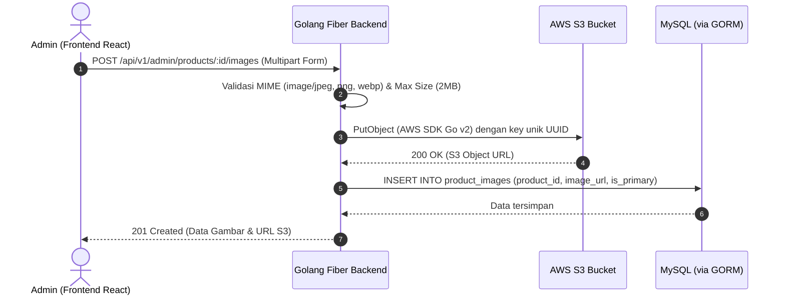

# Dokumen Spesifikasi Kebutuhan Fungsional (Hari 1)
**Aplikasi:** Okle Shop (E-Commerce Platform)  
**Status:** Disetujui (Hari 1 Selesai)  
**Terakhir Diperbarui:** 2026-09-26  

---

## 1. Ringkasan & Keputusan Arsitektur Produk

| Aspek | Keputusan Final | Keterangan / Implikasi Teknis |
| :--- | :--- | :--- |
| **Model Bisnis** | *Single-Vendor B2C* | 1 Admin pengelola toko, banyak customer. Tidak perlu sistem komisi marketplace multi-seller. |
| **Tipe Produk** | Produk Fisik | Membutuhkan alamat kirim, berat paket (gram), kalkulasi ongkir, dan pelacakan resi. |
| **Varian Produk** | **1-Level Variant** | Sederhana & fokus: setiap varian memiliki nama (misal: "Merah" atau "Size L"), SKU unik, harga, stok, dan berat. |
| **Penyimpanan Media** | **AWS S3** | Gambar produk diunggah langsung ke AWS S3 bucket menggunakan **AWS SDK Go v2**. URL publik disimpan di database. |
| **Penyimpanan Database** | MySQL 8.0 via GORM | Relasi tabel ACID, InnoDB engine, transaksi pesimistik saat checkout. |

---

## 2. Aktor Pengguna (User Roles)

### 2.1 Customer (Pembeli)
- **Registrasi & Autentikasi:** Mendaftar akun dengan nama, email, nomor HP, dan password. Login via email & password dengan JWT.
- **Manajemen Alamat:** Menyimpan beberapa alamat pengiriman (Rumah, Kantor, dll.) dan menandai 1 alamat utama (*default*).
- **Katalog & Pencarian:**
  - Menjelajah produk berdasarkan kategori.
  - Mencari produk lewat kata kunci nama/deskripsi.
  - Filter berdasarkan rentang harga, kategori, dan ketersediaan stok.
  - Sorting berdasarkan: Terbaru, Termurah, Termahal, Terpopuler.
- **Detail Produk:**
  - Melihat galeri foto produk (disajikan via AWS S3).
  - Memilih varian 1-level (misal pilihan warna atau pilihan ukuran).
  - Melihat ketersediaan stok varian dan harga dinamis.
- **Keranjang Belanja (Cart) & Wishlist:**
  - Menambahkan varian produk ke wishlist.
  - Menambahkan varian produk ke keranjang belanja.
  - Mengubah kuantitas item (dengan validasi stok real-time).
  - Memilih item yang ingin di-checkout (checkbox partial checkout).
- **Checkout & Pengiriman:**
  - Memilih alamat tujuan.
  - Memilih opsi ekspedisi (JNE, SiCepat, POS) dan layanan yang tersedia.
  - Menginput kode voucher/kupon diskon.
  - Meninjau rincian biaya: Subtotal + Ongkir - Diskon = Total Bayar.
- **Pembayaran & Riwayat:**
  - Melakukan pembayaran melalui Payment Gateway Sandbox (Virtual Account, QRIS, E-Wallet).
  - Melihat status pesanan: `UNPAID` ➔ `PAID` ➔ `PROCESSING` ➔ `SHIPPED` ➔ `COMPLETED` / `CANCELLED`.
  - Melihat nomor resi pengiriman saat pesanan sudah dikirim.
  - Membatalkan pesanan selama status masih `UNPAID`.

---

### 2.2 Admin (Pengelola Toko)
- **Autentikasi Khusus Admin:** Login dengan role `ADMIN`.
- **Manajemen Kategori:** Tambah, ubah nama/slug, unggah ikon kategori ke S3, dan hapus kategori.
- **Manajemen Produk & Varian (1-Level):**
  - Membuat produk baru (Nama, Slug, Deskripsi, Kategori).
  - Mengunggah banyak gambar produk (Multi-upload ke AWS S3).
  - Mengatur daftar varian 1-level:
    - *Nama Varian* (contoh: "Hitam", "Putih", "XL")
    - *SKU* (Stock Keeping Unit unik, misal: `OKL-SHIRT-BLK`)
    - *Harga* (tipe `DECIMAL(12,2)`)
    - *Stok* (integer)
    - *Berat* (dalam gram)
  - Edit cepat stok dan harga varian.
- **Manajemen Pesanan (Order Fulfillment):**
  - Melihat daftar semua pesanan pelanggan dengan filter status.
  - Konfirmasi pesanan masuk (`PAID` ➔ `PROCESSING`).
  - Input nomor resi pengiriman dan ubah status (`PROCESSING` ➔ `SHIPPED`).
- **Dashboard Ringkas:**
  - Total omset penjualan harian/bulanan.
  - Jumlah order menunggu diproses.
  - Peringatan produk dengan sisa stok < 5 (*Low Stock Alert*).

---

## 3. Spesifikasi Arsitektur Penyimpanan Media (AWS S3)

**Variabel Environment yang Diperlukan:**
- `AWS_REGION`
- `AWS_ACCESS_KEY_ID`
- `AWS_SECRET_ACCESS_KEY`
- `AWS_S3_BUCKET_NAME`
- `AWS_S3_BASE_URL` (atau CloudFront Domain jika ada)

---

## 4. Batasan MVP (Scope Boundary)

### Yang Masuk ke MVP (100 Hari):
1. User Auth: JWT + Refresh Token + RBAC (`CUSTOMER`, `ADMIN`).
2. Single-level Product Variants (SKU, Nama Varian, Stok, Harga, Berat).
3. Image storage langsung ke AWS S3 via AWS SDK Go v2.
4. Cart, Checkbox Checkout, & Sistem Kupon Diskon.
5. Transaksi checkout anti race-condition (`GORM Transaction + Pessimistic Lock`).
6. Integrasi kalkulasi ongkir ekspedisi.
7. Integrasi Midtrans Sandbox (Snap token + Webhook idempotency).
8. Admin CMS: Kelola Katalog, Kelola Pesanan, Input Resi, Ringkasan Penjualan.
9. Containerization Docker (Dev & Prod) + CI/CD GitHub Actions.

### Yang Ditunda ke Versi 2.0 (Non-MVP):
- Kombinasi varian multi-level (contoh: matriks Warna x Ukuran).
- Sistem multi-vendor / marketplace (banyak seller).
- Login sosial media (Google/Facebook OAuth).
- Live chat real-time antara pembeli dan penjual.
- Sistem refund otomatis via payment gateway.

---

## 5. Kesimpulan Hari 1 & Langkah Menuju Hari 2
Dengan disetujuinya batasan fungsional di atas:
- **Hari 1 (Kebutuhan & Scope Fungsional): SELESAI ✅**
- **Hari 2 (Selanjutnya):** Perancangan Entity Relationship Diagram (ERD) dan skema tabel MySQL berbasis spesifikasi di atas (termasuk tabel `product_variants` 1-level, `product_images` dengan S3 URL, relasi alamat, keranjang, pesanan, dan pembayaran).
