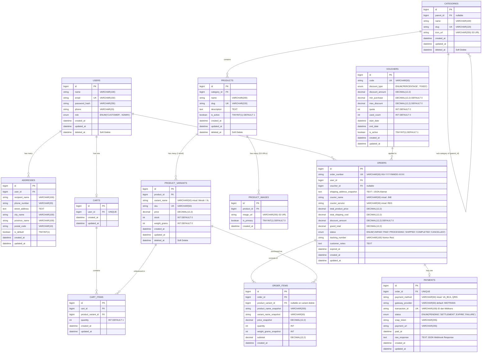

# Dokumen Perancangan Database & ERD (Hari 2)
**Aplikasi:** Okle Shop (E-Commerce Platform)  
**Database Engine:** MySQL 8.0+ (InnoDB)  
**ORM Support:** GORM v1.25+  
**Status:** Disetujui (Hari 2 Selesai)  
**Terakhir Diperbarui:** 2026-09-27  

---

## 1. Visualisasi Entity Relationship Diagram (ERD)



---

## 2. Rincian Spesifikasi Tabel & Kamus Data

### 2.1 Modul Pengguna & Alamat
1. **`users`**
   - Menyimpan kredensial otentikasi dan profil dasar.
   - Kolom `role`: `CUSTOMER` untuk pembeli umum, `ADMIN` untuk pengelola toko.
   - Kolom `deleted_at`: Memanfaatkan fitur GORM soft-delete agar akun yang ditutup tidak merusak riwayat transaksi terdahulu.
2. **`addresses`**
   - Menyimpan daftar alamat tujuan pengiriman milik user.
   - 1 user dapat memiliki banyak alamat, dengan flag `is_default = 1` sebagai alamat pengiriman bawaan.

### 2.2 Modul Katalog Produk (1-Level Variant & AWS S3)
3. **`categories`**
   - Mendukung hierarki bertingkat sederhana lewat `parent_id` (opsional / *nullable*).
   - Ikon/gambar kategori disimpan dalam bentuk URL AWS S3 (`icon_url`).
4. **`products`**
   - Entitas induk produk yang memegang nama produk, slug unik (SEO friendly), dan deskripsi umum.
5. **`product_images`**
   - Relasi *1-to-many* dari produk. Menyimpan URL publik AWS S3.
   - Kolom `is_primary = 1` menandai gambar utama yang tampil pada kartu produk di halaman katalog/home.
6. **`product_variants`**
   - **Varian 1-Level:** Setiap entitas memiliki `variant_name` (contoh: "Merah", "Hitam", "Size L", dll).
   - Memegang inventori riil: `stock`, `price`, dan `weight_grams` (digunakan langsung untuk kalkulasi ongkir ekspedisi).
   - `sku` bersifat unik di seluruh katalog toko.

### 2.3 Modul Keranjang & Promosi
7. **`carts` & `cart_items`**
   - Setiap user memiliki tepat 1 entitas `cart` yang aktif.
   - `cart_items` merujuk langsung ke `product_variant_id`. Jika stok varian berkurang di masa mendatang, keranjang akan memvalidasi ulang saat dibuka.
8. **`vouchers`**
   - Mendukung diskon berupa persentase (`PERCENTAGE`) dengan plafon maksimal (`max_discount`), atau potongan tetap (`FIXED`).
   - Dilengkapi `quota` dan `used_count` untuk mengontrol batas penggunaan kupon.

### 2.4 Modul Transaksi & Pembayaran (Data Integrity Critical)
9. **`orders`**
   - `order_number`: Identifier unik untuk tagihan dan pencarian customer (format: `INV-YYYYMMDD-XXXX`).
   - `shipping_address_snapshot`: Menyimpan teks atau JSON lengkap nama penerima, no telp, dan alamat lengkap saat checkout berlangsung.
   - Status pemesanan:
     ```text
     UNPAID -> PAID -> PROCESSING -> SHIPPED -> COMPLETED
        |                                |
        +--------> CANCELLED <-----------+
     ```
10. **`order_items`**
    - **Snapshotting Wajib:** Menyimpan `product_name_snapshot`, `variant_name_snapshot`, dan `price_snapshot`. Perubahan harga produk oleh admin di masa depan tidak akan memengaruhi laporan keuangan pesanan lama.
11. **`payments`**
    - Menyimpan interaksi dengan Payment Gateway (Midtrans).
    - `snap_token` & `payment_url` digunakan frontend React untuk memunculkan modal pembayaran Snap.
    - `transaction_id` dari gateway disimpan unik untuk mencegah double callback (idempotency).

---

## 3. Aturan Relasi Foreign Key & Integritas Data

| Tabel Asal | Kolom FK | Tabel Target | On Delete Action | Rasional / Alasan Bisnis |
| :--- | :--- | :--- | :--- | :--- |
| `addresses` | `user_id` | `users(id)` | `CASCADE` | Jika akun dihapus permanen, hapus buku alamatnya. |
| `products` | `category_id` | `categories(id)` | `RESTRICT` | Kategori tidak boleh dihapus jika masih ada produk aktif di dalamnya. |
| `product_variants` | `product_id` | `products(id)` | `CASCADE` | Menghapus produk induk akan menghapus variannya. |
| `product_images` | `product_id` | `products(id)` | `CASCADE` | Menghapus produk induk akan menghapus daftar referensi fotonya. |
| `cart_items` | `cart_id` | `carts(id)` | `CASCADE` | Membersihkan keranjang saat cart direset. |
| `cart_items` | `product_variant_id`| `product_variants(id)`| `CASCADE` | Jika varian dihapus, otomatis hilang dari keranjang user. |
| **`orders`** | **`user_id`** | `users(id)` | **`RESTRICT`** | **Pesanan historis tidak boleh terhapus demi rekam jejak audit & finansial.** |
| **`order_items`**| **`order_id`** | `orders(id)` | **`RESTRICT`** | Rincian pesanan historis tidak boleh hilang. |
| `payments` | `order_id` | `orders(id)` | `RESTRICT` | Data pembayaran terikat erat dengan nomor order. |

---

## 4. Presisi Angka & Tipe Data Keuangan

> [!IMPORTANT]
> **Hindari Tipe `FLOAT` atau `DOUBLE` untuk Finansial!**  
> Semua kolom nilai uang (`price`, `discount_amount`, `total_product_price`, `total_shipping_cost`, `grand_total`) wajib didefinisikan sebagai **`DECIMAL(12,2)`**. Tipe ini menjamin presisi hingga 12 digit total (hingga 999 milyar) dengan 2 angka di belakang koma tanpa resiko pembulatan biner.

---

## 5. Kesimpulan Hari 2 & Langkah Menuju Hari 3
- **Hari 2 (Perancangan ERD & Relasi Database): SELESAI ✅**
- **Hari 3 (Selanjutnya):** Finalisasi skema database MySQL:
  - Pembuatan skrip DDL migrasi awal (`000001_init_schema.up.sql`).
  - Penentuan indeks performa pencarian (`INDEX`, `FULLTEXT INDEX`, composite index).
  - Skrip pengembalian migrasi (`000001_init_schema.down.sql`).
