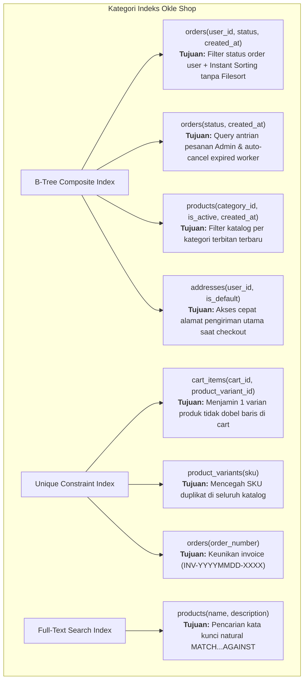

# Dokumen Finalisasi Skema Database MySQL & Indeks Performa (Hari 3)
**Aplikasi:** Okle Shop (E-Commerce Platform)  
**Database Engine:** MySQL 8.0+ (InnoDB)  
**Collation:** `utf8mb4_unicode_ci`  
**Status:** Disetujui (Hari 3 Selesai)  
**Terakhir Diperbarui:** 2026-09-27  

---

## 1. Strategi Indexing & Optimasi Query (High Throughput)

Indeks bukan sekadar mempercepat pencarian data, tetapi dirancang secara presisi menggunakan prinsip **Leftmost Prefix** untuk mengeliminasi beban CPU akibat sortir memori (*filesort*) dan pencarian teks penuh.



### 1.1 Mengapa `created_at` Ditempatkan di Indeks?
Pada e-commerce skala produksi, query pelanggan yang paling sering dipanggil adalah:
```sql
SELECT * FROM orders 
WHERE user_id = ? AND status = ? 
ORDER BY created_at DESC 
LIMIT 10;
```
- **Tanpa Indeks pada `created_at`:** MySQL menyaring baris terlebih dahulu, lalu memasukkan hasilnya ke memori (*Sort Buffer*) dan melakukan pengurutan manual. Pada hasil `EXPLAIN`, ini memunculkan `Using filesort` yang sangat membebani CPU.
- **Dengan Composite Index `(user_id, status, created_at)`:** Data fisik di disk/RAM sudah tersimpan dalam struktur B-Tree yang terurut. MySQL cukup membaca dari cabang paling belakang (*Backward Index Scan*) dan mengambil 10 baris. `Using filesort` tereliminasi 100% dan latency turun menjadi **1 – 2 ms**.

---

## 2. Struktur Skrip DDL SQL (MySQL 8.0 InnoDB)

Skrip DDL resmi disimpan di berkas:
- **Up Migration:** [`backend/migrations/000001_init_schema.up.sql`](file:///c:/Development/Golang/okle-shop/backend/migrations/000001_init_schema.up.sql)
- **Down Migration:** [`backend/migrations/000001_init_schema.down.sql`](file:///c:/Development/Golang/okle-shop/backend/migrations/000001_init_schema.down.sql)

### 2.1 Rangkuman Tabel & Relasi

```sql
-- 1. USERS
CREATE TABLE IF NOT EXISTS users (
    id BIGINT UNSIGNED AUTO_INCREMENT PRIMARY KEY,
    name VARCHAR(100) NOT NULL,
    email VARCHAR(150) NOT NULL UNIQUE,
    password_hash VARCHAR(255) NOT NULL,
    phone VARCHAR(20) NULL,
    role ENUM('CUSTOMER', 'ADMIN') NOT NULL DEFAULT 'CUSTOMER',
    created_at DATETIME NOT NULL DEFAULT CURRENT_TIMESTAMP,
    updated_at DATETIME NOT NULL DEFAULT CURRENT_TIMESTAMP ON UPDATE CURRENT_TIMESTAMP,
    deleted_at DATETIME NULL,
    INDEX idx_users_email (email),
    INDEX idx_users_deleted_at (deleted_at)
) ENGINE=InnoDB DEFAULT CHARSET=utf8mb4 COLLATE=utf8mb4_unicode_ci;

-- 2. ADDRESSES
CREATE TABLE IF NOT EXISTS addresses (
    id BIGINT UNSIGNED AUTO_INCREMENT PRIMARY KEY,
    user_id BIGINT UNSIGNED NOT NULL,
    recipient_name VARCHAR(100) NOT NULL,
    phone_number VARCHAR(20) NOT NULL,
    street_address TEXT NOT NULL,
    city_name VARCHAR(100) NOT NULL,
    province_name VARCHAR(100) NOT NULL,
    postal_code VARCHAR(10) NOT NULL,
    is_default TINYINT(1) NOT NULL DEFAULT 0,
    created_at DATETIME NOT NULL DEFAULT CURRENT_TIMESTAMP,
    updated_at DATETIME NOT NULL DEFAULT CURRENT_TIMESTAMP ON UPDATE CURRENT_TIMESTAMP,
    CONSTRAINT fk_addresses_user FOREIGN KEY (user_id) REFERENCES users(id) ON DELETE CASCADE,
    INDEX idx_addresses_user_default (user_id, is_default)
) ENGINE=InnoDB DEFAULT CHARSET=utf8mb4 COLLATE=utf8mb4_unicode_ci;

-- 3. CATEGORIES
CREATE TABLE IF NOT EXISTS categories (
    id BIGINT UNSIGNED AUTO_INCREMENT PRIMARY KEY,
    parent_id BIGINT UNSIGNED NULL,
    name VARCHAR(100) NOT NULL,
    slug VARCHAR(120) NOT NULL UNIQUE,
    icon_url VARCHAR(255) NULL,
    created_at DATETIME NOT NULL DEFAULT CURRENT_TIMESTAMP,
    updated_at DATETIME NOT NULL DEFAULT CURRENT_TIMESTAMP ON UPDATE CURRENT_TIMESTAMP,
    deleted_at DATETIME NULL,
    CONSTRAINT fk_categories_parent FOREIGN KEY (parent_id) REFERENCES categories(id) ON DELETE SET NULL,
    INDEX idx_categories_slug (slug),
    INDEX idx_categories_deleted_at (deleted_at)
) ENGINE=InnoDB DEFAULT CHARSET=utf8mb4 COLLATE=utf8mb4_unicode_ci;

-- 4. PRODUCTS
CREATE TABLE IF NOT EXISTS products (
    id BIGINT UNSIGNED AUTO_INCREMENT PRIMARY KEY,
    category_id BIGINT UNSIGNED NOT NULL,
    name VARCHAR(200) NOT NULL,
    slug VARCHAR(220) NOT NULL UNIQUE,
    description TEXT NULL,
    is_active TINYINT(1) NOT NULL DEFAULT 1,
    created_at DATETIME NOT NULL DEFAULT CURRENT_TIMESTAMP,
    updated_at DATETIME NOT NULL DEFAULT CURRENT_TIMESTAMP ON UPDATE CURRENT_TIMESTAMP,
    deleted_at DATETIME NULL,
    CONSTRAINT fk_products_category FOREIGN KEY (category_id) REFERENCES categories(id) ON DELETE RESTRICT,
    INDEX idx_products_cat_active_created (category_id, is_active, created_at),
    FULLTEXT INDEX idx_products_search (name, description)
) ENGINE=InnoDB DEFAULT CHARSET=utf8mb4 COLLATE=utf8mb4_unicode_ci;

-- 5. PRODUCT_IMAGES
CREATE TABLE IF NOT EXISTS product_images (
    id BIGINT UNSIGNED AUTO_INCREMENT PRIMARY KEY,
    product_id BIGINT UNSIGNED NOT NULL,
    image_url VARCHAR(255) NOT NULL,
    is_primary TINYINT(1) NOT NULL DEFAULT 0,
    created_at DATETIME NOT NULL DEFAULT CURRENT_TIMESTAMP,
    CONSTRAINT fk_images_product FOREIGN KEY (product_id) REFERENCES products(id) ON DELETE CASCADE,
    INDEX idx_images_product_primary (product_id, is_primary)
) ENGINE=InnoDB DEFAULT CHARSET=utf8mb4 COLLATE=utf8mb4_unicode_ci;

-- 6. PRODUCT_VARIANTS (1-Level Variant)
CREATE TABLE IF NOT EXISTS product_variants (
    id BIGINT UNSIGNED AUTO_INCREMENT PRIMARY KEY,
    product_id BIGINT UNSIGNED NOT NULL,
    variant_name VARCHAR(50) NOT NULL,
    sku VARCHAR(50) NOT NULL UNIQUE,
    price DECIMAL(12,2) NOT NULL,
    stock INT NOT NULL DEFAULT 0,
    weight_grams INT NOT NULL DEFAULT 0,
    created_at DATETIME NOT NULL DEFAULT CURRENT_TIMESTAMP,
    updated_at DATETIME NOT NULL DEFAULT CURRENT_TIMESTAMP ON UPDATE CURRENT_TIMESTAMP,
    deleted_at DATETIME NULL,
    CONSTRAINT fk_variants_product FOREIGN KEY (product_id) REFERENCES products(id) ON DELETE CASCADE,
    INDEX idx_variants_product_stock (product_id, stock),
    INDEX idx_variants_sku (sku),
    INDEX idx_variants_deleted_at (deleted_at)
) ENGINE=InnoDB DEFAULT CHARSET=utf8mb4 COLLATE=utf8mb4_unicode_ci;

-- 7. CARTS & CART_ITEMS
CREATE TABLE IF NOT EXISTS carts (
    id BIGINT UNSIGNED AUTO_INCREMENT PRIMARY KEY,
    user_id BIGINT UNSIGNED NOT NULL UNIQUE,
    created_at DATETIME NOT NULL DEFAULT CURRENT_TIMESTAMP,
    updated_at DATETIME NOT NULL DEFAULT CURRENT_TIMESTAMP ON UPDATE CURRENT_TIMESTAMP,
    CONSTRAINT fk_carts_user FOREIGN KEY (user_id) REFERENCES users(id) ON DELETE CASCADE
) ENGINE=InnoDB DEFAULT CHARSET=utf8mb4 COLLATE=utf8mb4_unicode_ci;

CREATE TABLE IF NOT EXISTS cart_items (
    id BIGINT UNSIGNED AUTO_INCREMENT PRIMARY KEY,
    cart_id BIGINT UNSIGNED NOT NULL,
    product_variant_id BIGINT UNSIGNED NOT NULL,
    quantity INT NOT NULL DEFAULT 1,
    created_at DATETIME NOT NULL DEFAULT CURRENT_TIMESTAMP,
    updated_at DATETIME NOT NULL DEFAULT CURRENT_TIMESTAMP ON UPDATE CURRENT_TIMESTAMP,
    CONSTRAINT fk_cart_items_cart FOREIGN KEY (cart_id) REFERENCES carts(id) ON DELETE CASCADE,
    CONSTRAINT fk_cart_items_variant FOREIGN KEY (product_variant_id) REFERENCES product_variants(id) ON DELETE CASCADE,
    UNIQUE KEY uk_cart_variant (cart_id, product_variant_id)
) ENGINE=InnoDB DEFAULT CHARSET=utf8mb4 COLLATE=utf8mb4_unicode_ci;

-- 8. VOUCHERS
CREATE TABLE IF NOT EXISTS vouchers (
    id BIGINT UNSIGNED AUTO_INCREMENT PRIMARY KEY,
    code VARCHAR(50) NOT NULL UNIQUE,
    discount_type ENUM('PERCENTAGE', 'FIXED') NOT NULL,
    discount_amount DECIMAL(12,2) NOT NULL,
    min_purchase DECIMAL(12,2) NOT NULL DEFAULT 0.00,
    max_discount DECIMAL(12,2) NOT NULL DEFAULT 0.00,
    quota INT NOT NULL DEFAULT 0,
    used_count INT NOT NULL DEFAULT 0,
    start_date DATETIME NOT NULL,
    end_date DATETIME NOT NULL,
    is_active TINYINT(1) NOT NULL DEFAULT 1,
    created_at DATETIME NOT NULL DEFAULT CURRENT_TIMESTAMP,
    updated_at DATETIME NOT NULL DEFAULT CURRENT_TIMESTAMP ON UPDATE CURRENT_TIMESTAMP,
    INDEX idx_vouchers_code_active (code, is_active)
) ENGINE=InnoDB DEFAULT CHARSET=utf8mb4 COLLATE=utf8mb4_unicode_ci;

-- 9. ORDERS
CREATE TABLE IF NOT EXISTS orders (
    id BIGINT UNSIGNED AUTO_INCREMENT PRIMARY KEY,
    order_number VARCHAR(50) NOT NULL UNIQUE,
    user_id BIGINT UNSIGNED NOT NULL,
    voucher_id BIGINT UNSIGNED NULL,
    shipping_address_snapshot TEXT NOT NULL,
    courier_name VARCHAR(50) NOT NULL,
    courier_service VARCHAR(50) NOT NULL,
    total_product_price DECIMAL(12,2) NOT NULL,
    total_shipping_cost DECIMAL(12,2) NOT NULL,
    discount_amount DECIMAL(12,2) NOT NULL DEFAULT 0.00,
    grand_total DECIMAL(12,2) NOT NULL,
    status ENUM('UNPAID', 'PAID', 'PROCESSING', 'SHIPPED', 'COMPLETED', 'CANCELLED') NOT NULL DEFAULT 'UNPAID',
    tracking_number VARCHAR(100) NULL,
    customer_notes TEXT NULL,
    expired_at DATETIME NOT NULL,
    created_at DATETIME NOT NULL DEFAULT CURRENT_TIMESTAMP,
    updated_at DATETIME NOT NULL DEFAULT CURRENT_TIMESTAMP ON UPDATE CURRENT_TIMESTAMP,
    CONSTRAINT fk_orders_user FOREIGN KEY (user_id) REFERENCES users(id) ON DELETE RESTRICT,
    CONSTRAINT fk_orders_voucher FOREIGN KEY (voucher_id) REFERENCES vouchers(id) ON DELETE SET NULL,
    INDEX idx_orders_user_status_created (user_id, status, created_at),
    INDEX idx_orders_status_created (status, created_at),
    INDEX idx_orders_order_number (order_number)
) ENGINE=InnoDB DEFAULT CHARSET=utf8mb4 COLLATE=utf8mb4_unicode_ci;

-- 10. ORDER_ITEMS (Snapshots)
CREATE TABLE IF NOT EXISTS order_items (
    id BIGINT UNSIGNED AUTO_INCREMENT PRIMARY KEY,
    order_id BIGINT UNSIGNED NOT NULL,
    product_variant_id BIGINT UNSIGNED NULL,
    product_name_snapshot VARCHAR(200) NOT NULL,
    variant_name_snapshot VARCHAR(50) NOT NULL,
    price_snapshot DECIMAL(12,2) NOT NULL,
    quantity INT NOT NULL,
    weight_grams_snapshot INT NOT NULL,
    subtotal DECIMAL(12,2) NOT NULL,
    created_at DATETIME NOT NULL DEFAULT CURRENT_TIMESTAMP,
    CONSTRAINT fk_order_items_order FOREIGN KEY (order_id) REFERENCES orders(id) ON DELETE RESTRICT,
    CONSTRAINT fk_order_items_variant FOREIGN KEY (product_variant_id) REFERENCES product_variants(id) ON DELETE SET NULL,
    INDEX idx_order_items_order (order_id)
) ENGINE=InnoDB DEFAULT CHARSET=utf8mb4 COLLATE=utf8mb4_unicode_ci;

-- 11. PAYMENTS
CREATE TABLE IF NOT EXISTS payments (
    id BIGINT UNSIGNED AUTO_INCREMENT PRIMARY KEY,
    order_id BIGINT UNSIGNED NOT NULL UNIQUE,
    payment_method VARCHAR(50) NULL,
    gateway_provider VARCHAR(50) NOT NULL DEFAULT 'MIDTRANS',
    transaction_id VARCHAR(100) NULL UNIQUE,
    status ENUM('PENDING', 'SETTLEMENT', 'EXPIRE', 'FAILURE') NOT NULL DEFAULT 'PENDING',
    snap_token VARCHAR(255) NULL,
    payment_url VARCHAR(255) NULL,
    paid_at DATETIME NULL,
    raw_response TEXT NULL,
    created_at DATETIME NOT NULL DEFAULT CURRENT_TIMESTAMP,
    updated_at DATETIME NOT NULL DEFAULT CURRENT_TIMESTAMP ON UPDATE CURRENT_TIMESTAMP,
    CONSTRAINT fk_payments_order FOREIGN KEY (order_id) REFERENCES orders(id) ON DELETE RESTRICT,
    INDEX idx_payments_status (status),
    INDEX idx_payments_transaction_id (transaction_id)
) ENGINE=InnoDB DEFAULT CHARSET=utf8mb4 COLLATE=utf8mb4_unicode_ci;
```

---

## 3. Kesimpulan Hari 3 & Langkah Menuju Hari 4
- **Hari 3 (Finalisasi Skema Database & Performance Indexing): SELESAI ✅**
- **Hari 4 (Selanjutnya):** Setup `docker-compose.dev.yml` untuk menjalankan container MySQL 8.0 dan PhpMyAdmin/Adminer secara otomatis dengan volume persistensi data.
