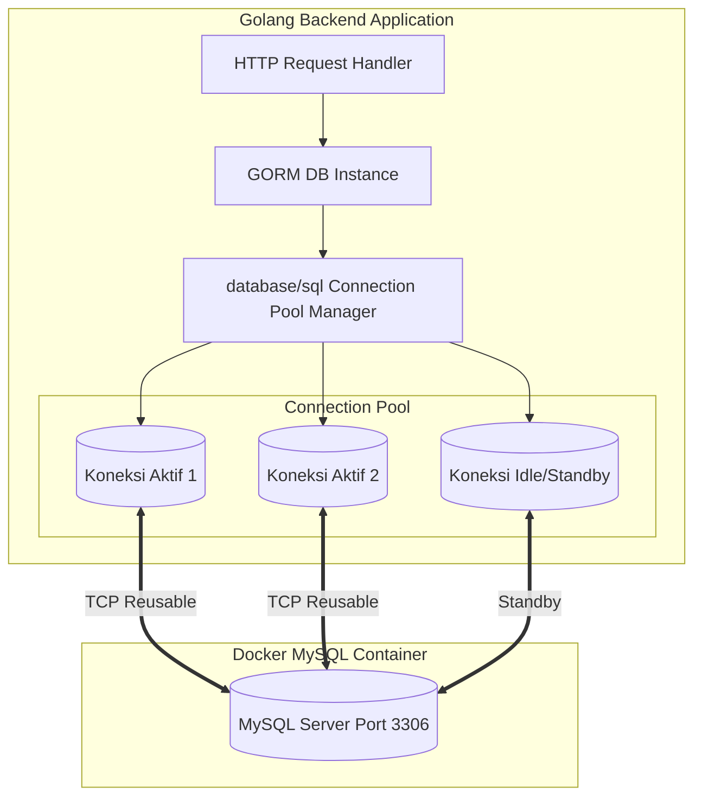

# Dokumen Setup GORM & Connection Pooling (Hari 5)
**Aplikasi:** Okle Shop (E-Commerce Platform)  
**Teknologi:** Golang 1.22+, GORM v1.25+, MySQL Driver  
**Status:** Disetujui (Hari 5 Selesai)  
**Terakhir Diperbarui:** 2026-09-28  

---

## 1. Konsep & Arsitektur Koneksi Database

Di Hari 5, Backend Golang mulai berinteraksi dengan database MySQL yang berjalan di Docker. Kita menggunakan **GORM v1.25+** dengan manajemen **Connection Pooling** tingkat lanjut.



---

## 2. Logika Connection Pooling: Mengapa Sangat Kritis?

Membuka koneksi baru ke database melalui jaringan (*TCP 3-Way Handshake + TLS/Auth negotiation*) memakan waktu sekitar **10 – 50 milidetik**. Jika setiap HTTP request dari customer membuka dan menutup koneksi secara manual:
1. Latensi API melonjak drastis.
2. Server MySQL kehabisan resource dan memunculkan error: `Error 1040: Too many connections`.

### Parameter Tuning Connection Pool di Go:
* **`SetMaxOpenConns(100)`**: Batas maksimal total koneksi (aktif + menganggur) yang diizinkan terbuka ke database secara serentak. Ini adalah tameng pelindung agar MySQL tidak *overload*.
* **`SetMaxIdleConns(10)`**: Jumlah koneksi yang tetap dipertahankan "tidur/standby" di dalam antrean *pool*. Saat request baru datang, koneksi ini langsung dipakai seketika tanpa perlu handshake ulang (latency 0 ms).
* **`SetConnMaxLifetime(time.Hour)`**: Batas umur sebuah koneksi fisik. Setelah 1 jam, koneksi akan dipensiunkan secara elegan dan diganti baru untuk mencegah koneksi basi (*stale / broken pipe* karena ditutup sepihak oleh firewall atau server MySQL).
* **`SetConnMaxIdleTime(15 * time.Minute)`**: Menutup koneksi yang menganggur jika tidak ada aktivitas selama 15 menit untuk menghemat RAM.

---

## 3. Format DSN (Data Source Name) MySQL

Untuk menghubungkan Go dengan MySQL, format DSN yang wajib digunakan adalah:
```text
user:password@tcp(host:port)/dbname?charset=utf8mb4&parseTime=True&loc=Local
```

* **`charset=utf8mb4`**: Menyelaraskan encoding 4-byte untuk dukungan emoji.
* **`parseTime=True`**: **Sangat Kritis!** Menginstruksikan driver MySQL agar otomatis mengubah tipe data `DATETIME` dan `TIMESTAMP` dari MySQL menjadi struct `time.Time` bawaan Go. Jika opsi ini lupa dipasang, query tanggal akan error/berupa slice byte mentah.
* **`loc=Local`**: Menyesuaikan zona waktu lokal dengan server.

---

## 4. Acuan Kode / Script Implementasi

### 4.1 Inisialisasi Go Module & Download Dependencies
Jalankan perintah ini di dalam folder `backend/`:
```bash
cd backend
go mod init okle-shop
go get -u gorm.io/gorm
go get -u gorm.io/driver/mysql
go get -u github.com/joho/godotenv
```

---

### 4.2 Struktur File Database: `backend/pkg/database/mysql.go`
Berikut adalah acuan logika kode inisialisasi koneksi GORM yang tahan banting (*resilient*):

```go
package database

import (
	"fmt"
	"log"
	"os"
	"time"

	"gorm.io/driver/mysql"
	"gorm.io/gorm"
	"gorm.io/gorm/logger"
)

type Config struct {
	Host     string
	Port     string
	User     string
	Password string
	DBName   string
	AppEnv   string // "development" atau "production"
}

// InitMySQL menginisialisasi koneksi GORM dengan Connection Pool dan Logger
func InitMySQL(cfg Config) (*gorm.DB, error) {
	// 1. Susun string DSN
	dsn := fmt.Sprintf("%s:%s@tcp(%s:%s)/%s?charset=utf8mb4&parseTime=True&loc=Local",
		cfg.User,
		cfg.Password,
		cfg.Host,
		cfg.Port,
		cfg.DBName,
	)

	// 2. Tentukan Level Logger GORM
	var gormLogLevel logger.LogLevel
	if cfg.AppEnv == "production" {
		gormLogLevel = logger.Error
	} else {
		gormLogLevel = logger.Info // Mencetak seluruh query SQL dan waktu eksekusi di terminal
	}

	gormLogger := logger.New(
		log.New(os.Stdout, "\r\n", log.LstdFlags),
		logger.Config{
			SlowThreshold:             200 * time.Millisecond, // Peringatan jika query > 200ms
			LogLevel:                  gormLogLevel,
			IgnoreRecordNotFoundError: true,
			Colorful:                  true,
		},
	)

	// 3. Buka Koneksi GORM
	db, err := gorm.Open(mysql.Open(dsn), &gorm.Config{
		Logger: gormLogger,
		// Menyiapkan statement cache untuk kecepatan query berulang
		PrepareStmt: true,
	})
	if err != nil {
		return nil, fmt.Errorf("gagal membuka koneksi database: %w", err)
	}

	// 4. Konfigurasi Connection Pool pada underlying sql.DB
	sqlDB, err := db.DB()
	if err != nil {
		return nil, fmt.Errorf("gagal mengambil generic database object: %w", err)
	}

	sqlDB.SetMaxIdleConns(10)
	sqlDB.SetMaxOpenConns(100)
	sqlDB.SetConnMaxLifetime(time.Hour)
	sqlDB.SetConnMaxIdleTime(15 * time.Minute)

	// 5. Tes Ping untuk memastikan database benar-benar hidup
	if err := sqlDB.Ping(); err != nil {
		return nil, fmt.Errorf("database tidak merespons ping: %w", err)
	}

	log.Println("✅ Berhasil terhubung ke database MySQL dengan GORM Connection Pool")
	return db, nil
}
```

---

### 4.3 Contoh Program Pengujian: `backend/cmd/test_db/main.go`
Untuk menguji koneksi langsung ke Docker MySQL dari laptop Anda:

```go
package main

import (
	"log"
	"okle-shop/pkg/database"

	"github.com/joho/godotenv"
	"os"
)

func main() {
	// Muat file .env dari root
	_ = godotenv.Load("../../.env")

	cfg := database.Config{
		Host:     os.Getenv("DB_HOST"), // localhost jika dijalankan dari laptop
		Port:     os.Getenv("DB_PORT"), // 3306
		User:     os.Getenv("DB_USER"),
		Password: os.Getenv("DB_PASSWORD"),
		DBName:   os.Getenv("DB_NAME"),
		AppEnv:   "development",
	}

	db, err := database.InitMySQL(cfg)
	if err != nil {
		log.Fatalf("❌ Koneksi Gagal: %v", err)
	}

	// Coba query sederhana
	var result int
	db.Raw("SELECT 1").Scan(&result)
	log.Printf("🎉 Uji Query Berhasil! Nilai: %d", result)
}
```

---

## 5. Checklist Verifikasi Hari 5

1. Inisialisasi modul Go di folder `backend/` (`go mod init okle-shop`).
2. Instal library: `gorm.io/gorm`, `gorm.io/driver/mysql`, dan `godotenv`.
3. Tulis file `backend/pkg/database/mysql.go` dengan connection pooling.
4. Jalankan pengujian koneksi ke container Docker MySQL yang sedang aktif.
5. Terminal menampilkan log query berwarna hijau dan pesan sukses: `✅ Berhasil terhubung ke database MySQL`.

---

## 6. Kesimpulan Hari 5 & Langkah Menuju Hari 6
- **Hari 5 (Inisialisasi GORM & Connection Pool): SELESAI ✅**
- **Hari 6 (Selanjutnya):** Setup strategi Database Migration (menggunakan migrasi bawaan GORM AutoMigrate vs migration scripts terprogram) dan Model Base Entity (`ID`, `CreatedAt`, `UpdatedAt`, `DeletedAt`).
