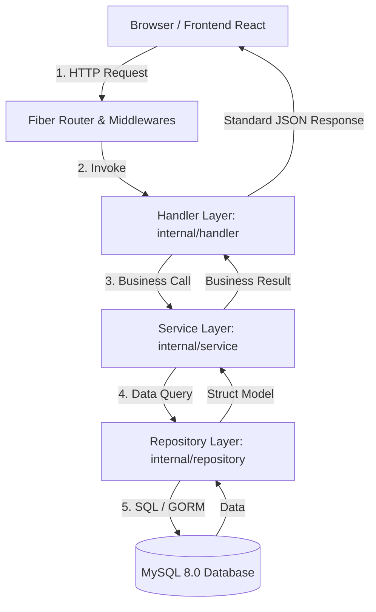

# Dokumen Backend Scaffolding & Clean Architecture (Hari 7)
**Aplikasi:** Okle Shop (E-Commerce Platform)  
**Teknologi:** Golang 1.22+, Fiber v2, Clean Architecture  
**Status:** Disetujui (Hari 7 Selesai)  
**Terakhir Diperbarui:** 2026-09-29  

---

## 1. Konsep Clean Architecture (Pemisahan Tanggung Jawab)

Untuk aplikasi e-commerce skala produksi, kode tidak boleh ditumpuk dalam satu file. Kita memisahkan kode menjadi 3 lapisan independen (*Separation of Concerns*):



### Tanggung Jawab Setiap Lapisan:
1. **Handler Layer (`internal/handler`):**
   - Hanya berurusan dengan HTTP protocol (`*fiber.Ctx`).
   - Membaca JSON body, URL params, dan query params.
   - Memanggil service layer.
   - Mengembalikan response JSON standar. **Dilarang keras memanggil query database/GORM di sini!**
2. **Service Layer (`internal/service`):**
   - Pusat logika bisnis (*business rules*).
   - Melakukan kalkulasi harga, validasi logika (misal: "apakah stok mencukupi?", "apakah voucher sudah kedaluwarsa?").
   - Hashing password, enkripsi, dan pembuatan token JWT.
3. **Repository Layer (`internal/repository`):**
   - Satu-satunya lapisan yang boleh menyentuh database (`*gorm.DB`).
   - Menjalankan operasi CRUD, filter, join, dan transaksi atomik.

---

## 2. Standar Response API (`pkg/response`)

Semua endpoint di Okle Shop wajib mengembalikan struktur JSON yang seragam agar Frontend React mudah menanganinya:

**Jika Sukses (HTTP 200/201):**
```json
{
  "success": true,
  "message": "Operasi berhasil",
  "data": { ... }
}
```

**Jika Gagal / Validasi Error (HTTP 400/404/500):**
```json
{
  "success": false,
  "message": "Deskripsi kesalahan",
  "errors": [ ... ]
}
```

---

## 3. Middleware Wajib di Fiber

1. **Recover Middleware (`recover.New()`):**
   - Menjaga server dari *crash*. Jika ada bug `panic` (misal pointer nil), server tidak mati, melainkan menangkap panic tersebut dan mengembalikan respon HTTP 500 yang rapi.
2. **Logger Middleware (`logger.New()`):**
   - Mencetak setiap HTTP request di terminal: `[METHOD] /path | STATUS | LATENCY`.
3. **CORS Middleware (`cors.New()`):**
   - Mengizinkan Frontend React di port `5173` mengakses API backend di port `8000` tanpa terkena blokir keamanan browser (*Cross-Origin Resource Sharing*).

---

## 4. Acuan Kode / Script Implementasi

### 4.1 Download Dependency Tambahan
Jalankan di folder `backend/`:
```powershell
cd backend
go get -u github.com/gofiber/fiber/v2
```

---

### 4.2 File Format Response: `backend/pkg/response/response.go`
```go
package response

import "github.com/gofiber/fiber/v2"

type ApiResponse struct {
	Success bool        `json:"success"`
	Message string      `json:"message"`
	Data    interface{} `json:"data,omitempty"`
	Errors  interface{} `json:"errors,omitempty"`
}

// Success mengirim response JSON sukses dengan data
func Success(c *fiber.Ctx, statusCode int, message string, data interface{}) error {
	return c.Status(statusCode).JSON(ApiResponse{
		Success: true,
		Message: message,
		Data:    data,
	})
}

// Error mengirim response JSON error
func Error(c *fiber.Ctx, statusCode int, message string, errors interface{}) error {
	return c.Status(statusCode).JSON(ApiResponse{
		Success: false,
		Message: message,
		Errors:  errors,
	})
}
```

---

### 4.3 Central Error Handler: `backend/pkg/response/error_handler.go`
```go
package response

import (
	"errors"
	"log"

	"github.com/gofiber/fiber/v2"
)

// CustomErrorHandler menangani seluruh unhandled error di Fiber secara terpusat
func CustomErrorHandler(c *fiber.Ctx, err error) error {
	code := fiber.StatusInternalServerError
	message := "Terjadi kesalahan internal pada server"

	var e *fiber.Error
	if errors.As(err, &e) {
		code = e.Code
		message = e.Message
	} else {
		log.Printf("🔥 [UNHANDLED ERROR] %v\n", err)
	}

	return Error(c, code, message, nil)
}
```

---

### 4.4 Handler Healthcheck: `backend/internal/handler/health_handler.go`
Contoh handler sederhana untuk menguji apakah backend dan koneksi database MySQL hidup:

```go
package handler

import (
	"okle-shop/pkg/response"

	"github.com/gofiber/fiber/v2"
	"gorm.io/gorm"
)

type HealthHandler struct {
	db *gorm.DB
}

func NewHealthHandler(db *gorm.DB) *HealthHandler {
	return &HealthHandler{db: db}
}

func (h *HealthHandler) Check(c *fiber.Ctx) error {
	// Cek koneksi ping database
	sqlDB, err := h.db.DB()
	if err != nil || sqlDB.Ping() != nil {
		return response.Error(c, fiber.StatusServiceUnavailable, "Database MySQL tidak terhubung", nil)
	}

	data := fiber.Map{
		"app_name": "Okle Shop API",
		"status":   "UP & HEALTHY",
		"database": "CONNECTED",
	}

	return response.Success(c, fiber.StatusOK, "Sistem berjalan normal", data)
}
```

---

### 4.5 Entry Point Aplikasi: `backend/cmd/api/main.go`
File utama penyala server dengan *Graceful Shutdown*:

```go
package main

import (
	"fmt"
	"log"
	"os"
	"os/signal"
	"syscall"
	"time"

	"okle-shop/internal/handler"
	"okle-shop/pkg/database"
	"okle-shop/pkg/response"

	"github.com/gofiber/fiber/v2"
	"github.com/gofiber/fiber/v2/middleware/cors"
	"github.com/gofiber/fiber/v2/middleware/logger"
	"github.com/gofiber/fiber/v2/middleware/recover"
	"github.com/joho/godotenv"
)

func main() {
	// 1. Muat environment variable
	_ = godotenv.Load("../../.env")
	if err := godotenv.Load(); err != nil {
		_ = godotenv.Load(".env")
	}

	// 2. Inisialisasi Database MySQL
	cfg := database.Config{
		Host:     os.Getenv("DB_HOST"),
		Port:     os.Getenv("DB_PORT"),
		User:     os.Getenv("DB_USER"),
		Password: os.Getenv("DB_PASSWORD"),
		DBName:   os.Getenv("DB_NAME"),
		AppEnv:   "development",
	}

	db, err := database.InitMySQL(cfg)
	if err != nil {
		log.Fatalf("❌ Database connection failed: %v", err)
	}

	// 3. Inisialisasi Fiber App dengan Custom Error Handler
	app := fiber.New(fiber.Config{
		ErrorHandler: response.CustomErrorHandler,
		AppName:      "Okle Shop API v1",
	})

	// 4. Pasang Global Middlewares
	app.Use(recover.New()) // Mencegah crash jika terjadi panic
	app.Use(logger.New(logger.Config{
		Format:     "[${time}] ${status} - ${latency} | ${method} ${path}\n",
		TimeFormat: "15:04:05",
		TimeZone:   "Local",
	}))
	app.Use(cors.New(cors.Config{
		AllowOrigins: "http://localhost:5173, http://localhost:3000",
		AllowHeaders: "Origin, Content-Type, Accept, Authorization",
		AllowMethods: "GET, POST, PUT, DELETE, PATCH, OPTIONS",
	}))

	// 5. Setup Routing
	api := app.Group("/api/v1")
	healthHandler := handler.NewHealthHandler(db)
	api.Get("/health", healthHandler.Check)

	// 6. Graceful Shutdown Listener
	port := os.Getenv("APP_PORT")
	if port == "" {
		port = "8000"
	}

	go func() {
		addr := fmt.Sprintf(":%s", port)
		log.Printf("🚀 Server Okle Shop berjalan di http://localhost%s\n", addr)
		if err := app.Listen(addr); err != nil {
			log.Printf("Server stopped: %v\n", err)
		}
	}()

	// Menunggu sinyal interrupt (Ctrl+C atau kill)
	quit := make(chan os.Signal, 1)
	signal.Notify(quit, os.Interrupt, syscall.SIGTERM)
	<-quit

	log.Println("⏳ Mematikan server secara tertib (graceful shutdown)...")
	_ = app.ShutdownWithTimeout(5 * time.Second)
	log.Println("👋 Server berhasil berhenti dengan aman.")
}
```

---

## 5. Cara Menjalankan & Verifikasi

1. Tambahkan variabel `APP_PORT=8000` di file `.env` root Anda.
2. Dari folder `backend/`, jalankan server:
   ```powershell
   go run cmd/api/main.go
   ```
3. Uji endpoint healthcheck menggunakan browser atau terminal curl/powershell:
   ```powershell
   curl http://localhost:8000/api/v1/health
   ```
4. Output yang diharapkan:
   ```json
   {
     "success": true,
     "message": "Sistem berjalan normal",
     "data": {
       "app_name": "Okle Shop API",
       "database": "CONNECTED",
       "status": "UP & HEALTHY"
     }
   }
   ```

---

## 6. Kesimpulan Hari 7 & Langkah Menuju Hari 8
- **Hari 7 (Backend Scaffolding & Clean Architecture): SELESAI ✅**
- **Hari 8 (Selanjutnya):** Frontend Scaffolding: Setup project React menggunakan Vite, instalasi Tailwind CSS, dan struktur folder frontend.
