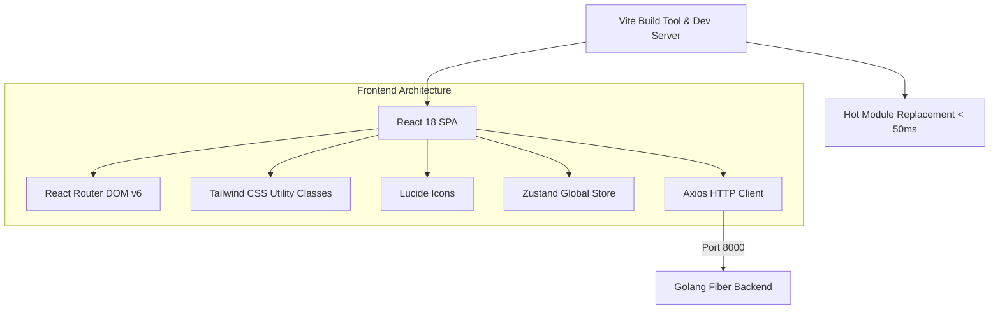

# Dokumen Frontend Scaffolding: React (Vite) & Tailwind CSS (Hari 8)
**Aplikasi:** Okle Shop (E-Commerce Platform)  
**Teknologi:** React 18+, Vite, Tailwind CSS v3, Lucide React, Axios, React Router DOM  
**Status:** Disetujui (Hari 8 Selesai)  
**Terakhir Diperbarui:** 2026-09-29  

---

## 1. Konsep & Arsitektur Frontend Modern

Di Hari 8, kita membangun fondasi antarmuka pengguna (*User Interface*) untuk Okle Shop menggunakan kombinasi **React + Vite + Tailwind CSS**.



### Mengapa Memilih Vite, Bukan Create React App (CRA)?
1. **Kecepatan Kompilasi:** CRA menggunakan Webpack yang lambat, sementara Vite menggunakan *esbuild* (ditulis dengan Go) dan *Native ES Modules* di browser.
2. **Hot Module Replacement (HMR) Instan:** Saat Anda mengubah kode JSX atau CSS, perubahan langsung tampil di browser dalam waktu **kurang dari 50 milidetik** tanpa memuat ulang seluruh halaman.

---

## 2. Struktur Folder Standar Industri (`frontend/src/`)

Susunan folder yang rapi memudahkan skalabilitas proyek e-commerce:

```text
frontend/
├── public/               # File statis (favicon, manifest)
├── src/
│   ├── assets/           # Logo, gambar ilustrasi
│   ├── components/       # Komponen UI reusable (Button, Input, Navbar, Card, Modal)
│   ├── pages/            # Halaman (Home, Login, Register, ProductDetail, Cart, Checkout)
│   ├── services/         # Axios API client & endpoints
│   ├── store/            # State management global (Auth store, Cart store)
│   ├── routes/           # React Router & ProtectedRoute guard
│   ├── App.jsx           # Komponen root aplikasi
│   ├── main.jsx          # Entry point React
│   └── index.css         # Import Tailwind directives & custom CSS
├── index.html            # HTML shell
├── tailwind.config.js    # Konfigurasi tema, warna, dan font
├── postcss.config.js     # Konfigurasi PostCSS untuk Tailwind
├── vite.config.js        # Konfigurasi build Vite
└── package.json          # Dependencies proyek
```

---

## 3. Langkah Instalasi Mandiri di Terminal

Jalankan perintah berikut secara berurutan di terminal dari **root workspace** (`okle-shop/`):

### 3.1 Inisialisasi Project Vite React
```powershell
# 1. Buat folder dan boilerplate React Vite
npm create vite@latest frontend -- --template react

# 2. Masuk ke folder frontend dan install dependensi dasar
cd frontend
npm install
```

---

### 3.2 Instalasi & Inisialisasi Tailwind CSS
```powershell
# 1. Install Tailwind CSS, PostCSS, dan Autoprefixer
npm install -D tailwindcss@3 postcss autoprefixer

# 2. Generate file tailwind.config.js dan postcss.config.js
npx tailwindcss init -p
```

---

### 3.3 Instalasi Library Pendukung E-Commerce
```powershell
# Router untuk navigasi SPA, Axios untuk HTTP client, dan Lucide untuk ikon modern
npm install react-router-dom axios lucide-react
```

---

## 4. Acuan Kode / Konfigurasi File

### 4.1 Konfigurasi `frontend/tailwind.config.js`
Atur jalur file template dan definisikan palet warna brand Okle Shop:

```javascript
/** @type {import('tailwindcss').Config} */
export default {
  content: [
    "./index.html",
    "./src/**/*.{js,ts,jsx,tsx}",
  ],
  theme: {
    extend: {
      colors: {
        brand: {
          50: '#ecfdf5',
          100: '#d1fae5',
          500: '#10b981',
          600: '#059669', // Warna utama hijau e-commerce
          700: '#047857',
          900: '#064e3b',
        },
      },
    },
  },
  plugins: [],
}
```

---

### 4.2 File Directiva Tailwind: `frontend/src/index.css`
Ganti isi file `frontend/src/index.css` dengan tiga baris direktiva dasar Tailwind berikut:

```css
@tailwind base;
@tailwind components;
@tailwind utilities;

body {
  margin: 0;
  font-family: -apple-system, BlinkMacSystemFont, 'Segoe UI', Roboto, Oxygen, Ubuntu, Cantarell, sans-serif;
  background-color: #f8fafc;
  color: #1e293b;
}
```

---

### 4.3 Contoh Komponen Uji Coba: `frontend/src/App.jsx`
Ganti isi `frontend/src/App.jsx` untuk menguji apakah React, Tailwind CSS, dan Lucide Icons berjalan sempurna:

```jsx
import React from 'react';
import { ShoppingBag, CheckCircle, ArrowRight } from 'lucide-react';

function App() {
  return (
    <div className="min-h-screen flex flex-col items-center justify-center p-6 bg-slate-50">
      <div className="max-w-md w-full bg-white rounded-2xl shadow-xl p-8 border border-slate-100 text-center">
        {/* Brand Icon */}
        <div className="w-16 h-16 bg-brand-50 text-brand-600 rounded-2xl flex items-center justify-center mx-auto mb-6 shadow-sm">
          <ShoppingBag className="w-8 h-8" />
        </div>

        {/* Title & Description */}
        <h1 className="text-2xl font-bold text-slate-800 tracking-tight">
          Okle Shop Frontend
        </h1>
        <p className="text-slate-500 text-sm mt-2">
          React 18 + Vite + Tailwind CSS berhasil diinisialisasi dan siap digunakan.
        </p>

        {/* Status Indicators */}
        <div className="mt-6 space-y-2 text-left bg-slate-50 p-4 rounded-xl text-sm text-slate-700">
          <div className="flex items-center gap-2">
            <CheckCircle className="w-4 h-4 text-brand-600" />
            <span>Vite Dev Server (HMR Aktif)</span>
          </div>
          <div className="flex items-center gap-2">
            <CheckCircle className="w-4 h-4 text-brand-600" />
            <span>Tailwind CSS Utility Classes</span>
          </div>
          <div className="flex items-center gap-2">
            <CheckCircle className="w-4 h-4 text-brand-600" />
            <span>Lucide React Icons</span>
          </div>
        </div>

        {/* Action Button */}
        <button className="w-full mt-6 bg-brand-600 hover:bg-brand-700 text-white font-medium py-3 px-4 rounded-xl shadow-md transition-all flex items-center justify-center gap-2 group">
          <span>Menuju Hari 9 (Docker Dev & Air)</span>
          <ArrowRight className="w-4 h-4 group-hover:translate-x-1 transition-transform" />
        </button>
      </div>
    </div>
  );
}

export default App;
```

---

## 5. Cara Menjalankan & Verifikasi

1. Pastikan Anda berada di direktori `frontend/`:
   ```powershell
   cd c:\Development\Golang\okle-shop\frontend
   ```
2. Jalankan development server:
   ```powershell
   npm run dev
   ```
3. Buka browser di alamat: **`http://localhost:5173`**
4. **Hasil yang Diharapkan:**  
   Kartu putih rapi di tengah layar dengan ikon belanja hijau (*Okle Shop Frontend*), bayangan halus (*box-shadow*), dan tombol interaktif dengan animasi hover Tailwind CSS.

---

## 6. Kesimpulan Hari 8 & Langkah Menuju Hari 9
- **Hari 8 (Frontend Scaffolding: React + Vite + Tailwind): SELESAI ✅**
- **Hari 9 (Selanjutnya):** Konfigurasi Dockerfile Development untuk Backend (dengan live-reload Air) dan Frontend, serta pengujian komunikasi jaringan antar-container di Docker Network.
