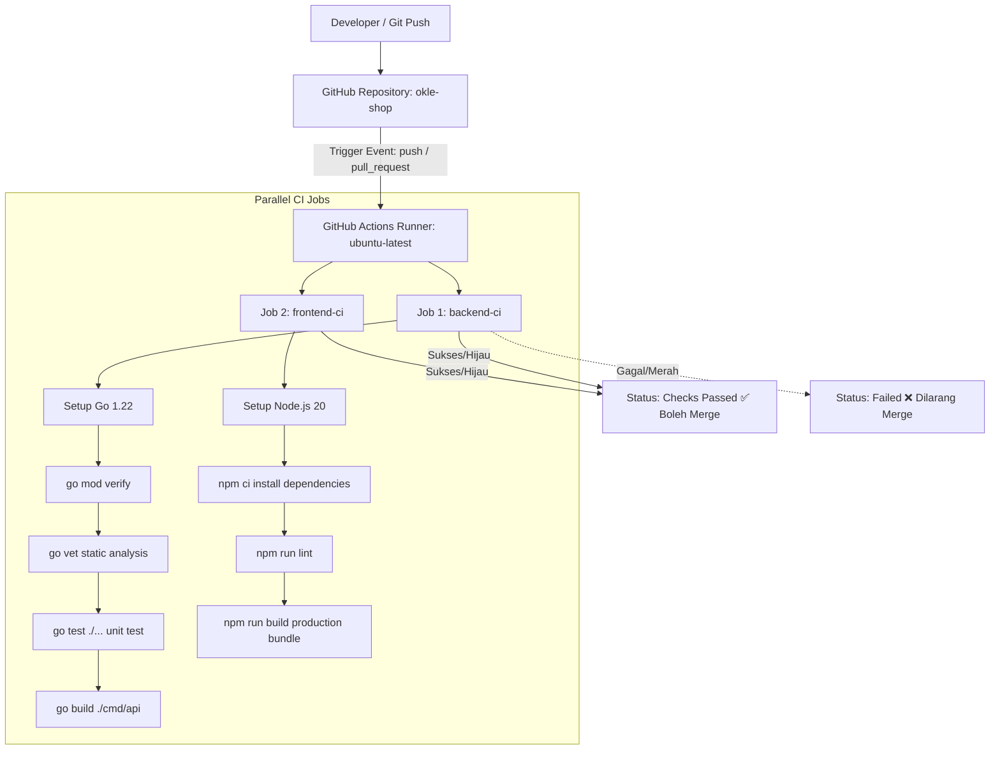

# Dokumen CI Pipeline Pertama dengan GitHub Actions (Hari 10)
**Aplikasi:** Okle Shop (E-Commerce Platform)  
**Teknologi:** GitHub Actions, Go Test & Vet, Node.js Build, CI Workflow  
**Status:** Disetujui (Hari 10 & Fase 1 Selesai)  
**Terakhir Diperbarui:** 2026-09-30  

---

## 1. Konsep & Arsitektur Continuous Integration (CI)

Hari ke-10 adalah **tonggak penutup Fase 1 (Hari 1 – 10)**. Tujuannya adalah memasang **"Robot Satpam Otomatis" (CI Pipeline)** menggunakan **GitHub Actions**.

Setiap kali Anda atau rekan tim melakukan `git push` atau membuat `Pull Request` ke branch `main`, GitHub akan otomatis menyalakan server Ubuntu virtual di cloud dan menguji kode Anda:



### Mengapa CI Sangat Penting Sebelum Masuk Fase 2?
1. **Mencegah Kerusakan Kode di Server Produksi:** Jika ada salah ketik kode di Go atau ada sintaks JSX yang rusak di React, robot CI akan langsung menolaknya.
2. **Otomatisasi Uji Coba:** Anda tidak perlu menguji manual satu per satu setiap kali ada perubahan kode.

---

## 2. Struktur Folder Alur Kerja GitHub Actions

Di root proyek Anda, buat folder khusus `.github/workflows/`:
```text
okle-shop/
└── .github/
    └── workflows/
        └── ci.yml   # File konfigurasi alur kerja CI
```

---

## 3. Acuan File Konfigurasi: `.github/workflows/ci.yml`

Berikut adalah skrip workflow CI modern yang menjalankan pengujian **Backend** dan **Frontend** secara paralel:

```yaml
name: CI Pipeline (Backend & Frontend)

# Event pemicu: Berjalan setiap ada push atau pull request ke branch utama
on:
  push:
    branches: [ main, master, develop ]
  pull_request:
    branches: [ main, master ]

jobs:
  # =============================================================
  # Job 1: Verifikasi Backend Golang
  # =============================================================
  backend-ci:
    name: Backend Lint, Test & Build
    runs-on: ubuntu-latest
    defaults:
      run:
        working-directory: backend

    steps:
      - name: 1. Checkout Repository Code
        uses: actions/checkout@v4

      - name: 2. Setup Golang Environment
        uses: actions/setup-go@v5
        with:
          go-version: '1.22'
          cache: true
          cache-dependency-path: backend/go.sum

      - name: 3. Verifikasi Dependensi Go
        run: |
          go mod verify

      - name: 4. Static Code Analysis (Go Vet)
        run: |
          go vet ./...

      - name: 5. Jalankan Unit Test
        run: |
          go test -v -race ./...

      - name: 6. Uji Kompilasi Build Binary
        run: |
          go build -v -o /dev/null ./cmd/api

  # =============================================================
  # Job 2: Verifikasi Frontend React Vite
  # =============================================================
  frontend-ci:
    name: Frontend Lint & Build
    runs-on: ubuntu-latest
    defaults:
      run:
        working-directory: frontend

    steps:
      - name: 1. Checkout Repository Code
        uses: actions/checkout@v4

      - name: 2. Setup Node.js Environment
        uses: actions/setup-node@v4
        with:
          node-version: 20
          cache: 'npm'
          cache-dependency-path: frontend/package-lock.json

      - name: 3. Install Dependensi Bersih (npm ci)
        run: |
          npm ci

      - name: 4. Uji Kompilasi Bundle Produksi (Vite Build)
        run: |
          npm run build
```

---

## 4. Bedah Perintah Kritis di Dalam CI

1. **`actions/setup-go@v5` dengan `cache: true`:**
   GitHub Actions otomatis menyimpan cache folder `pkg/mod`. Hasilnya: saat CI berjalan untuk kedua kalinya, Go tidak perlu mendownload ulang dependensi dari internet (hemat waktu CI hingga 70%).
2. **`go vet ./...`:**
   Pemeriksaan statis bawaan Go untuk mendeteksi *deadlock*, *unreachable code*, atau format cetak `printf` yang salah ketik.
3. **`go test -v -race ./...`:**
   Flag `-race` adalah fitur detektor canggih Go untuk mendeteksi potensi *Race Condition* pada memori saat ada dua goroutine yang mengakses data bersamaan.
4. **`npm ci` (Bukan `npm install`):**
   Pada server CI, perintah yang wajib digunakan adalah `npm ci` (*Clean Install*). Perintah ini menginstal dependensi dengan versi yang persis 100% sama dengan yang tercatat di `package-lock.json`.
5. **`npm run build`:**
   Memverifikasi bahwa seluruh komponen React, file Tailwind CSS, dan aset Vite dapat dikompilasi menjadi bundle statis tanpa error TypeScript/JSX.

---

## 5. Cara Menguji Workflow CI Secara Lokal / di GitHub

1. Buat folder `.github/workflows/` di root workspace Anda.
2. Tulis file `ci.yml` sesuai acuan di atas.
3. Lakukan commit dan push ke repositori GitHub Anda:
   ```powershell
   git add .
   git commit -m "feat: setup initial CI pipeline for backend and frontend"
   git push origin main
   ```
4. Buka tab **Actions** di repositori GitHub Anda di browser.
5. Anda akan melihat workflow **CI Pipeline (Backend & Frontend)** berjalan dengan indikator kuning (sedang memproses) dan berubah menjadi **dua centang hijau ✅** jika semua pengujian berhasil!

---

## 6. 🎉 Pencapaian Akhir: FASE 1 SELESAI (Hari 1 – 10)

Selamat! Dengan terselesaikannya Hari ke-10, **Fase 1 (Fondasi, Arsitektur & Infrastruktur)** telah rampung 100%:

| Hari | Pencapaian Milestone Fase 1 | Status |
| :---: | :--- | :---: |
| **Hari 1** | Analisis Kebutuhan Fungsional & Batasan Fitur MVP | Selesai ✅ |
| **Hari 2** | Perancangan ERD Relasional & Kamus Data Transaksi | Selesai ✅ |
| **Hari 3** | Finalisasi DDL MySQL & Strategi Indeks Komposit | Selesai ✅ |
| **Hari 4** | Setup Container Docker MySQL 8 & Persistent Volume | Selesai ✅ |
| **Hari 5** | Inisialisasi GORM v1.25+, Connection Pooling & Logger | Selesai ✅ |
| **Hari 6** | Model Entitas Berbasis `gorm.Model` & CLI Migrasi | Selesai ✅ |
| **Hari 7** | Backend Clean Architecture (Fiber, Middleware, Response Formatter) | Selesai ✅ |
| **Hari 8** | Frontend Scaffolding (React 18, Vite, Tailwind CSS v3) | Selesai ✅ |
| **Hari 9** | Docker Compose Stack Lengkap (Air Live-Reload & Vite HMR) | Selesai ✅ |
| **Hari 10**| **Automated CI Pipeline (GitHub Actions) untuk Backend & Frontend** | **Selesai ✅** |

---

## 7. Langkah Menuju FASE 2: Autentikasi, User & RBAC (Hari 11 – 25)
Besok kita resmi memasuki **Fase 2**:
* **Hari 11:** Perancangan Modul Registrasi User: Validasi Request Input (`go-playground/validator`), Hashing Password aman dengan `bcrypt`, dan GORM Hook `BeforeCreate`.
