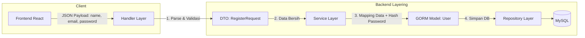

# Dokumen Desain DTO Autentikasi, Validator & User Repository (Hari 11)
**Aplikasi:** Okle Shop (E-Commerce Platform)  
**Fase:** FASE 2 - Autentikasi, Manajemen Pengguna & RBAC (Hari 11 – 25)  
**Teknologi:** Golang 1.22+, GORM, go-playground/validator v10, DTO Pattern  
**Status:** Disetujui (Hari 11 Selesai)  
**Terakhir Diperbarui:** 2026-10-01  

---

## 1. Konsep Pemisahan: Model Database vs DTO (Data Transfer Object)

Selamat datang di **Fase 2**! Mulai hari ini kita membangun fitur bisnis autentikasi.

Salah satu prinsip keamanan terpenting dalam pengembangan web adalah:  
> **"Jangan pernah menggunakan Struct Model Database untuk menerima data Request HTTP secara langsung!"**



### Bahaya Fatal Jika Tanpa DTO: *Mass Assignment Vulnerability*
Jika Anda langsung me-binding JSON request ke struct `model.User`:
* Pengguna jahat bisa mengirim payload JSON seperti ini:
  ```json
  {
    "name": "Hacker",
    "email": "hacker@evil.com",
    "password": "secret",
    "role": "ADMIN"
  }
  ```
* Jika tidak ada DTO penyaring, pengguna biasa bisa langsung mendaftar sebagai **ADMIN** toko Anda!
* **Solusi DTO:** Struct `RegisterRequest` **hanya memiliki field `Name`, `Email`, `Password`, dan `Phone`**. Apapun field lain yang dikirim oleh penyerang (seperti `role`) akan otomatis diabaikan.

---

## 2. Struktur Direktori Baru di `backend/internal/`

Di Hari 11, kita menambahkan dua folder arsitektur penting:

```text
backend/internal/
├── dto/                   # Data Transfer Object (Request & Response payloads)
│   └── auth_dto.go        # DTO Registrasi, Login & Profil
└── repository/            # Lapisan akses data MySQL via GORM
    └── user_repository.go # Operasi query CRUD khusus tabel users
```

---

## 3. Acuan Kode & Konfigurasi File

### 3.1 Install Library Validator
Jalankan di folder `backend/`:
```powershell
cd backend
go get -u github.com/go-playground/validator/v10
```

---

### 3.2 File DTO: `backend/internal/dto/auth_dto.go`
File ini mendefinisikan kontrak data yang masuk dan keluar dari API Autentikasi:

```go
package dto

import "time"

// RegisterRequest mendefinisikan payload JSON yang diterima saat user registrasi
type RegisterRequest struct {
	Name     string `json:"name" validate:"required,min=3,max=100"`
	Email    string `json:"email" validate:"required,email"`
	Password string `json:"password" validate:"required,min=8,max=100"`
	Phone    string `json:"phone" validate:"omitempty,min=10,max=15"`
}

// LoginRequest mendefinisikan payload JSON saat login
type LoginRequest struct {
	Email    string `json:"email" validate:"required,email"`
	Password string `json:"password" validate:"required"`
}

// UserResponse adalah format aman data profil user yang dikembalikan ke Frontend
// (Tidak pernah membocorkan password_hash)
type UserResponse struct {
	ID        uint      `json:"id"`
	Name      string    `json:"name"`
	Email     string    `json:"email"`
	Phone     string    `json:"phone"`
	Role      string    `json:"role"`
	CreatedAt time.Time `json:"created_at"`
}

// LoginResponse mengembalikan token JWT dan profil user
type LoginResponse struct {
	AccessToken  string       `json:"access_token"`
	RefreshToken string       `json:"refresh_token"`
	User         UserResponse `json:"user"`
}
```

---

### 3.3 Helper Validator Terpusat: `backend/pkg/validator/validator.go`
Helper untuk menerjemahkan error validasi menjadi pesan yang ramah bagi Frontend React:

```go
package validator

import (
	"fmt"
	"strings"

	"github.com/go-playground/validator/v10"
)

var validate = validator.New()

type ValidationErrorResponse struct {
	Field   string `json:"field"`
	Message string `json:"message"`
}

// ValidateStruct memeriksa validasi struct dan mengembalikan daftar pesan error
func ValidateStruct(s interface{}) []ValidationErrorResponse {
	var errs []ValidationErrorResponse

	err := validate.Struct(s)
	if err != nil {
		for _, err := range err.(validator.ValidationErrors) {
			field := strings.ToLower(err.Field())
			var msg string

			switch err.Tag() {
			case "required":
				msg = fmt.Sprintf("%s wajib diisi", field)
			case "email":
				msg = fmt.Sprintf("%s harus berupa format email yang valid", field)
			case "min":
				msg = fmt.Sprintf("%s minimal harus %s karakter", field, err.Param())
			case "max":
				msg = fmt.Sprintf("%s maksimal %s karakter", field, err.Param())
			default:
				msg = fmt.Sprintf("%s tidak valid", field)
			}

			errs = append(errs, ValidationErrorResponse{
				Field:   field,
				Message: msg,
			})
		}
	}

	return errs
}
```

---

### 3.4 Interface & Repository: `backend/internal/repository/user_repository.go`
Lapisan yang bertugas menjalankan query database MySQL khusus untuk data user:

```go
package repository

import (
	"errors"
	"okle-shop/internal/model"

	"gorm.io/gorm"
)

type UserRepository interface {
	Create(user *model.User) error
	FindByEmail(email string) (*model.User, error)
	FindByID(id uint) (*model.User, error)
	IsEmailExist(email string) (bool, error)
}

type userRepository struct {
	db *gorm.DB
}

func NewUserRepository(db *gorm.DB) UserRepository {
	return &userRepository{db: db}
}

// Create menyimpan data user baru ke database
func (r *userRepository) Create(user *model.User) error {
	return r.db.Create(user).Error
}

// FindByEmail mencari user berdasarkan alamat email
func (r *userRepository) FindByEmail(email string) (*model.User, error) {
	var user model.User
	err := r.db.Where("email = ?", email).First(&user).Error
	if err != nil {
		if errors.Is(err, gorm.ErrRecordNotFound) {
			return nil, nil // user tidak ditemukan (bukan error sistem)
		}
		return nil, err
	}
	return &user, nil
}

// FindByID mencari user berdasarkan ID
func (r *userRepository) FindByID(id uint) (*model.User, error) {
	var user model.User
	err := r.db.Preload("Addresses").First(&user, id).Error
	if err != nil {
		if errors.Is(err, gorm.ErrRecordNotFound) {
			return nil, nil
		}
		return nil, err
	}
	return &user, nil
}

// IsEmailExist mengecek apakah email sudah terdaftar sebelumnya
func (r *userRepository) IsEmailExist(email string) (bool, error) {
	var count int64
	err := r.db.Model(&model.User{}).Where("email = ?", email).Count(&count).Error
	if err != nil {
		return false, err
	}
	return count > 0, nil
}
```

---

## 4. Keunggulan Desain Ini untuk Keamanan & Pengujian

1. **Anti-Leakage (Bebas Kebocoran Password):**  
   Dengan adanya `UserResponse`, kita menjamin 100% bahwa field hash password tidak akan pernah terkirim ke jaringan publik.
2. **Interface Abstraction (`UserRepository`):**  
   Dengan mendefinisikan interface, kita akan sangat mudah melakukan **Unit Testing** di kemudian hari tanpa harus menyalakan database MySQL asli (*Mocking*).
3. **Pesan Validasi Terstruktur:**  
   Frontend React dapat langsung menampilkan pesan error di bawah masing-masing input field (misal: "email harus berupa format email yang valid").

---

## 5. Kesimpulan Hari 11 & Langkah Menuju Hari 12
- **Hari 11 (DTO Autentikasi, Validator & User Repository): SELESAI ✅**
- **Hari 12 (Selanjutnya):** Registrasi Service: Hashing Password dengan `bcrypt`, validasi logika bisnis duplikasi email, dan pembuatan endpoint API `POST /api/v1/auth/register`.
