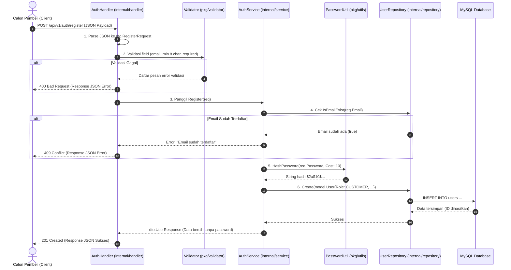

# Dokumen Registrasi User, Hashing Bcrypt & Endpoint API (Hari 12)
**Aplikasi:** Okle Shop (E-Commerce Platform)  
**Fase:** FASE 2 - Autentikasi, Manajemen Pengguna & RBAC (Hari 11 – 25)  
**Teknologi:** Golang 1.22+, Fiber v2, golang.org/x/crypto/bcrypt, Clean Architecture  
**Status:** Disetujui (Hari 12 Selesai)  
**Terakhir Diperbarui:** 2026-10-02  

---

## 1. Konsep & Arsitektur Alur Registrasi

Di Hari 12, kita mengimplementasikan fungsionalitas registrasi pengguna baru dari hulu ke hilir (*End-to-End*) mengikuti prinsip **Clean Architecture**:



---

## 2. Mengapa Menggunakan `bcrypt`?

Menyimpan password pengguna secara *plain-text* adalah pelanggaran keamanan fatal.
* **Mengapa tidak menggunakan MD5 atau SHA-256?**  
  MD5 dan SHA-256 dibuat untuk kecepatan (*hashing data berukuran gigabyte*). GPU modern dapat menghitung **milyaran hash per detik**, sehingga hacker sangat mudah menebak password menggunakan *Rainbow Tables* atau *Brute Force*.
* **Mengapa `bcrypt`?**  
  1. **Algoritma Lambat yang Aman (*Key Stretching*):** Bcrypt sengaja didesain membutuhkan waktu komputasi (kita pakai *Cost Factor 10* = ~50 – 100 ms per hash). Serangan brute force menjadi mustahil secara matematis.
  2. **Garam Otomatis (*Auto Salt*):** Bcrypt otomatis menghasilkan string acak (*Salt*) untuk setiap password. Dua pengguna dengan password yang sama persis (misal `"rahasia123"`) akan menghasilkan string hash yang **sama sekali berbeda di database**.

---

## 3. Acuan Kode & Konfigurasi File

### 3.1 Install Library Enkripsi Bcrypt
Jalankan perintah ini di folder `backend/`:
```powershell
cd backend
go get -u golang.org/x/crypto/bcrypt
```

---

### 3.2 Helper Password: `backend/pkg/utils/password.go`
Helper utilitas untuk hashing dan perbandingan password:

```go
package utils

import (
	"fmt"

	"golang.org/x/crypto/bcrypt"
)

// HashPassword mengenkripsi plain password menjadi hash bcrypt (Cost 10)
func HashPassword(password string) (string, error) {
	bytes, err := bcrypt.GenerateFromPassword([]byte(password), bcrypt.DefaultCost)
	if err != nil {
		return "", fmt.Errorf("gagal mengenkripsi password: %w", err)
	}
	return string(bytes), nil
}

// CheckPasswordHash membandingkan plain password dengan hash yang tersimpan di DB
func CheckPasswordHash(password, hash string) bool {
	err := bcrypt.CompareHashAndPassword([]byte(hash), []byte(password))
	return err == nil
}
```

---

### 3.3 Service Layer: `backend/internal/service/auth_service.go`
Pusat logika bisnis registrasi dan mapping data:

```go
package service

import (
	"errors"
	"fmt"
	"okle-shop/internal/dto"
	"okle-shop/internal/model"
	"okle-shop/internal/repository"
	"okle-shop/pkg/utils"
)

type AuthService interface {
	Register(req dto.RegisterRequest) (*dto.UserResponse, error)
}

type authService struct {
	userRepo repository.UserRepository
}

func NewAuthService(userRepo repository.UserRepository) AuthService {
	return &authService{userRepo: userRepo}
}

// Register menangani alur pendaftaran user baru
func (s *authService) Register(req dto.RegisterRequest) (*dto.UserResponse, error) {
	// 1. Validasi Bisnis: Cek apakah email sudah dipakai
	exists, err := s.userRepo.IsEmailExist(req.Email)
	if err != nil {
		return nil, fmt.Errorf("gagal memeriksa ketersediaan email: %w", err)
	}
	if exists {
		return nil, errors.New("email sudah terdaftar, gunakan email lain")
	}

	// 2. Enkripsi password menggunakan bcrypt
	hashedPassword, err := utils.HashPassword(req.Password)
	if err != nil {
		return nil, err
	}

	// 3. Siapkan entity model User dengan role default CUSTOMER
	user := model.User{
		Name:         req.Name,
		Email:        req.Email,
		PasswordHash: hashedPassword,
		Phone:        req.Phone,
		Role:         model.RoleCustomer,
	}

	// 4. Simpan ke database melalui repository
	if err := s.userRepo.Create(&user); err != nil {
		return nil, fmt.Errorf("gagal menyimpan data user: %w", err)
	}

	// 5. Kembalikan data profil aman (UserResponse tanpa password_hash)
	response := &dto.UserResponse{
		ID:        user.ID,
		Name:      user.Name,
		Email:     user.Email,
		Phone:     user.Phone,
		Role:      string(user.Role),
		CreatedAt: user.CreatedAt,
	}

	return response, nil
}
```

---

### 3.4 Handler Layer: `backend/internal/handler/auth_handler.go`
Pintu masuk komunikasi HTTP yang menangani request/response registrasi:

```go
package handler

import (
	"okle-shop/internal/dto"
	"okle-shop/internal/service"
	"okle-shop/pkg/response"
	"okle-shop/pkg/validator"

	"github.com/gofiber/fiber/v2"
)

type AuthHandler struct {
	authService service.AuthService
}

func NewAuthHandler(authService service.AuthService) *AuthHandler {
	return &AuthHandler{authService: authService}
}

// Register menangani endpoint POST /api/v1/auth/register
func (h *AuthHandler) Register(c *fiber.Ctx) error {
	var req dto.RegisterRequest

	// 1. Parsing JSON request body
	if err := c.BodyParser(&req); err != nil {
		return response.Error(c, fiber.StatusBadRequest, "Format JSON tidak valid", nil)
	}

	// 2. Validasi input request
	if validationErrors := validator.ValidateStruct(req); len(validationErrors) > 0 {
		return response.Error(c, fiber.StatusBadRequest, "Validasi input gagal", validationErrors)
	}

	// 3. Panggil business service
	userResponse, err := h.authService.Register(req)
	if err != nil {
		// Jika error karena email duplikat
		if err.Error() == "email sudah terdaftar, gunakan email lain" {
			return response.Error(c, fiber.StatusConflict, err.Error(), nil)
		}
		// Error internal lainnya
		return response.Error(c, fiber.StatusInternalServerError, err.Error(), nil)
	}

	// 4. Kembalikan response sukses 201 Created
	return response.Success(c, fiber.StatusCreated, "Registrasi berhasil", userResponse)
}
```

---

### 3.5 Daftarkan Endpoint di `backend/cmd/api/main.go`
Perbarui bagian inisialisasi repository, service, handler, dan routing di file `cmd/api/main.go`:

```go
// Di dalam func main():

// 5. Setup Repository & Service (Clean Architecture)
userRepo := repository.NewUserRepository(db)
authService := service.NewAuthService(userRepo)

// 6. Setup Handler
healthHandler := handler.NewHealthHandler(db)
authHandler := handler.NewAuthHandler(authService)

// 7. Setup Routing API
api := app.Group("/api/v1")
api.Get("/health", healthHandler.Check)

// Auth Routes Group
authGroup := api.Group("/auth")
authGroup.Post("/register", authHandler.Register)
```

---

## 4. Cara Pengujian & Verifikasi Endpoint Registrasi

Pastikan container Docker Anda menyala (`docker compose -f docker-compose.dev.yml up -d`) atau jalankan backend secara lokal (`go run cmd/api/main.go`).

### Test 1: Uji Registrasi Sukses (Happy Path)
Kirim request via PowerShell / Terminal:
```powershell
curl -X POST http://localhost:8000/api/v1/auth/register `
  -H "Content-Type: application/json" `
  -d '{"name": "Budi Santoso", "email": "budi@example.com", "password": "password123", "phone": "08123456789"}'
```
**Respon yang Diharapkan (HTTP 201 Created):**
```json
{
  "success": true,
  "message": "Registrasi berhasil",
  "data": {
    "id": 1,
    "name": "Budi Santoso",
    "email": "budi@example.com",
    "phone": "08123456789",
    "role": "CUSTOMER",
    "created_at": "2026-10-02T08:00:00Z"
  }
}
```

---

### Test 2: Uji Validasi Input Gagal (Password Terlalu Pendek & Email Salah)
```powershell
curl -X POST http://localhost:8000/api/v1/auth/register `
  -H "Content-Type: application/json" `
  -d '{"name": "Bu", "email": "bukan-email", "password": "123"}'
```
**Respon yang Diharapkan (HTTP 400 Bad Request):**
```json
{
  "success": false,
  "message": "Validasi input gagal",
  "errors": [
    { "field": "name", "message": "name minimal harus 3 karakter" },
    { "field": "email", "message": "email harus berupa format email yang valid" },
    { "field": "password", "message": "password minimal harus 8 karakter" }
  ]
}
```

---

### Test 3: Uji Coba Duplikasi Email (Email Sama Didaftarkan Ulang)
Jalankan kembali Test 1 dengan email `"budi@example.com"`.  
**Respon yang Diharapkan (HTTP 409 Conflict):**
```json
{
  "success": false,
  "message": "email sudah terdaftar, gunakan email lain"
}
```

---

### Test 4: Verifikasi Enkripsi di Database MySQL
Periksa langsung isi tabel `users` di dalam container MySQL:
```powershell
docker exec -it okle_mysql_dev mysql -u okle_user -pokle_password123 okle_shop_dev -e "SELECT id, name, email, password_hash, role FROM users;"
```
*Pastikan kolom `password_hash` berisi string acak panjang yang diawali `$2a$10$...` dan TIDAK terbaca kata `"password123"`!*

---

## 5. Kesimpulan Hari 12 & Langkah Menuju Hari 13
- **Hari 12 (Service Registrasi, Hashing Bcrypt & API Register): SELESAI ✅**
- **Hari 13 (Selanjutnya):** Modul Login & Autentikasi JWT: Validasi kredensial password, pembuatan Access Token (durasi pendek 15m) dan Refresh Token (durasi panjang 7d) menggunakan `golang-jwt/jwt/v5`.
