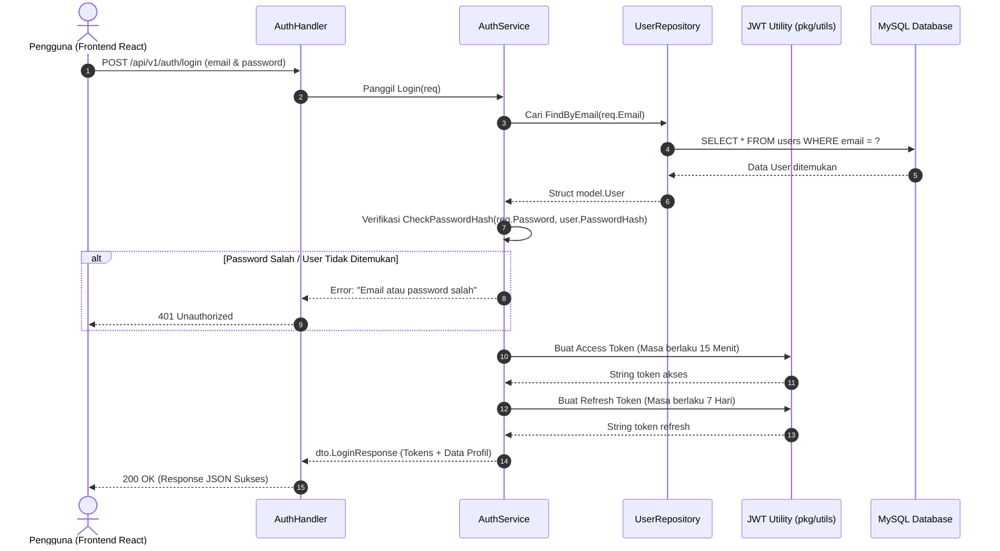

# Dokumen Implementasi Login & Autentikasi JWT (Hari 13)
**Aplikasi:** Okle Shop (E-Commerce Platform)  
**Fase:** FASE 2 - Autentikasi, Manajemen Pengguna & RBAC (Hari 11 – 25)  
**Teknologi:** Golang 1.22+, Fiber v2, golang-jwt/jwt/v5, Dual-Token Architecture  
**Status:** Disetujui (Hari 13 Selesai)  
**Terakhir Diperbarui:** 2026-10-02  

---

## 1. Konsep & Arsitektur JSON Web Token (JWT)

Di Hari 13, kita mengimplementasikan sistem login menggunakan standar industri **JWT (RFC 7519)** dengan arsitektur **Dual-Token** (*Access Token + Refresh Token*).



---

## 2. Mengapa Menggunakan "Dual-Token" (Access + Refresh)?

Menyimpan token yang berlaku selamanya (*lifetime*) adalah bencana keamanan: jika token dicuri hacker lewat script XSS di browser, akun korban bisa dibajak selamanya.

| Tipe Token | Masa Berlaku | Tempat Penyimpanan | Fungsi Utama |
| :--- | :--- | :--- | :--- |
| **Access Token** | **15 Menit** *(Durasi Pendek)* | Memory / Header Authorization | Dibawa pada setiap request API untuk mengakses data profil, keranjang, atau checkout. Jika dicuri, token akan otomatis mati dalam 15 menit. |
| **Refresh Token** | **7 Hari** *(Durasi Panjang)* | Penyimpanan Aman (Cookie HttpOnly / DB) | Hanya digunakan untuk meminta Access Token baru ke endpoint `/refresh` tanpa memaksa pengguna mengetik password berulang kali. |

---

## 3. Anatomi Klaim Data JWT (*Custom Claims*)

JWT terdiri dari 3 bagian: `Header.Payload.Signature`.  
Di dalam **Payload**, kita menyisipkan klaim (*claims*) data pengguna:

```json
{
  "user_id": 1,
  "email": "budi@example.com",
  "role": "CUSTOMER",
  "exp": 1759400000,
  "iat": 1759399100
}
```
> [!IMPORTANT]
> **Payload JWT BUKAN Data Terenkripsi!**  
> Payload hanya di-encode dalam format Base64Url (siapapun bisa membacanya). Oleh karena itu, **DILARANG KERAS** menyisipkan data rahasia seperti `password_hash` ke dalam klaim JWT!

---

## 4. Acuan Kode & Konfigurasi File

### 4.1 Install Library JWT Resmi: `golang-jwt/jwt/v5`
Jalankan perintah ini di dalam folder `backend/`:
```powershell
cd backend
go get -u github.com/golang-jwt/jwt/v5
```

---

### 4.2 Tambahkan Variabel Konfigurasi di `.env`
Buka file `.env` di root proyek dan tambahkan kunci rahasia JWT:

```ini
# ==========================================
# Konfigurasi JWT (JSON Web Token)
# ==========================================
JWT_SECRET=super_secret_okle_shop_jwt_key_production_2026_xyz
JWT_ACCESS_DURATION_MINUTES=15
JWT_REFRESH_DURATION_DAYS=7
```

---

### 4.3 Helper JWT: `backend/pkg/utils/jwt.go`
File utilitas untuk menghasilkan (*generate*) dan memvalidasi (*verify*) token JWT:

```go
package utils

import (
	"errors"
	"fmt"
	"time"

	"github.com/golang-jwt/jwt/v5"
)

// JwtCustomClaims menyimpan informasi pengguna di dalam payload token
type JwtCustomClaims struct {
	UserID uint   `json:"user_id"`
	Email  string `json:"email"`
	Role   string `json:"role"`
	jwt.RegisteredClaims
}

// GenerateToken membuat token JWT baru dengan masa berlaku tertentu
func GenerateToken(userID uint, email, role, secret string, duration time.Duration) (string, error) {
	claims := JwtCustomClaims{
		UserID: userID,
		Email:  email,
		Role:   role,
		RegisteredClaims: jwt.RegisteredClaims{
			ExpiresAt: jwt.NewNumericDate(time.Now().Add(duration)),
			IssuedAt:  jwt.NewNumericDate(time.Now()),
			NotBefore: jwt.NewNumericDate(time.Now()),
			Issuer:    "okle-shop",
		},
	}

	token := jwt.NewWithClaims(jwt.SigningMethodHS256, claims)
	signedToken, err := token.SignedString([]byte(secret))
	if err != nil {
		return "", fmt.Errorf("gagal menandatangani token: %w", err)
	}

	return signedToken, nil
}

// ValidateToken memverifikasi keaslian signature dan masa kedaluwarsa token
func ValidateToken(tokenString, secret string) (*JwtCustomClaims, error) {
	token, err := jwt.ParseWithClaims(tokenString, &JwtCustomClaims{}, func(t *jwt.Token) (interface{}, error) {
		// Validasi algoritma signing wajib HMAC SHA256
		if _, ok := t.Method.(*jwt.SigningMethodHMAC); !ok {
			return nil, fmt.Errorf("metode signing tidak valid: %v", t.Header["alg"])
		}
		return []byte(secret), nil
	})

	if err != nil {
		return nil, err
	}

	claims, ok := token.Claims.(*JwtCustomClaims)
	if !ok || !token.Valid {
		return nil, errors.New("token tidak valid atau telah kedaluwarsa")
	}

	return claims, nil
}
```

---

### 4.4 Perbarui `backend/internal/service/auth_service.go`
Tambahkan metode `Login` ke interface dan implementasi `AuthService`:

```go
package service

import (
	"errors"
	"fmt"
	"os"
	"strconv"
	"time"

	"okle-shop/internal/dto"
	"okle-shop/internal/model"
	"okle-shop/internal/repository"
	"okle-shop/pkg/utils"
)

type AuthService interface {
	Register(req dto.RegisterRequest) (*dto.UserResponse, error)
	Login(req dto.LoginRequest) (*dto.LoginResponse, error) // <- Metode baru Hari 13
}

type authService struct {
	userRepo repository.UserRepository
}

func NewAuthService(userRepo repository.UserRepository) AuthService {
	return &authService{userRepo: userRepo}
}

// Register (sudah dibuat di Hari 12)...

// Login memverifikasi email dan password lalu menerbitkan Access & Refresh Token
func (s *authService) Login(req dto.LoginRequest) (*dto.LoginResponse, error) {
	// 1. Cari user berdasarkan email
	user, err := s.userRepo.FindByEmail(req.Email)
	if err != nil {
		return nil, fmt.Errorf("gagal memproses data login: %w", err)
	}
	// Pesan generik demi keamanan agar penyerang tidak bisa menebak email yang terdaftar
	if user == nil {
		return nil, errors.New("email atau password salah")
	}

	// 2. Verifikasi password hash bcrypt
	if !utils.CheckPasswordHash(req.Password, user.PasswordHash) {
		return nil, errors.New("email atau password salah")
	}

	// 3. Baca konfigurasi JWT dari environment variable
	jwtSecret := os.Getenv("JWT_SECRET")
	if jwtSecret == "" {
		jwtSecret = "default_fallback_secret_key"
	}

	accessDurationMinutes, _ := strconv.Atoi(os.Getenv("JWT_ACCESS_DURATION_MINUTES"))
	if accessDurationMinutes <= 0 {
		accessDurationMinutes = 15 // default 15 menit
	}

	refreshDurationDays, _ := strconv.Atoi(os.Getenv("JWT_REFRESH_DURATION_DAYS"))
	if refreshDurationDays <= 0 {
		refreshDurationDays = 7 // default 7 hari
	}

	// 4. Generate Access Token (Durasi Pendek)
	accessToken, err := utils.GenerateToken(
		user.ID,
		user.Email,
		string(user.Role),
		jwtSecret,
		time.Duration(accessDurationMinutes)*time.Minute,
	)
	if err != nil {
		return nil, err
	}

	// 5. Generate Refresh Token (Durasi Panjang)
	refreshToken, err := utils.GenerateToken(
		user.ID,
		user.Email,
		string(user.Role),
		jwtSecret,
		time.Duration(refreshDurationDays)*24*time.Hour,
	)
	if err != nil {
		return nil, err
	}

	// 6. Susun response sukses
	response := &dto.LoginResponse{
		AccessToken:  accessToken,
		RefreshToken: refreshToken,
		User: dto.UserResponse{
			ID:        user.ID,
			Name:      user.Name,
			Email:     user.Email,
			Phone:     user.Phone,
			Role:      string(user.Role),
			CreatedAt: user.CreatedAt,
		},
	}

	return response, nil
}
```

---

### 4.5 Perbarui `backend/internal/handler/auth_handler.go`
Tambahkan fungsi HTTP handler untuk endpoint `Login`:

```go
// Tambahkan di dalam auth_handler.go:

// Login menangani endpoint POST /api/v1/auth/login
func (h *AuthHandler) Login(c *fiber.Ctx) error {
	var req dto.LoginRequest

	// 1. Parsing JSON request body
	if err := c.BodyParser(&req); err != nil {
		return response.Error(c, fiber.StatusBadRequest, "Format JSON tidak valid", nil)
	}

	// 2. Validasi input request (email & password wajib diisi)
	if validationErrors := validator.ValidateStruct(req); len(validationErrors) > 0 {
		return response.Error(c, fiber.StatusBadRequest, "Validasi input gagal", validationErrors)
	}

	// 3. Panggil business service
	loginResponse, err := h.authService.Login(req)
	if err != nil {
		if err.Error() == "email atau password salah" {
			return response.Error(c, fiber.StatusUnauthorized, err.Error(), nil)
		}
		return response.Error(c, fiber.StatusInternalServerError, err.Error(), nil)
	}

	// 4. Kembalikan response sukses 200 OK beserta Token
	return response.Success(c, fiber.StatusOK, "Login berhasil", loginResponse)
}
```

---

### 4.6 Daftarkan Route Login di `backend/cmd/api/main.go`
Tambahkan rute login pada group auth di `main.go`:

```go
// Auth Routes Group
authGroup := api.Group("/auth")
authGroup.Post("/register", authHandler.Register)
authGroup.Post("/login", authHandler.Login) // <- Rute Baru Hari 13
```

---

## 5. Cara Pengujian & Verifikasi Endpoint Login

Nyalakan server (`go run cmd/api/main.go` atau via Docker Compose).

### Test 1: Uji Login Sukses (Happy Path)
Gunakan akun yang telah didaftarkan pada Hari 12:
```powershell
curl -X POST http://localhost:8000/api/v1/auth/login `
  -H "Content-Type: application/json" `
  -d '{"email": "budi@example.com", "password": "password123"}'
```
**Respon yang Diharapkan (HTTP 200 OK):**
```json
{
  "success": true,
  "message": "Login berhasil",
  "data": {
    "access_token": "eyJhbGciOiJIUzI1NiIsInR5cCI6IkpXVCJ9...",
    "refresh_token": "eyJhbGciOiJIUzI1NiIsInR5cCI6IkpXVCJ9...",
    "user": {
      "id": 1,
      "name": "Budi Santoso",
      "email": "budi@example.com",
      "phone": "08123456789",
      "role": "CUSTOMER",
      "created_at": "2026-10-02T08:00:00Z"
    }
  }
}
```

---

### Test 2: Uji Login Password Salah (HTTP 401 Unauthorized)
```powershell
curl -X POST http://localhost:8000/api/v1/auth/login `
  -H "Content-Type: application/json" `
  -d '{"email": "budi@example.com", "password": "passwordSALAH"}'
```
**Respon yang Diharapkan:**
```json
{
  "success": false,
  "message": "email atau password salah"
}
```

---

### Test 3: Inspeksi Isi Token di Browser
1. Buka situs penyedia dekode resmi: **[jwt.io](https://jwt.io)**.
2. Salin string `access_token` dari hasil Test 1 dan tempelkan ke kolom *Encoded*.
3. Periksa bagian *Payload Data*: Anda akan melihat `user_id: 1`, `email: "budi@example.com"`, `role: "CUSTOMER"`, dan waktu expired `exp` tepat 15 menit dari waktu login.

---

## 6. Kesimpulan Hari 13 & Langkah Menuju Hari 14
- **Hari 13 (Login User & Penerbitan JWT Token): SELESAI ✅**
- **Hari 14 (Selanjutnya):** Pembuatan Middleware JWT Auth di Fiber untuk memproteksi rute privat dan Middleware Pengecekan Peran (*Role-Based Access Control* / RBAC).
