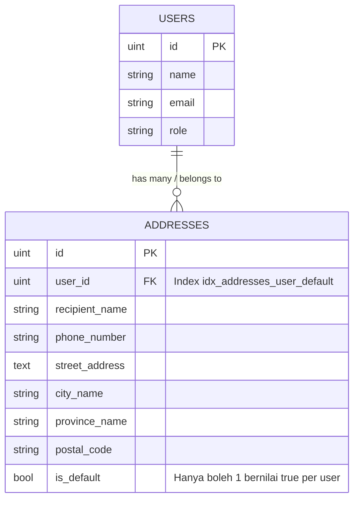

# Dokumen CRUD Manajemen Alamat Pengiriman Pengguna (Hari 16)
**Aplikasi:** Okle Shop (E-Commerce Platform)  
**Fase:** FASE 2 - Autentikasi, Manajemen Pengguna & RBAC (Hari 11 – 25)  
**Teknologi:** Golang 1.22+, Fiber v2, GORM v1.25+, Database Transaction, IDOR Security, Relasi BelongsTo  
**Status:** Disetujui (Hari 16)  
**Terakhir Diperbarui:** 2026-10-03  

---

## 1. Konsep & Arsitektur Manajemen Alamat

Dalam sistem e-commerce, alamat pengiriman (*shipping address*) adalah data krusial sebelum checkout pesanan. Satu pengguna (`User`) dapat memiliki banyak alamat (Rumah, Kantor, Kost), namun hanya ada **satu alamat utama (`is_default = true`)** yang otomatis terpilih saat berbelanja.



### 1.1 Aturan Bisnis Penting (Business Logic)
1. **Otomatis Alamat Utama Pertama:** Jika pengguna belum memiliki alamat sama sekali (count = 0), maka alamat pertama yang dibuat **wajib otomatis bernilai `is_default = true`**.
2. **Integritas Alamat Utama (Atomisitas Database):** Saat pengguna menandai sebuah alamat sebagai default (`is_default = true`), semua alamat lama milik user tersebut **harus diubah menjadi `false`** dalam satu transaksi database (`db.Transaction`) agar tidak terjadi inkonsistensi (*race condition*).
3. **Penanganan Saat Alamat Utama Dihapus:** Jika alamat yang dihapus adalah alamat utama dan user masih memiliki alamat lain, sistem otomatis memilih salah satu alamat tersisa untuk dijadikan alamat utama baru.
4. **Pencegahan Celah Keamanan IDOR (Insecure Direct Object Reference):** Pengguna tidak boleh melihat, mengubah, atau menghapus alamat milik pengguna lain hanya dengan menebak parameter `:id`. Setiap query database **wajib difilter ganda:** `WHERE id = ? AND user_id = ?`.

---

## 2. Struktur File Hari 16 di `backend/`

```text
backend/internal/
├── dto/
│   └── address_dto.go           # DTO Request & Response Alamat
├── repository/
│   └── address_repository.go    # Query GORM & Transaksi database
├── service/
│   └── address_service.go       # Validasi bisnis & aturan default address
├── handler/
│   └── address_handler.go       # Fiber Controller HTTP & parsing URL param
└── cmd/
    └── api/
        └── main.go              # Registrasi router grup /api/v1/addresses
```

---

## 3. Langkah Implementasi Kode

---

### Langkah 1: Buat DTO (`backend/internal/dto/address_dto.go`)
File ini mendefinisikan validasi payload JSON yang dikirim oleh frontend serta format kembalian data alamat yang aman.

Ketik kode berikut pada `backend/internal/dto/address_dto.go`:

```go
package dto

import "time"

// CreateAddressRequest payload JSON untuk membuat alamat baru
type CreateAddressRequest struct {
	RecipientName string `json:"recipient_name" validate:"required,min=3,max=100"`
	PhoneNumber   string `json:"phone_number" validate:"required,min=10,max=15"`
	StreetAddress string `json:"street_address" validate:"required,min=5"`
	CityName      string `json:"city_name" validate:"required,max=100"`
	ProvinceName  string `json:"province_name" validate:"required,max=100"`
	PostalCode    string `json:"postal_code" validate:"required,min=5,max=10"`
	IsDefault     bool   `json:"is_default"`
}

// UpdateAddressRequest payload JSON untuk memperbarui alamat yang sudah ada
type UpdateAddressRequest struct {
	RecipientName string `json:"recipient_name" validate:"required,min=3,max=100"`
	PhoneNumber   string `json:"phone_number" validate:"required,min=10,max=15"`
	StreetAddress string `json:"street_address" validate:"required,min=5"`
	CityName      string `json:"city_name" validate:"required,max=100"`
	ProvinceName  string `json:"province_name" validate:"required,max=100"`
	PostalCode    string `json:"postal_code" validate:"required,min=5,max=10"`
	IsDefault     bool   `json:"is_default"`
}

// AddressResponse format data alamat yang dikembalikan ke client
type AddressResponse struct {
	ID            uint      `json:"id"`
	UserID        uint      `json:"user_id"`
	RecipientName string    `json:"recipient_name"`
	PhoneNumber   string    `json:"phone_number"`
	StreetAddress string    `json:"street_address"`
	CityName      string    `json:"city_name"`
	ProvinceName  string    `json:"province_name"`
	PostalCode    string    `json:"postal_code"`
	IsDefault     bool      `json:"is_default"`
	CreatedAt     time.Time `json:"created_at"`
	UpdatedAt     time.Time `json:"updated_at"`
}
```

---

### Langkah 2: Buat Repository (`backend/internal/repository/address_repository.go`)
Repository menangani komunikasi langsung ke MySQL menggunakan GORM dengan penanganan transaksi database (`tx`).

Ketik kode berikut pada `backend/internal/repository/address_repository.go`:

```go
package repository

import (
	"errors"
	"okle-shop/internal/model"

	"gorm.io/gorm"
)

type AddressRepository interface {
	Create(address *model.Address) error
	FindByUserID(userID uint) ([]model.Address, error)
	FindByIDAndUserID(id uint, userID uint) (*model.Address, error)
	Update(address *model.Address) error
	Delete(id uint, userID uint) error
	SetDefault(id uint, userID uint) error
	CountByUserID(userID uint) (int64, error)
	UnsetOtherDefaults(userID uint, tx *gorm.DB) error
	FindLatestByUserID(userID uint) (*model.Address, error)
}

type addressRepository struct {
	db *gorm.DB
}

func NewAddressRepository(db *gorm.DB) AddressRepository {
	return &addressRepository{db: db}
}

// Create menyimpan alamat baru ke database
func (r *addressRepository) Create(address *model.Address) error {
	return r.db.Transaction(func(tx *gorm.DB) error {
		// Jika alamat baru ditandai sebagai default, reset alamat lainnya
		if address.IsDefault {
			if err := r.UnsetOtherDefaults(address.UserID, tx); err != nil {
				return err
			}
		}
		return tx.Create(address).Error
	})
}

// FindByUserID mengambil semua alamat milik pengguna (yang default diletakkan paling atas)
func (r *addressRepository) FindByUserID(userID uint) ([]model.Address, error) {
	var addresses []model.Address
	err := r.db.Where("user_id = ?", userID).
		Order("is_default DESC, id DESC").
		Find(&addresses).Error
	return addresses, err
}

// FindByIDAndUserID mengambil alamat spesifik milik pengguna (mencegah IDOR)
func (r *addressRepository) FindByIDAndUserID(id uint, userID uint) (*model.Address, error) {
	var address model.Address
	err := r.db.Where("id = ? AND user_id = ?", id, userID).First(&address).Error
	if err != nil {
		if errors.Is(err, gorm.ErrRecordNotFound) {
			return nil, nil
		}
		return nil, err
	}
	return &address, nil
}

// Update memperbarui data alamat dengan proteksi transaksi default
func (r *addressRepository) Update(address *model.Address) error {
	return r.db.Transaction(func(tx *gorm.DB) error {
		if address.IsDefault {
			if err := r.UnsetOtherDefaults(address.UserID, tx); err != nil {
				return err
			}
		}
		return tx.Save(address).Error
	})
}

// Delete menghapus alamat dan jika alamat default dihapus, alihkan ke alamat tersisa
func (r *addressRepository) Delete(id uint, userID uint) error {
	return r.db.Transaction(func(tx *gorm.DB) error {
		// 1. Ambil data alamat yang akan dihapus
		var address model.Address
		if err := tx.Where("id = ? AND user_id = ?", id, userID).First(&address).Error; err != nil {
			return err
		}

		// 2. Hapus alamat
		if err := tx.Delete(&address).Error; err != nil {
			return err
		}

		// 3. Jika alamat yang dihapus adalah default, pilih salah satu yang tersisa
		if address.IsDefault {
			var remaining model.Address
			err := tx.Where("user_id = ?", userID).Order("id DESC").First(&remaining).Error
			if err == nil {
				remaining.IsDefault = true
				if err := tx.Save(&remaining).Error; err != nil {
					return err
				}
			}
		}

		return nil
	})
}

// SetDefault mengubah alamat tertentu menjadi alamat utama
func (r *addressRepository) SetDefault(id uint, userID uint) error {
	return r.db.Transaction(func(tx *gorm.DB) error {
		// 1. Reset semua alamat user menjadi non-default
		if err := r.UnsetOtherDefaults(userID, tx); err != nil {
			return err
		}

		// 2. Jadikan alamat terpilih sebagai default
		res := tx.Model(&model.Address{}).
			Where("id = ? AND user_id = ?", id, userID).
			Update("is_default", true)

		if res.Error != nil {
			return res.Error
		}
		if res.RowsAffected == 0 {
			return gorm.ErrRecordNotFound
		}

		return nil
	})
}

// CountByUserID menghitung jumlah alamat yang dimiliki seorang user
func (r *addressRepository) CountByUserID(userID uint) (int64, error) {
	var count int64
	err := r.db.Model(&model.Address{}).Where("user_id = ?", userID).Count(&count).Error
	return count, err
}

// UnsetOtherDefaults mereset semua alamat user menjadi is_default = false
func (r *addressRepository) UnsetOtherDefaults(userID uint, tx *gorm.DB) error {
	db := r.db
	if tx != nil {
		db = tx
	}
	return db.Model(&model.Address{}).
		Where("user_id = ?", userID).
		Update("is_default", false).Error
}

// FindLatestByUserID mengambil alamat terakhir milik user
func (r *addressRepository) FindLatestByUserID(userID uint) (*model.Address, error) {
	var address model.Address
	err := r.db.Where("user_id = ?", userID).Order("id DESC").First(&address).Error
	if err != nil {
		if errors.Is(err, gorm.ErrRecordNotFound) {
			return nil, nil
		}
		return nil, err
	}
	return &address, nil
}
```

---

### Langkah 3: Buat Service (`backend/internal/service/address_service.go`)
Service menerapkan validasi bisnis dan pemetaan entitas ke DTO response.

Ketik kode berikut pada `backend/internal/service/address_service.go`:

```go
package service

import (
	"errors"
	"fmt"
	"okle-shop/internal/dto"
	"okle-shop/internal/model"
	"okle-shop/internal/repository"
)

type AddressService interface {
	Create(userID uint, req dto.CreateAddressRequest) (*dto.AddressResponse, error)
	GetAllByUserID(userID uint) ([]dto.AddressResponse, error)
	GetByID(id uint, userID uint) (*dto.AddressResponse, error)
	Update(id uint, userID uint, req dto.UpdateAddressRequest) (*dto.AddressResponse, error)
	Delete(id uint, userID uint) error
	SetDefault(id uint, userID uint) error
}

type addressService struct {
	addressRepo repository.AddressRepository
}

func NewAddressService(addressRepo repository.AddressRepository) AddressService {
	return &addressService{addressRepo: addressRepo}
}

// Create memproses pembuatan alamat baru dan langsung mengembalikan DTO
func (s *addressService) Create(userID uint, req dto.CreateAddressRequest) (*dto.AddressResponse, error) {
	// Cek jumlah alamat saat ini
	count, err := s.addressRepo.CountByUserID(userID)
	if err != nil {
		return nil, fmt.Errorf("gagal memeriksa jumlah alamat: %w", err)
	}

	// Aturan Bisnis: Jika ini alamat pertama, otomatis wajib menjadi is_default = true
	isDefault := req.IsDefault
	if count == 0 {
		isDefault = true
	}

	address := model.Address{
		UserID:        userID,
		RecipientName: req.RecipientName,
		PhoneNumber:   req.PhoneNumber,
		StreetAddress: req.StreetAddress,
		CityName:      req.CityName,
		ProvinceName:  req.ProvinceName,
		PostalCode:    req.PostalCode,
		IsDefault:     isDefault,
	}

	if err := s.addressRepo.Create(&address); err != nil {
		return nil, fmt.Errorf("gagal menyimpan alamat: %w", err)
	}

	return &dto.AddressResponse{
		ID:            address.ID,
		UserID:        address.UserID,
		RecipientName: address.RecipientName,
		PhoneNumber:   address.PhoneNumber,
		StreetAddress: address.StreetAddress,
		CityName:      address.CityName,
		ProvinceName:  address.ProvinceName,
		PostalCode:    address.PostalCode,
		IsDefault:     address.IsDefault,
		CreatedAt:     address.CreatedAt,
		UpdatedAt:     address.UpdatedAt,
	}, nil
}

// GetAllByUserID mengambil seluruh alamat milik pengguna yang sedang login
func (s *addressService) GetAllByUserID(userID uint) ([]dto.AddressResponse, error) {
	addresses, err := s.addressRepo.FindByUserID(userID)
	if err != nil {
		return nil, fmt.Errorf("gagal mengambil daftar alamat: %w", err)
	}

	response := make([]dto.AddressResponse, len(addresses))
	for i, addr := range addresses {
		response[i] = dto.AddressResponse{
			ID:            addr.ID,
			UserID:        addr.UserID,
			RecipientName: addr.RecipientName,
			PhoneNumber:   addr.PhoneNumber,
			StreetAddress: addr.StreetAddress,
			CityName:      addr.CityName,
			ProvinceName:  addr.ProvinceName,
			PostalCode:    addr.PostalCode,
			IsDefault:     addr.IsDefault,
			CreatedAt:     addr.CreatedAt,
			UpdatedAt:     addr.UpdatedAt,
		}
	}

	return response, nil
}

// GetByID mengambil detail alamat spesifik milik pengguna (Aman dari IDOR)
func (s *addressService) GetByID(id uint, userID uint) (*dto.AddressResponse, error) {
	address, err := s.addressRepo.FindByIDAndUserID(id, userID)
	if err != nil {
		return nil, fmt.Errorf("gagal mengambil alamat: %w", err)
	}
	if address == nil {
		return nil, errors.New("alamat tidak ditemukan")
	}

	return &dto.AddressResponse{
		ID:            address.ID,
		UserID:        address.UserID,
		RecipientName: address.RecipientName,
		PhoneNumber:   address.PhoneNumber,
		StreetAddress: address.StreetAddress,
		CityName:      address.CityName,
		ProvinceName:  address.ProvinceName,
		PostalCode:    address.PostalCode,
		IsDefault:     address.IsDefault,
		CreatedAt:     address.CreatedAt,
		UpdatedAt:     address.UpdatedAt,
	}, nil
}

// Update memperbarui data alamat
func (s *addressService) Update(id uint, userID uint, req dto.UpdateAddressRequest) (*dto.AddressResponse, error) {
	address, err := s.addressRepo.FindByIDAndUserID(id, userID)
	if err != nil {
		return nil, fmt.Errorf("gagal mencari alamat: %w", err)
	}
	if address == nil {
		return nil, errors.New("alamat tidak ditemukan")
	}

	// Jika alamat ini satu-satunya alamat user, paksa is_default tetap true
	count, _ := s.addressRepo.CountByUserID(userID)
	isDefault := req.IsDefault
	if count <= 1 {
		isDefault = true
	}

	address.RecipientName = req.RecipientName
	address.PhoneNumber = req.PhoneNumber
	address.StreetAddress = req.StreetAddress
	address.CityName = req.CityName
	address.ProvinceName = req.ProvinceName
	address.PostalCode = req.PostalCode
	address.IsDefault = isDefault

	if err := s.addressRepo.Update(address); err != nil {
		return nil, fmt.Errorf("gagal memperbarui alamat: %w", err)
	}

	return &dto.AddressResponse{
		ID:            address.ID,
		UserID:        address.UserID,
		RecipientName: address.RecipientName,
		PhoneNumber:   address.PhoneNumber,
		StreetAddress: address.StreetAddress,
		CityName:      address.CityName,
		ProvinceName:  address.ProvinceName,
		PostalCode:    address.PostalCode,
		IsDefault:     address.IsDefault,
		CreatedAt:     address.CreatedAt,
		UpdatedAt:     address.UpdatedAt,
	}, nil
}

// Delete menghapus alamat
func (s *addressService) Delete(id uint, userID uint) error {
	address, err := s.addressRepo.FindByIDAndUserID(id, userID)
	if err != nil {
		return fmt.Errorf("gagal memeriksa alamat: %w", err)
	}
	if address == nil {
		return errors.New("alamat tidak ditemukan")
	}

	if err := s.addressRepo.Delete(id, userID); err != nil {
		return fmt.Errorf("gagal menghapus alamat: %w", err)
	}

	return nil
}

// SetDefault menetapkan alamat sebagai alamat utama
func (s *addressService) SetDefault(id uint, userID uint) error {
	address, err := s.addressRepo.FindByIDAndUserID(id, userID)
	if err != nil {
		return fmt.Errorf("gagal memeriksa alamat: %w", err)
	}
	if address == nil {
		return errors.New("alamat tidak ditemukan")
	}

	if err := s.addressRepo.SetDefault(id, userID); err != nil {
		return fmt.Errorf("gagal menetapkan alamat utama: %w", err)
	}

	return nil
}
```

---

### Langkah 4: Buat Handler (`backend/internal/handler/address_handler.go`)
Handler menerima request HTTP Fiber, memvalidasi payload, mengekstrak identitas `user_id` dari `c.Locals`, dan mengembalikan response JSON seragam.

Ketik kode berikut pada `backend/internal/handler/address_handler.go`:

```go
package handler

import (
	"strconv"

	"okle-shop/internal/dto"
	"okle-shop/internal/service"
	"okle-shop/pkg/response"
	"okle-shop/pkg/validator"

	"github.com/gofiber/fiber/v2"
)

type AddressHandler struct {
	addressService service.AddressService
}

func NewAddressHandler(addressService service.AddressService) *AddressHandler {
	return &AddressHandler{addressService: addressService}
}

// Create menangani endpoint POST /api/v1/addresses
func (h *AddressHandler) Create(c *fiber.Ctx) error {
	userID, ok := c.Locals("user_id").(uint)
	if !ok {
		return response.Error(c, fiber.StatusUnauthorized, "Sesi tidak valid", nil)
	}

	var req dto.CreateAddressRequest
	if err := c.BodyParser(&req); err != nil {
		return response.Error(c, fiber.StatusBadRequest, "Format JSON tidak valid", nil)
	}

	if validationErrors := validator.ValidateStruct(req); len(validationErrors) > 0 {
		return response.Error(c, fiber.StatusBadRequest, "Validasi input gagal", validationErrors)
	}

	res, err := h.addressService.Create(userID, req)
	if err != nil {
		return response.Error(c, fiber.StatusInternalServerError, err.Error(), nil)
	}

	return response.Success(c, fiber.StatusCreated, "Alamat berhasil ditambahkan", res)
}

// GetAll menangani endpoint GET /api/v1/addresses
func (h *AddressHandler) GetAll(c *fiber.Ctx) error {
	userID, ok := c.Locals("user_id").(uint)
	if !ok {
		return response.Error(c, fiber.StatusUnauthorized, "Sesi tidak valid", nil)
	}

	res, err := h.addressService.GetAllByUserID(userID)
	if err != nil {
		return response.Error(c, fiber.StatusInternalServerError, err.Error(), nil)
	}

	return response.Success(c, fiber.StatusOK, "Berhasil mengambil daftar alamat", res)
}

// GetByID menangani endpoint GET /api/v1/addresses/:id
func (h *AddressHandler) GetByID(c *fiber.Ctx) error {
	userID, ok := c.Locals("user_id").(uint)
	if !ok {
		return response.Error(c, fiber.StatusUnauthorized, "Sesi tidak valid", nil)
	}

	addressID, err := strconv.ParseUint(c.Params("id"), 10, 64)
	if err != nil {
		return response.Error(c, fiber.StatusBadRequest, "ID alamat tidak valid", nil)
	}

	res, err := h.addressService.GetByID(uint(addressID), userID)
	if err != nil {
		if err.Error() == "alamat tidak ditemukan" {
			return response.Error(c, fiber.StatusNotFound, err.Error(), nil)
		}
		return response.Error(c, fiber.StatusInternalServerError, err.Error(), nil)
	}

	return response.Success(c, fiber.StatusOK, "Berhasil mengambil data alamat", res)
}

// Update menangani endpoint PUT /api/v1/addresses/:id
func (h *AddressHandler) Update(c *fiber.Ctx) error {
	userID, ok := c.Locals("user_id").(uint)
	if !ok {
		return response.Error(c, fiber.StatusUnauthorized, "Sesi tidak valid", nil)
	}

	addressID, err := strconv.ParseUint(c.Params("id"), 10, 64)
	if err != nil {
		return response.Error(c, fiber.StatusBadRequest, "ID alamat tidak valid", nil)
	}

	var req dto.UpdateAddressRequest
	if err := c.BodyParser(&req); err != nil {
		return response.Error(c, fiber.StatusBadRequest, "Format JSON tidak valid", nil)
	}

	if validationErrors := validator.ValidateStruct(req); len(validationErrors) > 0 {
		return response.Error(c, fiber.StatusBadRequest, "Validasi input gagal", validationErrors)
	}

	res, err := h.addressService.Update(uint(addressID), userID, req)
	if err != nil {
		if err.Error() == "alamat tidak ditemukan" {
			return response.Error(c, fiber.StatusNotFound, err.Error(), nil)
		}
		return response.Error(c, fiber.StatusInternalServerError, err.Error(), nil)
	}

	return response.Success(c, fiber.StatusOK, "Alamat berhasil diperbarui", res)
}

// Delete menangani endpoint DELETE /api/v1/addresses/:id
func (h *AddressHandler) Delete(c *fiber.Ctx) error {
	userID, ok := c.Locals("user_id").(uint)
	if !ok {
		return response.Error(c, fiber.StatusUnauthorized, "Sesi tidak valid", nil)
	}

	addressID, err := strconv.ParseUint(c.Params("id"), 10, 64)
	if err != nil {
		return response.Error(c, fiber.StatusBadRequest, "ID alamat tidak valid", nil)
	}

	if err := h.addressService.Delete(uint(addressID), userID); err != nil {
		if err.Error() == "alamat tidak ditemukan" {
			return response.Error(c, fiber.StatusNotFound, err.Error(), nil)
		}
		return response.Error(c, fiber.StatusInternalServerError, err.Error(), nil)
	}

	return response.Success(c, fiber.StatusOK, "Alamat berhasil dihapus", nil)
}

// SetDefault menangani endpoint PATCH /api/v1/addresses/:id/default
func (h *AddressHandler) SetDefault(c *fiber.Ctx) error {
	userID, ok := c.Locals("user_id").(uint)
	if !ok {
		return response.Error(c, fiber.StatusUnauthorized, "Sesi tidak valid", nil)
	}

	addressID, err := strconv.ParseUint(c.Params("id"), 10, 64)
	if err != nil {
		return response.Error(c, fiber.StatusBadRequest, "ID alamat tidak valid", nil)
	}

	if err := h.addressService.SetDefault(uint(addressID), userID); err != nil {
		if err.Error() == "alamat tidak ditemukan" {
			return response.Error(c, fiber.StatusNotFound, err.Error(), nil)
		}
		return response.Error(c, fiber.StatusInternalServerError, err.Error(), nil)
	}

	return response.Success(c, fiber.StatusOK, "Alamat utama berhasil diperbarui", nil)
}
```

---

### Langkah 5: Hubungkan Dependency & Routing di `backend/cmd/api/main.go`
Buka [main.go](file:///c:/Development/Golang/okle-shop/backend/cmd/api/main.go):
1. Inisialisasi `AddressRepository`, `AddressService`, dan `AddressHandler`.
2. Daftarkan grup rute `/api/v1/addresses` yang diproteksi oleh `middleware.Protected()`.

Contoh potongan wiring di `main.go`:
```go
	// 5. Inisialisasi Repository & Service
	userRepo := repository.NewUserRepository(db)
	authService := service.NewAuthService(userRepo)

	addressRepo := repository.NewAddressRepository(db)
	addressService := service.NewAddressService(addressRepo)

	// 6. Inisialisasi Handler
	healthHandler := handler.NewHealthHandler(db)
	authHandler := handler.NewAuthHandler(authService)
	addressHandler := handler.NewAddressHandler(addressService)

	// 7. Setup Routing API
	api := app.Group("/api/v1")
	api.Get("/health", healthHandler.Check)

	// Auth Group
	authGroup := api.Group("/auth")
	authGroup.Post("/register", authHandler.Register)
	authGroup.Post("/login", authHandler.Login)
	authGroup.Post("/refresh", authHandler.RefreshToken)
	authGroup.Get("/me", middleware.Protected(), authHandler.GetMe)
	authGroup.Post("/logout", middleware.Protected(), authHandler.Logout)

	// Address Group (Wajib Login / Protected):
	addressGroup := api.Group("/addresses", middleware.Protected())
	addressGroup.Post("/", addressHandler.Create)
	addressGroup.Get("/", addressHandler.GetAll)
	addressGroup.Get("/:id", addressHandler.GetByID)
	addressGroup.Put("/:id", addressHandler.Update)
	addressGroup.Delete("/:id", addressHandler.Delete)
	addressGroup.Patch("/:id/default", addressHandler.SetDefault)
```

---

## 4. Panduan Pengujian API (REST API Test)

Pastikan backend sedang berjalan:
```powershell
cd C:\Development\Golang\okle-shop\backend
go run cmd/api/main.go
```

> **Simpan Access Token:** Login terlebih dahulu untuk mendapatkan `<TOKEN_ANDA>`.

### 1. Tambah Alamat Pertama (`POST /api/v1/addresses`)
```bash
curl -X POST http://localhost:8000/api/v1/addresses \
  -H "Authorization: Bearer <TOKEN_ANDA>" \
  -H "Content-Type: application/json" \
  -d '{
    "recipient_name": "Budi Santoso",
    "phone_number": "081234567890",
    "street_address": "Jl. Melati No. 45, RT 02/RW 05",
    "city_name": "Jakarta Selatan",
    "province_name": "DKI Jakarta",
    "postal_code": "12410",
    "is_default": false
  }'
```
*Catatan: Walaupun dikirim `"is_default": false`, karena ini alamat pertama, backend secara cerdas akan mengembalikan `"is_default": true`!*

---

### 2. Tambah Alamat Kedua (Kantor)
```bash
curl -X POST http://localhost:8000/api/v1/addresses \
  -H "Authorization: Bearer <TOKEN_ANDA>" \
  -H "Content-Type: application/json" \
  -d '{
    "recipient_name": "Budi (Kantor)",
    "phone_number": "081299887766",
    "street_address": "Gedung Cyber 2 Lt. 15, Jl. HR Rasuna Said",
    "city_name": "Jakarta Selatan",
    "province_name": "DKI Jakarta",
    "postal_code": "12950",
    "is_default": true
  }'
```
*Catatan: Karena alamat kedua diset `"is_default": true`, alamat pertama otomatis di-reset menjadi `false` via database transaction!*

---

### 3. Ambil Semua Alamat Pengguna (`GET /api/v1/addresses`)
```bash
curl -X GET http://localhost:8000/api/v1/addresses \
  -H "Authorization: Bearer <TOKEN_ANDA>"
```
*Ekspektasi: Muncul list array kedua alamat, di mana alamat utama (`is_default = true`) otomatis berada di urutan teratas.*

---

### 4. Jadikan Alamat Tertentu Sebagai Utama (`PATCH /api/v1/addresses/:id/default`)
```bash
curl -X PATCH http://localhost:8000/api/v1/addresses/1/default \
  -H "Authorization: Bearer <TOKEN_ANDA>"
```
*Ekspektasi: Alamat dengan ID 1 kembali menjadi alamat default.*

---

### 5. Uji Keamanan IDOR (Akses Lintas Pengguna)
Coba login dengan akun User B, lalu coba akses atau hapus alamat milik User A (misal: ID 1):
```bash
curl -X DELETE http://localhost:8000/api/v1/addresses/1 \
  -H "Authorization: Bearer <TOKEN_USER_B>"
```
*Ekspektasi: `404 Not Found` dengan pesan `"alamat tidak ditemukan"`. User B sama sekali tidak dapat menyentuh data User A!*

---

## 5. Checklist Verifikasi Hari 16

| Kriteria Uji | Komponen | Status |
| :--- | :--- | :---: |
| DTO Request & Response tervalidasi (`required`, `min`, `max`) | `internal/dto/address_dto.go` | [x] |
| Relasi GORM `User` BelongsTo `Address` via `user_id` | `internal/repository/address_repository.go` | [x] |
| Transaksi database atomik saat rotasi status `is_default` | GORM `db.Transaction` | [x] |
| Pencegahan celah keamanan IDOR via filter `WHERE id = ? AND user_id = ?` | Service & Repository | [x] |
| Proteksi rute menggunakan `middleware.Protected()` | `cmd/api/main.go` | [x] |

---
*Langkah selanjutnya (Hari 17): Masuk ke Frontend: Konfigurasi Axios Instance dengan Request & Response Interceptors (Injeksi Token Otomatis & Silent Refresh saat status 401).*
