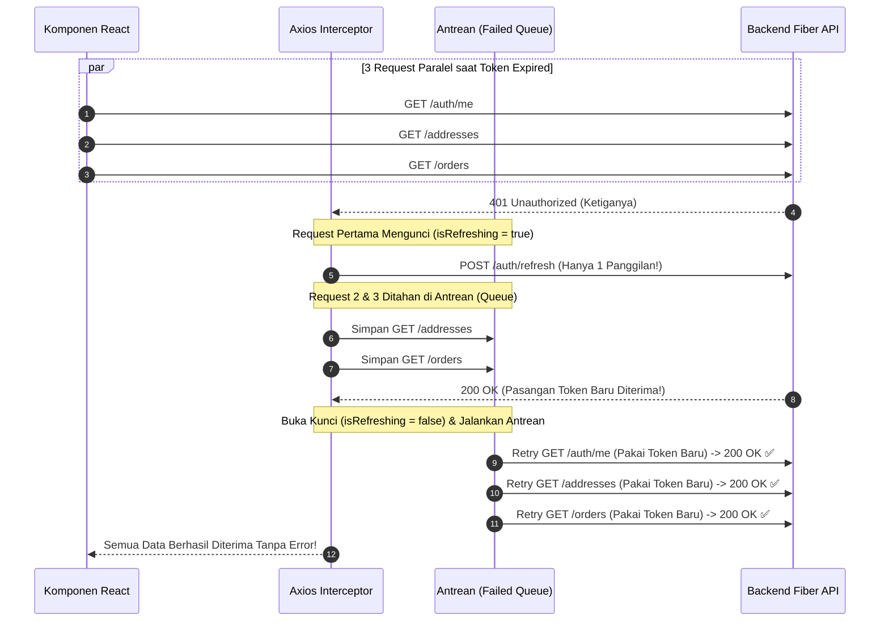

# Dokumen Konfigurasi Frontend Axios Interceptor & Silent Refresh (Hari 17)
**Aplikasi:** Okle Shop (E-Commerce Platform)  
**Fase:** FASE 2 - Autentikasi, Manajemen Pengguna & RBAC (Hari 11 – 25)  
**Teknologi:** React 18/19, Vite, Axios, Request & Response Interceptors, LocalStorage, Mutex Queue Pattern (Silent Refresh)  
**Status:** Disetujui (Hari 17)  
**Terakhir Diperbarui:** 2026-10-03  

---

## 1. Konsep & Arsitektur Axios Interceptors

Di aplikasi frontend skala produksi, komponen UI (seperti halaman Katalog, Profil, atau Keranjang) **tidak boleh mengurus detail teknis HTTP secara manual**, seperti:
* Mengetik header `Authorization: Bearer <token>` berulang-ulang di setiap request (*Don't Repeat Yourself / DRY*).
* Menangani sendiri jika token kedaluwarsa (error 401).

Untuk itu, kita membangun **HTTP Client Terpusat** menggunakan **Axios Instance** yang dilengkapi dua satpam (*interceptor*):
1. **Request Interceptor:** Secara otomatis membaca `access_token` dari penyimpanan lokal (`localStorage`) dan menyisipkannya ke header `Authorization` sebelum request terbang ke server.
2. **Response Interceptor:** Menginspeksi respons dari server. Jika server membalas dengan status **`401 Unauthorized`** (artinya Access Token sudah kedaluwarsa setelah 15 menit), interceptor akan:
   - Menahan request yang gagal tersebut.
   - Melakukan **Silent Refresh** (meminta token baru ke `POST /api/v1/auth/refresh` di balik layar).
   - Mengulangi kembali (*retry*) request pengguna dengan token baru secara transparan tanpa pengguna menyadari atau terganggu saat belanja.

---

### 1.1 Masalah "Race Condition" pada 401 & Solusi Mutex Queue

Bayangkan saat pengguna membuka halaman Dashboard Akun. Frontend memicu **3 request API sekaligus secara paralel**:
1. `GET /api/v1/auth/me` (Ambil profil)
2. `GET /api/v1/addresses` (Ambil daftar alamat)
3. `GET /api/v1/orders` (Ambil histori pesanan)

Jika Access Token sudah expired, **ketiga request tersebut akan sama-sama gagal dengan status 401 di detik yang sama!**

> ⚠️ **Bahaya Besar (Race Condition):**  
> Jika tidak dikelola, frontend akan memanggil `POST /auth/refresh` sebanyak 3 kali. Karena backend kita menerapkan **Refresh Token Rotation**, pemanggilan refresh pertama akan langsung menghanguskan refresh token lama, sehingga refresh kedua dan ketiga akan **gagal total** dan pengguna langsung terlempar keluar (*force logout*).

#### Solusi: Antrean Permintaan (*Request Queue / Mutex Pattern*)



---

## 2. Struktur File Hari 17 di `frontend/`

```text
frontend/
├── .env                       # Variabel lingkungan frontend (Satu Pintu: VITE_API_BASE_URL)
└── src/
    ├── utils/
    │   └── token.js           # Helper penyimpanan Access & Refresh Token
    ├── services/
    │   ├── api.js             # Axios Instance + Request & Response Interceptors
    │   └── authService.js     # Kumpulan pemanggilan API Auth (Login, Register, Logout)
    └── App.jsx                # Playground interaktif pengujian Axios & Silent Refresh
```

---

## 3. Langkah Implementasi Kode

---

### Langkah 1: Buat Variabel Lingkungan (`frontend/.env`)
Sesuai prinsip arsitektur proyek kita: *Semua konfigurasi berasal dari satu pintu `.env`*. Pada Vite, variabel lingkungan yang dapat diakses oleh browser wajib diawali dengan awalan `VITE_`.

Buat file baru di [frontend/.env](file:///c:/Development/Golang/okle-shop/frontend/.env):

```env
VITE_API_BASE_URL=http://localhost:8000/api/v1
```

---

### Langkah 2: Buat Token Storage Helper (`frontend/src/utils/token.js`)
File ini memusatkan seluruh operasi baca-tulis token ke `localStorage` agar tidak ada kode `localStorage.getItem("...")` yang tersebar berantakan di komponen.

Buat file baru di `frontend/src/utils/token.js`:

```javascript
// Kunci penyimpanan di LocalStorage
const ACCESS_TOKEN_KEY = 'okle_access_token';
const REFRESH_TOKEN_KEY = 'okle_refresh_token';

/**
 * Mengambil Access Token dari storage
 */
export const getAccessToken = () => {
  return localStorage.getItem(ACCESS_TOKEN_KEY);
};

/**
 * Mengambil Refresh Token dari storage
 */
export const getRefreshToken = () => {
  return localStorage.getItem(REFRESH_TOKEN_KEY);
};

/**
 * Menyimpan pasangan Access Token dan Refresh Token
 */
export const setTokens = (accessToken, refreshToken) => {
  if (accessToken) {
    localStorage.setItem(ACCESS_TOKEN_KEY, accessToken);
  }
  if (refreshToken) {
    localStorage.setItem(REFRESH_TOKEN_KEY, refreshToken);
  }
};

/**
 * Menghapus semua token saat logout
 */
export const clearTokens = () => {
  localStorage.removeItem(ACCESS_TOKEN_KEY);
  localStorage.removeItem(REFRESH_TOKEN_KEY);
};

/**
 * Memeriksa apakah user memiliki access token
 */
export const hasAccessToken = () => {
  return Boolean(getAccessToken());
};
```

---

### Langkah 3: Buat Axios Instance & Interceptors (`frontend/src/services/api.js`)
File ini adalah jantung komunikasi data frontend. Menggunakan pola *Mutex Queue* untuk mencegah *race condition* saat silent refresh token.

Buat file baru di `frontend/src/services/api.js`:

```javascript
import axios from 'axios';
import { getAccessToken, getRefreshToken, setTokens, clearTokens } from '../utils/token';

// 1. Ambil Base URL dari .env (Fail-Safe jika env belum diset)
const BASE_URL = import.meta.env.VITE_API_BASE_URL || 'http://localhost:8000/api/v1';

// 2. Buat instance Axios khusus aplikasi Okle Shop
const apiClient = axios.create({
  baseURL: BASE_URL,
  headers: {
    'Content-Type': 'application/json',
  },
  timeout: 10000, // Batas waktu 10 detik
});

// Variabel untuk mengelola antrean request saat sedang silent refresh (Mutex Pattern)
let isRefreshing = false;
let failedQueue = [];

// Fungsi untuk memproses seluruh antrean setelah refresh token selesai
const processQueue = (error, token = null) => {
  failedQueue.forEach((promise) => {
    if (error) {
      promise.reject(error);
    } else {
      promise.resolve(token);
    }
  });

  failedQueue = [];
};

// =========================================================================
// 3. REQUEST INTERCEPTOR: Otomatis sisipkan Authorization Bearer Token
// =========================================================================
apiClient.interceptors.request.use(
  (config) => {
    const token = getAccessToken();
    if (token) {
      config.headers.Authorization = `Bearer ${token}`;
    }
    return config;
  },
  (error) => {
    return Promise.reject(error);
  }
);

// =========================================================================
// 4. RESPONSE INTERCEPTOR: Tangani 401 dan Silent Refresh Otomatis
// =========================================================================
apiClient.interceptors.response.use(
  (response) => {
    // Jika respons sukses (2xx), langsung kembalikan data
    return response;
  },
  async (error) => {
    const originalRequest = error.config;

    // Jika error bukan dari server (misal network error)
    if (!error.response) {
      return Promise.reject(error);
    }

    // Periksa apakah error adalah 401 (Unauthorized) dan bukan request login/refresh itu sendiri
    const isUnauthorized = error.response.status === 401;
    const isAuthRoute = originalRequest.url.includes('/auth/login') || originalRequest.url.includes('/auth/refresh');

    if (isUnauthorized && !isAuthRoute && !originalRequest._retry) {
      // Jika saat ini sedang ada proses refresh yang berjalan, masukkan request ini ke antrean!
      if (isRefreshing) {
        return new Promise((resolve, reject) => {
          failedQueue.push({ resolve, reject });
        })
          .then((token) => {
            originalRequest.headers.Authorization = `Bearer ${token}`;
            return apiClient(originalRequest);
          })
          .catch((err) => {
            return Promise.reject(err);
          });
      }

      // Tandai request ini sudah pernah dicoba ulang agar tidak looping tak terbatas
      originalRequest._retry = true;
      isRefreshing = true;

      const currentRefreshToken = getRefreshToken();

      // Jika tidak ada Refresh Token di storage, langsung logout
      if (!currentRefreshToken) {
        clearTokens();
        isRefreshing = false;
        return Promise.reject(error);
      }

      try {
        // Panggil endpoint refresh menggunakan axios biasa (bukan apiClient agar tidak kena interceptor)
        const refreshResponse = await axios.post(`${BASE_URL}/auth/refresh`, {
          refresh_token: currentRefreshToken,
        });

        const { access_token, refresh_token } = refreshResponse.data.data;

        // Simpan pasangan token yang baru (Token Rotation)
        setTokens(access_token, refresh_token);

        // Pasang token baru di request yang pertama kali gagal
        originalRequest.headers.Authorization = `Bearer ${access_token}`;

        // Jalankan semua request lain yang sempat mengantre
        processQueue(null, access_token);

        // Ulangi request original
        return apiClient(originalRequest);
      } catch (refreshError) {
        // Jika refresh token juga ditolak (misal sudah lewat 7 hari atau dibatalkan)
        processQueue(refreshError, null);
        clearTokens();

        // Redirect pengguna ke halaman login jika di lingkungan browser
        if (typeof window !== 'undefined') {
          console.warn('Sesi login telah berakhir. Silakan login kembali.');
        }

        return Promise.reject(refreshError);
      } finally {
        isRefreshing = false;
      }
    }

    return Promise.reject(error);
  }
);

export default apiClient;
```

---

### Langkah 4: Buat Service Auth API (`frontend/src/services/authService.js`)
File ini menyediakan fungsi-fungsi bersih yang akan dipanggil oleh komponen React.

Buat file baru di `frontend/src/services/authService.js`:

```javascript
import apiClient from './api';
import { setTokens, clearTokens } from '../utils/token';

export const authService = {
  /**
   * Login user dan simpan token otomatis
   */
  async login(email, password) {
    const response = await apiClient.post('/auth/login', { email, password });
    const { access_token, refresh_token, user } = response.data.data;

    // Simpan token ke LocalStorage
    setTokens(access_token, refresh_token);

    return { user, accessToken: access_token, refreshToken: refresh_token };
  },

  /**
   * Registrasi user baru
   */
  async register(name, email, password, phone) {
    const response = await apiClient.post('/auth/register', {
      name,
      email,
      password,
      phone,
    });
    return response.data;
  },

  /**
   * Mengambil data profil user yang sedang login
   */
  async getMe() {
    const response = await apiClient.get('/auth/me');
    return response.data.data;
  },

  /**
   * Logout user dari server dan hapus token lokal
   */
  async logout() {
    try {
      await apiClient.post('/auth/logout');
    } finally {
      clearTokens();
    }
  },
};
```

---

### Langkah 5: Buat Halaman Uji Coba Interaktif di `frontend/src/App.jsx`
Ganti isi file [frontend/src/App.jsx](file:///c:/Development/Golang/okle-shop/frontend/src/App.jsx) dengan antarmuka pengujian visual yang interaktif. Anda bisa menguji koneksi API, Login, Request Terproteksi, Simulasi Token Kedaluwarsa, dan Logout.

```jsx
import { useState, useEffect } from 'react';
import { authService } from './services/authService';
import apiClient from './services/api';
import { getAccessToken, getRefreshToken, setTokens } from './utils/token';
import { ShieldCheck, LogIn, LogOut, User, RefreshCw, AlertCircle, Database, CheckCircle2 } from 'lucide-react';

export default function App() {
  const [email, setEmail] = useState('customer@gmail.com');
  const [password, setPassword] = useState('Password123!');
  const [userProfile, setUserProfile] = useState(null);
  const [addresses, setAddresses] = useState([]);
  const [logs, setLogs] = useState([]);
  const [loading, setLoading] = useState(false);
  const [tokenInfo, setTokenInfo] = useState({
    access: getAccessToken(),
    refresh: getRefreshToken(),
  });

  const addLog = (message, type = 'info') => {
    const timestamp = new Date().toLocaleTimeString();
    setLogs((prev) => [{ id: Date.now(), time: timestamp, message, type }, ...prev]);
  };

  const updateTokensState = () => {
    setTokenInfo({
      access: getAccessToken(),
      refresh: getRefreshToken(),
    });
  };

  useEffect(() => {
    updateTokensState();
  }, []);

  // 1. Cek Server Health
  const handleCheckHealth = async () => {
    try {
      setLoading(true);
      const res = await apiClient.get('/health');
      addLog(`✅ Server OK: ${res.data.message}`, 'success');
    } catch (err) {
      addLog(`❌ Server Error: ${err.message}`, 'error');
    } finally {
      setLoading(false);
    }
  };

  // 2. Login
  const handleLogin = async (e) => {
    e.preventDefault();
    try {
      setLoading(true);
      const result = await authService.login(email, password);
      setUserProfile(result.user);
      updateTokensState();
      addLog(`🎉 Login Berhasil sebagai: ${result.user.name} (${result.user.role})`, 'success');
    } catch (err) {
      const errMsg = err.response?.data?.message || err.message;
      addLog(`❌ Gagal Login: ${errMsg}`, 'error');
    } finally {
      setLoading(false);
    }
  };

  // 3. Ambil Profil (/auth/me)
  const handleGetProfile = async () => {
    try {
      setLoading(true);
      const data = await authService.getMe();
      setUserProfile(data);
      addLog(`👤 Profil Diambil: ID ${data.user_id} - ${data.email}`, 'success');
    } catch (err) {
      addLog(`❌ Gagal Ambil Profil: ${err.response?.data?.message || err.message}`, 'error');
    } finally {
      setLoading(false);
    }
  };

  // 4. Ambil Alamat (/addresses)
  const handleGetAddresses = async () => {
    try {
      setLoading(true);
      const res = await apiClient.get('/addresses');
      setAddresses(res.data.data || []);
      addLog(`📦 Berhasil mengambil ${res.data.data?.length || 0} alamat`, 'success');
    } catch (err) {
      addLog(`❌ Gagal Ambil Alamat: ${err.response?.data?.message || err.message}`, 'error');
    } finally {
      setLoading(false);
    }
  };

  // 5. SIMULASI KEDALUWARSA TOKEN (Uji Coba Silent Refresh)
  const handleSimulateExpiredToken = () => {
    // Sengaja mengganti Access Token dengan token palsu / basi
    setTokens('token_palsu_sudah_expired_123', getRefreshToken());
    updateTokensState();
    addLog('⚠️ Access Token sengaja dirusak/dibuat kedaluwarsa! Coba klik "Ambil Profil" sekarang untuk melihat Silent Refresh bekerja secara otomatis.', 'warning');
  };

  // 6. Logout
  const handleLogout = async () => {
    try {
      setLoading(true);
      await authService.logout();
      setUserProfile(null);
      setAddresses([]);
      updateTokensState();
      addLog('👋 Logout Berhasil. Token dibersihkan.', 'info');
    } catch (err) {
      addLog(`❌ Logout Error: ${err.message}`, 'error');
    } finally {
      setLoading(false);
    }
  };

  return (
    <div className="min-h-screen bg-slate-900 text-slate-100 p-4 md:p-8 font-sans">
      <div className="max-w-6xl mx-auto space-y-6">
        
        {/* Header */}
        <header className="flex flex-col md:flex-row justify-between items-start md:items-center bg-slate-800 p-6 rounded-2xl border border-slate-700 shadow-xl">
          <div>
            <h1 className="text-2xl font-bold flex items-center gap-2 text-indigo-400">
              <ShieldCheck className="w-8 h-8 text-indigo-500" />
              Okle Shop - Frontend Auth & Axios Interceptors
            </h1>
            <p className="text-slate-400 text-sm mt-1">
              Hari 17: Uji Coba Request Interceptor, Silent Refresh 401, & Mutex Queue
            </p>
          </div>
          <button
            onClick={handleCheckHealth}
            disabled={loading}
            className="mt-4 md:mt-0 flex items-center gap-2 px-4 py-2 bg-slate-700 hover:bg-slate-600 rounded-lg text-sm font-medium transition"
          >
            <Database className="w-4 h-4 text-emerald-400" />
            Cek Server Health
          </button>
        </header>

        {/* Grid Konten */}
        <div className="grid grid-cols-1 md:grid-cols-2 gap-6">
          
          {/* Sisi Kiri: Form Login & Aksi API */}
          <div className="space-y-6">
            
            {/* Form Login */}
            <div className="bg-slate-800 p-6 rounded-2xl border border-slate-700 shadow-md">
              <h2 className="text-lg font-semibold flex items-center gap-2 text-slate-200 mb-4">
                <LogIn className="w-5 h-5 text-indigo-400" /> Form Autentikasi
              </h2>
              <form onSubmit={handleLogin} className="space-y-4">
                <div>
                  <label className="block text-xs font-medium text-slate-400 mb-1">Email</label>
                  <input
                    type="email"
                    value={email}
                    onChange={(e) => setEmail(e.target.value)}
                    className="w-full bg-slate-900 border border-slate-700 rounded-lg px-3 py-2 text-sm focus:outline-none focus:border-indigo-500"
                    required
                  />
                </div>
                <div>
                  <label className="block text-xs font-medium text-slate-400 mb-1">Password</label>
                  <input
                    type="password"
                    value={password}
                    onChange={(e) => setPassword(e.target.value)}
                    className="w-full bg-slate-900 border border-slate-700 rounded-lg px-3 py-2 text-sm focus:outline-none focus:border-indigo-500"
                    required
                  />
                </div>
                <div className="flex gap-2 pt-2">
                  <button
                    type="submit"
                    disabled={loading}
                    className="flex-1 bg-indigo-600 hover:bg-indigo-500 text-white font-medium py-2 rounded-lg text-sm transition"
                  >
                    Login Akun
                  </button>
                  <button
                    type="button"
                    onClick={handleLogout}
                    disabled={!tokenInfo.access}
                    className="px-4 py-2 bg-rose-600/20 text-rose-300 hover:bg-rose-600/30 rounded-lg text-sm font-medium transition flex items-center gap-1 disabled:opacity-40"
                  >
                    <LogOut className="w-4 h-4" /> Logout
                  </button>
                </div>
              </form>
            </div>

            {/* Tombol Uji Coba Endpoint Terproteksi */}
            <div className="bg-slate-800 p-6 rounded-2xl border border-slate-700 shadow-md">
              <h2 className="text-lg font-semibold text-slate-200 mb-3">Uji Rute Privat (Protected)</h2>
              <div className="grid grid-cols-2 gap-3">
                <button
                  onClick={handleGetProfile}
                  disabled={loading}
                  className="p-3 bg-slate-700 hover:bg-slate-600 rounded-xl text-xs font-medium flex flex-col items-center gap-2 transition"
                >
                  <User className="w-5 h-5 text-sky-400" />
                  Ambil Profil (/me)
                </button>
                <button
                  onClick={handleGetAddresses}
                  disabled={loading}
                  className="p-3 bg-slate-700 hover:bg-slate-600 rounded-xl text-xs font-medium flex flex-col items-center gap-2 transition"
                >
                  <Database className="w-5 h-5 text-emerald-400" />
                  Ambil Alamat (/addresses)
                </button>
              </div>

              {/* Tombol Simulasi Silent Refresh */}
              <div className="mt-4 pt-4 border-t border-slate-700">
                <button
                  onClick={handleSimulateExpiredToken}
                  disabled={!tokenInfo.refresh}
                  className="w-full bg-amber-500/20 text-amber-300 hover:bg-amber-500/30 border border-amber-500/30 p-3 rounded-xl text-xs font-medium flex items-center justify-center gap-2 transition disabled:opacity-40"
                >
                  <RefreshCw className="w-4 h-4" />
                  Simulasi Token Expired (Uji Silent Refresh)
                </button>
                <p className="text-[11px] text-slate-400 mt-2 text-center">
                  Klik tombol di atas untuk merusak Access Token, lalu klik &quot;Ambil Profil&quot;. Perhatikan Network tab: Axios akan otomatis meminta token baru dan request profil tetap berhasil!
                </p>
              </div>
            </div>

          </div>

          {/* Sisi Kanan: Status Token & Activity Log */}
          <div className="space-y-6">
            
            {/* Status Token Saat Ini */}
            <div className="bg-slate-800 p-6 rounded-2xl border border-slate-700 shadow-md space-y-3">
              <h2 className="text-lg font-semibold text-slate-200">Status Token di Storage</h2>
              <div>
                <span className="text-xs text-slate-400 font-mono">Access Token:</span>
                <div className="bg-slate-900 p-2.5 rounded-lg border border-slate-700 text-xs font-mono text-sky-300 truncate">
                  {tokenInfo.access || <span className="text-slate-500">(Kosong / Belum Login)</span>}
                </div>
              </div>
              <div>
                <span className="text-xs text-slate-400 font-mono">Refresh Token:</span>
                <div className="bg-slate-900 p-2.5 rounded-lg border border-slate-700 text-xs font-mono text-emerald-300 truncate">
                  {tokenInfo.refresh || <span className="text-slate-500">(Kosong / Belum Login)</span>}
                </div>
              </div>
            </div>

            {/* Live Event Console Logs */}
            <div className="bg-slate-800 p-6 rounded-2xl border border-slate-700 shadow-md">
              <div className="flex justify-between items-center mb-3">
                <h2 className="text-lg font-semibold text-slate-200">Log Aktivitas</h2>
                <button
                  onClick={() => setLogs([])}
                  className="text-xs text-slate-400 hover:text-slate-200"
                >
                  Bersihkan
                </button>
              </div>
              <div className="bg-slate-950 p-3 rounded-xl border border-slate-800 h-64 overflow-y-auto space-y-2 font-mono text-xs">
                {logs.length === 0 ? (
                  <p className="text-slate-600 text-center py-8">Belum ada aktivitas.</p>
                ) : (
                  logs.map((log) => (
                    <div
                      key={log.id}
                      className={`p-2 rounded border flex items-start gap-2 ${
                        log.type === 'error'
                          ? 'bg-rose-950/30 border-rose-800 text-rose-300'
                          : log.type === 'success'
                          ? 'bg-emerald-950/30 border-emerald-800 text-emerald-300'
                          : log.type === 'warning'
                          ? 'bg-amber-950/30 border-amber-800 text-amber-300'
                          : 'bg-slate-900 border-slate-800 text-slate-300'
                      }`}
                    >
                      <span className="text-slate-500 text-[10px] whitespace-nowrap">[{log.time}]</span>
                      <span className="break-all">{log.message}</span>
                    </div>
                  ))
                )}
              </div>
            </div>

          </div>

        </div>

      </div>
    </div>
  );
}
```

---

## 4. Panduan Menjalankan & Menguji Aplikasi

### 1. Jalankan Backend Golang (Terminal 1)
```powershell
cd C:\Development\Golang\okle-shop\backend
go run cmd/api/main.go
```

### 2. Jalankan Frontend React Vite (Terminal 2)
```powershell
cd C:\Development\Golang\okle-shop\frontend
npm run dev
```
Buka browser di alamat: `http://localhost:5173/`

### 3. Skenario Uji Coba Silent Refresh di Browser
1. **Lakukan Login:** Klik tombol **"Login Akun"**.
   - Perhatikan kotak *Status Token*: `Access Token` dan `Refresh Token` langsung terisi.
2. **Uji Rute Privat:** Klik **"Ambil Profil (/me)"** atau **"Ambil Alamat (/addresses)"**.
   - Buka **Inspect -> Network Tab** di browser.
   - Perhatikan header request: `Authorization: Bearer ...` otomatis terpasang tanpa Anda ketik secara manual!
3. **Uji Silent Refresh (Fitur Utama Hari 17):**
   - Klik tombol kuning **"Simulasi Token Expired (Uji Silent Refresh)"**.
   - Sekarang, klik tombol **"Ambil Profil (/me)"**.
   - **Perhatikan Network Tab di browser:**
     1. Request pertama ke `/auth/me` mengembalikan status `401 Unauthorized` (karena token dirusak).
     2. Axios Interceptor langsung menangkap 401 dan otomatis mengirim `POST /api/v1/auth/refresh`.
     3. Backend memberikan token baru.
     4. Axios Interceptor mengulang request ke `/auth/me` dengan token baru dan berhasil `200 OK`!
     5. Pengguna tetap melihat data profilnya tanpa pernah terputus!

---

## 5. Checklist Verifikasi Hari 17

| Kriteria Uji | Komponen | Status |
| :--- | :--- | :---: |
| Konfigurasi API terpusat dari satu pintu `.env` | `frontend/.env` (`VITE_API_BASE_URL`) | [x] |
| Helper LocalStorage untuk token terpusat | `frontend/src/utils/token.js` | [x] |
| Request Interceptor otomatis menyisipkan Bearer token | `frontend/src/services/api.js` | [x] |
| Response Interceptor menangani status 401 dengan Silent Refresh | `frontend/src/services/api.js` | [x] |
| Pola antrean *Mutex Queue* mencegah duplicate refresh calls | `frontend/src/services/api.js` | [x] |
| UI Demo interaktif untuk pengujian Auth & Token | `frontend/src/App.jsx` | [x] |

---
*Langkah selanjutnya (Hari 18): Setup State Management Global menggunakan Zustand untuk Auth Store & User Profile.*
