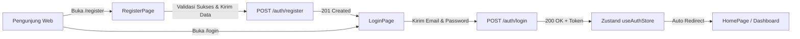

# Dokumen Halaman Login & Register dengan Validasi Form Interaktif (Hari 19)
**Aplikasi:** Okle Shop (E-Commerce Platform)  
**Fase:** FASE 2 - Autentikasi, Manajemen Pengguna & RBAC (Hari 11 – 25)  
**Teknologi:** React 18/19, React Router DOM v7, Tailwind CSS v3, Zustand Auth Store, Form Validation & UX  
**Status:** Disetujui (Hari 19)  
**Terakhir Diperbarui:** 2026-10-04  

---

## 1. Konsep & Arsitektur Halaman Autentikasi

Pada Hari 19, kita beralih dari pengujian teknis (*playground*) ke **Halaman UI Nyata Berstandar Produksi**:
1. **Navigasi Multi-Halaman (`react-router-dom`):** Mengatur rute URL `/login`, `/register`, dan `/` (Home).
2. **Validasi Form Sisi Klien (*Client-Side Validation*):**
   - Format email valid (regex).
   - Password minimal 8 karakter.
   - Konfirmasi password harus cocok (*password match*).
   - Nomor telepon wajib angka minimal 10 digit.
3. **User Experience (UX) Modern:**
   - Tombol intip password (*Show/Hide Password Toggle*).
   - Indikator loading (*spinner*) saat request dikirim ke backend Fiber.
   - Pesan error server yang ramah (misal: *"Email sudah terdaftar, silakan gunakan email lain"*).
   - Pengalihan otomatis (*auto-redirect*) ke halaman utama `/` jika pengguna sudah login.



---

## 2. Struktur File Hari 19 di `frontend/`

```text
frontend/src/
├── pages/
│   ├── HomePage.jsx          # Halaman beranda dengan Navbar & status akun
│   ├── LoginPage.jsx         # Halaman login dengan validasi & show/hide password
│   └── RegisterPage.jsx      # Halaman pendaftaran akun baru
└── App.jsx                   # Konfigurasi BrowserRouter & Route
```

---

## 3. Langkah Implementasi Kode

---

### Langkah 1: Buat Halaman Beranda (`frontend/src/pages/HomePage.jsx`)
Buat folder `frontend/src/pages/`, lalu buat file `HomePage.jsx` sebagai halaman utama yang memiliki Navbar responsif:

```jsx
import { Link } from 'react-router-dom';
import { useAuthStore } from '../store/authStore';
import { ShoppingBag, User, LogOut, LogIn, UserPlus, MapPin, Package, Shield } from 'lucide-react';

export default function HomePage() {
  const { user, isAuthenticated, logout } = useAuthStore();

  return (
    <div className="min-h-screen bg-slate-900 text-slate-100 flex flex-col font-sans">
      {/* 1. Header / Navbar */}
      <header className="bg-slate-800/80 backdrop-blur-md border-b border-slate-700/60 sticky top-0 z-50">
        <div className="max-w-7xl mx-auto px-4 sm:px-6 lg:px-8 h-16 flex items-center justify-between">
          <Link to="/" className="flex items-center gap-2.5 font-bold text-xl text-indigo-400 hover:text-indigo-300 transition">
            <ShoppingBag className="w-6 h-6 text-indigo-500" />
            <span>Okle Shop</span>
          </Link>

          {/* Navigasi Kanan */}
          <div className="flex items-center gap-3">
            {isAuthenticated && user ? (
              <div className="flex items-center gap-4">
                <div className="text-right hidden sm:block">
                  <p className="text-sm font-semibold text-slate-200">{user.name || user.email}</p>
                  <span className={`text-[10px] px-2 py-0.5 rounded-full font-bold uppercase tracking-wider ${
                    user.role === 'ADMIN'
                      ? 'bg-amber-500/20 text-amber-300 border border-amber-500/30'
                      : 'bg-emerald-500/20 text-emerald-300 border border-emerald-500/30'
                  }`}>
                    {user.role}
                  </span>
                </div>
                <button
                  onClick={logout}
                  className="flex items-center gap-1.5 px-3 py-1.5 rounded-lg text-xs font-medium bg-rose-600/20 text-rose-300 hover:bg-rose-600/30 border border-rose-600/30 transition"
                >
                  <LogOut className="w-4 h-4" /> Keluar
                </button>
              </div>
            ) : (
              <div className="flex items-center gap-2">
                <Link
                  to="/login"
                  className="flex items-center gap-1.5 px-3.5 py-2 rounded-lg text-xs font-medium text-slate-300 hover:text-white hover:bg-slate-700 transition"
                >
                  <LogIn className="w-4 h-4" /> Masuk
                </Link>
                <Link
                  to="/register"
                  className="flex items-center gap-1.5 px-3.5 py-2 rounded-lg text-xs font-medium bg-indigo-600 hover:bg-indigo-500 text-white shadow-md shadow-indigo-600/20 transition"
                >
                  <UserPlus className="w-4 h-4" /> Daftar
                </Link>
              </div>
            )}
          </div>
        </div>
      </header>

      {/* 2. Hero Section */}
      <main className="flex-1 max-w-7xl mx-auto px-4 sm:px-6 lg:px-8 py-12 w-full space-y-12">
        <section className="text-center space-y-4 py-8">
          <span className="px-3 py-1 rounded-full text-xs font-medium bg-indigo-500/20 text-indigo-300 border border-indigo-500/30">
            E-Commerce Berskala Produksi
          </span>
          <h1 className="text-4xl sm:text-5xl font-extrabold tracking-tight text-white">
            Belanja Nyaman, Aman, & Cepat di <span className="text-indigo-400">Okle Shop</span>
          </h1>
          <p className="max-w-2xl mx-auto text-slate-400 text-sm sm:text-base">
            Dibangun dengan arsitektur modern: Golang Fiber di backend dan React Vite di frontend dengan proteksi JWT Dual-Token.
          </p>
        </section>

        {/* 3. Kartu Menu / Fitur */}
        <section className="grid grid-cols-1 md:grid-cols-3 gap-6">
          <div className="bg-slate-800/60 p-6 rounded-2xl border border-slate-700/60 space-y-3">
            <div className="w-10 h-10 rounded-xl bg-indigo-500/20 text-indigo-400 flex items-center justify-center">
              <User className="w-5 h-5" />
            </div>
            <h2 className="text-lg font-semibold text-slate-100">Status Akun</h2>
            <p className="text-xs text-slate-400">
              {isAuthenticated && user
                ? `Login sebagai ${user.name} (${user.email}) dengan hak akses ${user.role}.`
                : 'Anda saat ini berada dalam sesi Tamu (Guest). Masuk untuk mulai berbelanja.'}
            </p>
          </div>

          <div className="bg-slate-800/60 p-6 rounded-2xl border border-slate-700/60 space-y-3">
            <div className="w-10 h-10 rounded-xl bg-emerald-500/20 text-emerald-400 flex items-center justify-center">
              <MapPin className="w-5 h-5" />
            </div>
            <h2 className="text-lg font-semibold text-slate-100">Buku Alamat</h2>
            <p className="text-xs text-slate-400">
              Kelola alamat pengiriman pesanan Anda dengan sistem pemilihan alamat utama otomatis (Hari 16).
            </p>
          </div>

          <div className="bg-slate-800/60 p-6 rounded-2xl border border-slate-700/60 space-y-3">
            <div className="w-10 h-10 rounded-xl bg-sky-500/20 text-sky-400 flex items-center justify-center">
              <Shield className="w-5 h-5" />
            </div>
            <h2 className="text-lg font-semibold text-slate-100">Keamanan Terverifikasi</h2>
            <p className="text-xs text-slate-400">
              Didukung Axios Interceptors dengan Silent Token Refresh & rotasi sesi otomatis (Hari 17 & 18).
            </p>
          </div>
        </section>
      </main>

      {/* 4. Footer */}
      <footer className="border-t border-slate-800 py-6 text-center text-xs text-slate-500">
        &copy; 2026 Okle Shop. Dibangun secara bertahap selama 100 Hari.
      </footer>
    </div>
  );
}
```

---

### Langkah 2: Buat Halaman Login (`frontend/src/pages/LoginPage.jsx`)
Buat file `LoginPage.jsx` dengan validasi interaktif dan tombol intip kata sandi:

```jsx
import { useState, useEffect } from 'react';
import { Link, useNavigate } from 'react-router-dom';
import { useAuthStore } from '../store/authStore';
import { ShoppingBag, Mail, Lock, Eye, EyeOff, LogIn, AlertCircle } from 'lucide-react';

export default function LoginPage() {
  const navigate = useNavigate();
  const { login, isAuthenticated, isLoading, error, clearError } = useAuthStore();

  const [email, setEmail] = useState('');
  const [password, setPassword] = useState('');
  const [showPassword, setShowPassword] = useState(false);
  const [formErrors, setFormErrors] = useState({});

  // Jika pengguna sudah login, langsung alihkan ke beranda
  useEffect(() => {
    if (isAuthenticated) {
      navigate('/');
    }
    clearError();
  }, [isAuthenticated, navigate, clearError]);

  // Validasi lokal sebelum kirim ke server
  const validate = () => {
    const errors = {};
    if (!email.trim()) {
      errors.email = 'Email wajib diisi';
    } else if (!/\S+@\S+\.\S+/.test(email)) {
      errors.email = 'Format email tidak valid';
    }

    if (!password) {
      errors.password = 'Kata sandi wajib diisi';
    } else if (password.length < 8) {
      errors.password = 'Kata sandi minimal 8 karakter';
    }

    setFormErrors(errors);
    return Object.keys(errors).length === 0;
  };

  const handleSubmit = async (e) => {
    e.preventDefault();
    if (!validate()) return;

    try {
      await login(email, password);
      navigate('/');
    } catch {
      // Error otomatis ditangani oleh useAuthStore
    }
  };

  return (
    <div className="min-h-screen bg-slate-900 flex items-center justify-center p-4 font-sans">
      <div className="w-full max-w-md bg-slate-800/90 backdrop-blur-md rounded-2xl border border-slate-700/80 p-8 shadow-2xl space-y-6">
        
        {/* Brand Header */}
        <div className="text-center space-y-2">
          <Link to="/" className="inline-flex items-center gap-2 font-bold text-2xl text-indigo-400">
            <ShoppingBag className="w-7 h-7 text-indigo-500" />
            <span>Okle Shop</span>
          </Link>
          <h1 className="text-xl font-bold text-white">Selamat Datang Kembali</h1>
          <p className="text-xs text-slate-400">Masuk ke akun Anda untuk melanjutkan belanja</p>
        </div>

        {/* Alert Error dari Backend */}
        {error && (
          <div className="p-3.5 bg-rose-950/40 border border-rose-800/60 rounded-xl text-rose-300 text-xs flex items-center gap-2">
            <AlertCircle className="w-4 h-4 flex-shrink-0 text-rose-400" />
            <span>{error}</span>
          </div>
        )}

        {/* Form Login */}
        <form onSubmit={handleSubmit} className="space-y-4">
          {/* Input Email */}
          <div>
            <label className="block text-xs font-medium text-slate-300 mb-1.5">Alamat Email</label>
            <div className="relative">
              <Mail className="w-4 h-4 text-slate-500 absolute left-3.5 top-3" />
              <input
                type="email"
                value={email}
                onChange={(e) => {
                  setEmail(e.target.value);
                  if (formErrors.email) setFormErrors({ ...formErrors, email: '' });
                }}
                placeholder="nama@email.com"
                className={`w-full bg-slate-900/80 border ${
                  formErrors.email ? 'border-rose-500' : 'border-slate-700'
                } rounded-xl pl-10 pr-4 py-2.5 text-sm text-slate-100 placeholder-slate-500 focus:outline-none focus:border-indigo-500 transition`}
              />
            </div>
            {formErrors.email && <p className="text-rose-400 text-[11px] mt-1">{formErrors.email}</p>}
          </div>

          {/* Input Password */}
          <div>
            <div className="flex justify-between items-center mb-1.5">
              <label className="block text-xs font-medium text-slate-300">Kata Sandi</label>
              <Link to="/forgot-password" className="text-xs text-indigo-400 hover:text-indigo-300 transition">
                Lupa sandi?
              </Link>
            </div>
            <div className="relative">
              <Lock className="w-4 h-4 text-slate-500 absolute left-3.5 top-3" />
              <input
                type={showPassword ? 'text' : 'password'}
                value={password}
                onChange={(e) => {
                  setPassword(e.target.value);
                  if (formErrors.password) setFormErrors({ ...formErrors, password: '' });
                }}
                placeholder="Minimal 8 karakter"
                className={`w-full bg-slate-900/80 border ${
                  formErrors.password ? 'border-rose-500' : 'border-slate-700'
                } rounded-xl pl-10 pr-10 py-2.5 text-sm text-slate-100 placeholder-slate-500 focus:outline-none focus:border-indigo-500 transition`}
              />
              <button
                type="button"
                onClick={() => setShowPassword(!showPassword)}
                className="absolute right-3.5 top-3 text-slate-500 hover:text-slate-300 transition"
              >
                {showPassword ? <EyeOff className="w-4 h-4" /> : <Eye className="w-4 h-4" />}
              </button>
            </div>
            {formErrors.password && <p className="text-rose-400 text-[11px] mt-1">{formErrors.password}</p>}
          </div>

          {/* Tombol Submit */}
          <button
            type="submit"
            disabled={isLoading}
            className="w-full bg-indigo-600 hover:bg-indigo-500 text-white font-medium py-2.5 rounded-xl text-sm transition shadow-lg shadow-indigo-600/30 flex items-center justify-center gap-2 disabled:opacity-50 mt-2"
          >
            {isLoading ? (
              <span className="flex items-center gap-2">
                <span className="w-4 h-4 border-2 border-white/20 border-t-white rounded-full animate-spin"></span>
                Memproses...
              </span>
            ) : (
              <>
                <LogIn className="w-4 h-4" /> Masuk ke Akun
              </>
            )}
          </button>
        </form>

        {/* Link Daftar */}
        <p className="text-center text-xs text-slate-400">
          Belum punya akun?{' '}
          <Link to="/register" className="text-indigo-400 font-semibold hover:text-indigo-300 transition">
            Daftar sekarang
          </Link>
        </p>

      </div>
    </div>
  );
}
```

---

### Langkah 3: Buat Halaman Register (`frontend/src/pages/RegisterPage.jsx`)
Buat file `RegisterPage.jsx` dengan validasi kecocokan kata sandi dan format nomor HP:

```jsx
import { useState, useEffect } from 'react';
import { Link, useNavigate } from 'react-router-dom';
import { useAuthStore } from '../store/authStore';
import { ShoppingBag, User, Mail, Phone, Lock, Eye, EyeOff, UserPlus, AlertCircle, CheckCircle2 } from 'lucide-react';

export default function RegisterPage() {
  const navigate = useNavigate();
  const { register, isAuthenticated, isLoading, error, clearError } = useAuthStore();

  const [formData, setFormData] = useState({
    name: '',
    email: '',
    phone: '',
    password: '',
    confirmPassword: '',
  });

  const [showPassword, setShowPassword] = useState(false);
  const [formErrors, setFormErrors] = useState({});
  const [successMessage, setSuccessMessage] = useState('');

  useEffect(() => {
    if (isAuthenticated) {
      navigate('/');
    }
    clearError();
  }, [isAuthenticated, navigate, clearError]);

  const validate = () => {
    const errors = {};
    if (!formData.name.trim() || formData.name.trim().length < 3) {
      errors.name = 'Nama lengkap minimal 3 karakter';
    }

    if (!formData.email.trim()) {
      errors.email = 'Email wajib diisi';
    } else if (!/\S+@\S+\.\S+/.test(formData.email)) {
      errors.email = 'Format email tidak valid';
    }

    if (!formData.phone.trim()) {
      errors.phone = 'Nomor telepon wajib diisi';
    } else if (!/^[0-9]{10,15}$/.test(formData.phone)) {
      errors.phone = 'Nomor telepon harus berupa 10 - 15 digit angka';
    }

    if (!formData.password) {
      errors.password = 'Kata sandi wajib diisi';
    } else if (formData.password.length < 8) {
      errors.password = 'Kata sandi minimal 8 karakter';
    }

    if (formData.password !== formData.confirmPassword) {
      errors.confirmPassword = 'Konfirmasi kata sandi tidak cocok';
    }

    setFormErrors(errors);
    return Object.keys(errors).length === 0;
  };

  const handleChange = (e) => {
    const { name, value } = e.target;
    setFormData((prev) => ({ ...prev, [name]: value }));
    if (formErrors[name]) {
      setFormErrors((prev) => ({ ...prev, [name]: '' }));
    }
  };

  const handleSubmit = async (e) => {
    e.preventDefault();
    if (!validate()) return;

    try {
      await register(formData.name, formData.email, formData.password, formData.phone);
      setSuccessMessage('Registrasi berhasil! Mengalihkan ke halaman masuk...');
      setTimeout(() => {
        navigate('/login');
      }, 2000);
    } catch {
      // Error backend otomatis ditangani oleh useAuthStore
    }
  };

  return (
    <div className="min-h-screen bg-slate-900 flex items-center justify-center p-4 font-sans">
      <div className="w-full max-w-md bg-slate-800/90 backdrop-blur-md rounded-2xl border border-slate-700/80 p-8 shadow-2xl space-y-6">
        
        {/* Brand Header */}
        <div className="text-center space-y-2">
          <Link to="/" className="inline-flex items-center gap-2 font-bold text-2xl text-indigo-400">
            <ShoppingBag className="w-7 h-7 text-indigo-500" />
            <span>Okle Shop</span>
          </Link>
          <h1 className="text-xl font-bold text-white">Buat Akun Pembeli Baru</h1>
          <p className="text-xs text-slate-400">Daftar sekarang untuk mulai berbelanja di Okle Shop</p>
        </div>

        {/* Alert Sukses */}
        {successMessage && (
          <div className="p-3.5 bg-emerald-950/40 border border-emerald-800/60 rounded-xl text-emerald-300 text-xs flex items-center gap-2">
            <CheckCircle2 className="w-4 h-4 flex-shrink-0 text-emerald-400" />
            <span>{successMessage}</span>
          </div>
        )}

        {/* Alert Error dari Backend */}
        {error && (
          <div className="p-3.5 bg-rose-950/40 border border-rose-800/60 rounded-xl text-rose-300 text-xs flex items-center gap-2">
            <AlertCircle className="w-4 h-4 flex-shrink-0 text-rose-400" />
            <span>{error}</span>
          </div>
        )}

        {/* Form Registrasi */}
        <form onSubmit={handleSubmit} className="space-y-3.5">
          {/* Nama Lengkap */}
          <div>
            <label className="block text-xs font-medium text-slate-300 mb-1">Nama Lengkap</label>
            <div className="relative">
              <User className="w-4 h-4 text-slate-500 absolute left-3.5 top-3" />
              <input
                type="text"
                name="name"
                value={formData.name}
                onChange={handleChange}
                placeholder="Budi Santoso"
                className={`w-full bg-slate-900/80 border ${
                  formErrors.name ? 'border-rose-500' : 'border-slate-700'
                } rounded-xl pl-10 pr-4 py-2.5 text-sm text-slate-100 placeholder-slate-500 focus:outline-none focus:border-indigo-500 transition`}
              />
            </div>
            {formErrors.name && <p className="text-rose-400 text-[11px] mt-1">{formErrors.name}</p>}
          </div>

          {/* Email */}
          <div>
            <label className="block text-xs font-medium text-slate-300 mb-1">Alamat Email</label>
            <div className="relative">
              <Mail className="w-4 h-4 text-slate-500 absolute left-3.5 top-3" />
              <input
                type="email"
                name="email"
                value={formData.email}
                onChange={handleChange}
                placeholder="budi@email.com"
                className={`w-full bg-slate-900/80 border ${
                  formErrors.email ? 'border-rose-500' : 'border-slate-700'
                } rounded-xl pl-10 pr-4 py-2.5 text-sm text-slate-100 placeholder-slate-500 focus:outline-none focus:border-indigo-500 transition`}
              />
            </div>
            {formErrors.email && <p className="text-rose-400 text-[11px] mt-1">{formErrors.email}</p>}
          </div>

          {/* Nomor HP */}
          <div>
            <label className="block text-xs font-medium text-slate-300 mb-1">Nomor Handphone / WhatsApp</label>
            <div className="relative">
              <Phone className="w-4 h-4 text-slate-500 absolute left-3.5 top-3" />
              <input
                type="tel"
                name="phone"
                value={formData.phone}
                onChange={handleChange}
                placeholder="081234567890"
                className={`w-full bg-slate-900/80 border ${
                  formErrors.phone ? 'border-rose-500' : 'border-slate-700'
                } rounded-xl pl-10 pr-4 py-2.5 text-sm text-slate-100 placeholder-slate-500 focus:outline-none focus:border-indigo-500 transition`}
              />
            </div>
            {formErrors.phone && <p className="text-rose-400 text-[11px] mt-1">{formErrors.phone}</p>}
          </div>

          {/* Password */}
          <div>
            <label className="block text-xs font-medium text-slate-300 mb-1">Kata Sandi</label>
            <div className="relative">
              <Lock className="w-4 h-4 text-slate-500 absolute left-3.5 top-3" />
              <input
                type={showPassword ? 'text' : 'password'}
                name="password"
                value={formData.password}
                onChange={handleChange}
                placeholder="Minimal 8 karakter"
                className={`w-full bg-slate-900/80 border ${
                  formErrors.password ? 'border-rose-500' : 'border-slate-700'
                } rounded-xl pl-10 pr-10 py-2.5 text-sm text-slate-100 placeholder-slate-500 focus:outline-none focus:border-indigo-500 transition`}
              />
              <button
                type="button"
                onClick={() => setShowPassword(!showPassword)}
                className="absolute right-3.5 top-3 text-slate-500 hover:text-slate-300 transition"
              >
                {showPassword ? <EyeOff className="w-4 h-4" /> : <Eye className="w-4 h-4" />}
              </button>
            </div>
            {formErrors.password && <p className="text-rose-400 text-[11px] mt-1">{formErrors.password}</p>}
          </div>

          {/* Konfirmasi Password */}
          <div>
            <label className="block text-xs font-medium text-slate-300 mb-1">Ulangi Kata Sandi</label>
            <div className="relative">
              <Lock className="w-4 h-4 text-slate-500 absolute left-3.5 top-3" />
              <input
                type={showPassword ? 'text' : 'password'}
                name="confirmPassword"
                value={formData.confirmPassword}
                onChange={handleChange}
                placeholder="Ketik ulang kata sandi di atas"
                className={`w-full bg-slate-900/80 border ${
                  formErrors.confirmPassword ? 'border-rose-500' : 'border-slate-700'
                } rounded-xl pl-10 pr-4 py-2.5 text-sm text-slate-100 placeholder-slate-500 focus:outline-none focus:border-indigo-500 transition`}
              />
            </div>
            {formErrors.confirmPassword && (
              <p className="text-rose-400 text-[11px] mt-1">{formErrors.confirmPassword}</p>
            )}
          </div>

          {/* Tombol Submit */}
          <button
            type="submit"
            disabled={isLoading}
            className="w-full bg-indigo-600 hover:bg-indigo-500 text-white font-medium py-2.5 rounded-xl text-sm transition shadow-lg shadow-indigo-600/30 flex items-center justify-center gap-2 disabled:opacity-50 mt-4"
          >
            {isLoading ? (
              <span className="flex items-center gap-2">
                <span className="w-4 h-4 border-2 border-white/20 border-t-white rounded-full animate-spin"></span>
                Mendaftarkan Akun...
              </span>
            ) : (
              <>
                <UserPlus className="w-4 h-4" /> Daftar Akun Sekarang
              </>
            )}
          </button>
        </form>

        {/* Link Masuk */}
        <p className="text-center text-xs text-slate-400">
          Sudah punya akun?{' '}
          <Link to="/login" className="text-indigo-400 font-semibold hover:text-indigo-300 transition">
            Masuk di sini
          </Link>
        </p>

      </div>
    </div>
  );
}
```

---

### Langkah 4: Setup Router di `frontend/src/App.jsx`
Perbarui file [frontend/src/App.jsx](file:///c:/Development/Golang/okle-shop/frontend/src/App.jsx) untuk menghubungkan ketiga halaman di atas menggunakan `react-router-dom`:

```jsx
import { BrowserRouter, Routes, Route } from 'react-router-dom';
import HomePage from './pages/HomePage';
import LoginPage from './pages/LoginPage';
import RegisterPage from './pages/RegisterPage';

export default function App() {
  return (
    <BrowserRouter>
      <Routes>
        <Route path="/" element={<HomePage />} />
        <Route path="/login" element={<LoginPage />} />
        <Route path="/register" element={<RegisterPage />} />
      </Routes>
    </BrowserRouter>
  );
}
```

---

## 4. Panduan Menjalankan & Menguji Halaman

### 1. Jalankan Backend Go (Terminal 1)
```powershell
cd C:\Development\Golang\okle-shop\backend
go run cmd/api/main.go
```

### 2. Jalankan Frontend React (Terminal 2)
```powershell
cd C:\Development\Golang\okle-shop\frontend
npm run dev
```
Buka browser di: `http://localhost:5173/`

### 3. Skenario Pengujian:
1. **Navigasi Beranda:**
   - Buka `http://localhost:5173/`. Navbar menampilkan tombol **"Masuk"** dan **"Daftar"**.
2. **Uji Validasi Form Register (`/register`):**
   - Klik tombol **"Daftar"**.
   - Coba submit tanpa mengisi apa pun -> Pesan error merah muncul di setiap input.
   - Coba ketik password `1234567` (< 8 karakter) dan konfirmasi berbeda -> Validasi langsung mencegat sebelum request ke server.
   - Isi form secara benar dan submit -> Pesan sukses muncul dan halaman otomatis berpindah ke `/login` setelah 2 detik!
3. **Uji Login (`/login`):**
   - Masukkan email dan password yang baru saja didaftarkan.
   - Klik ikon mata (Eye) untuk mengintip kata sandi.
   - Klik **"Masuk ke Akun"** -> Seketika berpindah ke Halaman Beranda (`/`).
   - Navbar di beranda sekarang menampilkan nama Anda dan badge `CUSTOMER`, serta tombol **"Keluar"**!
4. **Uji Proteksi Auto-Redirect:**
   - Dalam keadaan sudah login, coba ketik manual `http://localhost:5173/login` di URL browser.
   - Anda akan otomatis dialihkan kembali ke beranda (`/`) karena sudah memiliki sesi login aktif!

---

## 5. Checklist Verifikasi Hari 19

| Kriteria Uji | Komponen | Status |
| :--- | :--- | :---: |
| Navigasi `BrowserRouter` aktif untuk rute `/`, `/login`, `/register` | `frontend/src/App.jsx` | [x] |
| Halaman Beranda membaca data Zustand `useAuthStore` secara reaktif | `frontend/src/pages/HomePage.jsx` | [x] |
| Halaman Login memiliki validasi email, password, dan show/hide toggle | `frontend/src/pages/LoginPage.jsx` | [x] |
| Halaman Register memvalidasi nama, nomor HP, dan konfirmasi password | `frontend/src/pages/RegisterPage.jsx` | [x] |
| Auto-redirect ke `/` jika pengguna yang sudah login membuka `/login` | `useEffect` check di Login/Register | [x] |

---
*Langkah selanjutnya (Hari 20): Halaman Lupa Password & Reset Password dengan token verifikasi.*
