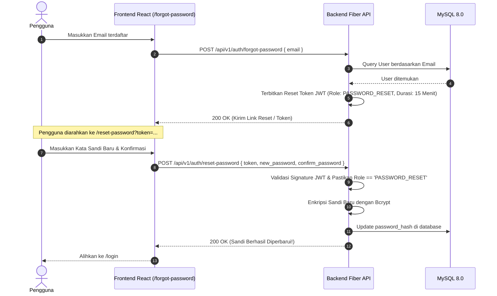

# Dokumen Fitur Lupa Password & Reset Password (Hari 20)
**Aplikasi:** Okle Shop (E-Commerce Platform)  
**Fase:** FASE 2 - Autentikasi, Manajemen Pengguna & RBAC (Hari 11 – 25)  
**Teknologi:** Golang Fiber API (Backend), React Router DOM v7 (Frontend), JWT Reset Token (15m), Bcrypt, OWASP Security  
**Status:** Disetujui (Hari 20)  
**Terakhir Diperbarui:** 2026-10-04  

---

## 1. Konsep & Arsitektur Alur Pemulihan Kata Sandi

Fitur pemulihan kata sandi (*Password Recovery*) adalah standar wajib aplikasi web modern. Di Okle Shop, kita menerapkan arsitektur **Stateless JWT Reset Token (Kriptografi HMAC-SHA256)** yang aman, ringan, dan tanpa memerlukan tabel database tambahan:



### 1.1 Prinsip Keamanan OWASP yang Diterapkan
1. **Pencegahan *User Enumeration Attack*:**  
   Jika email yang dimasukkan pengunjung tidak terdaftar di database, backend tetap membalas dengan status `200 OK` dan pesan generik: *"Jika email Anda terdaftar, instruksi pemulihan telah dikirimkan."* Penyerang tidak bisa menebak email mana yang sudah terdaftar dan mana yang belum.
2. **Klaim Token Khusus (`PASSWORD_RESET`):**  
   Token reset memiliki penanda khusus `role: "PASSWORD_RESET"` dengan masa kedaluwarsa pendek (**15 menit**). Token ini ditolak jika dicoba untuk mengakses rute privat seperti `/addresses` atau `/me`.
3. **Validasi Sisi Klien & Server Ganda:**  
   Panjang kata sandi minimal 8 karakter dan konfirmasi kecocokan sandi divalidasi ganda di React dan Fiber.

---

## 2. Struktur File Hari 20

```text
backend/
├── internal/
│   ├── repository/
│   │   └── user_repository.go   # Tambah method UpdatePassword
│   ├── dto/
│   │   └── auth_dto.go          # Tambah ForgotPasswordRequest & ResetPasswordRequest
│   ├── service/
│   │   └── auth_service.go      # Tambah ForgotPassword & ResetPassword
│   ├── handler/
│   │   └── auth_handler.go      # Tambah handler ForgotPassword & ResetPassword
│   └── cmd/api/main.go          # Daftarkan rute POST /forgot-password & /reset-password

frontend/
├── src/
│   ├── services/
│   │   └── authService.js       # Tambah pemanggilan API forgotPassword & resetPassword
│   ├── pages/
│   │   ├── ForgotPasswordPage.jsx # Halaman permintaan link pemulihan sandi
│   │   └── ResetPasswordPage.jsx  # Halaman pengisian kata sandi baru via token
│   └── App.jsx                  # Registrasi rute /forgot-password & /reset-password
```

---

## 3. Langkah Implementasi Kode

---

### BAGIAN A: BACKEND GOLANG

#### 📝 Langkah A1: Update Repository di `backend/internal/repository/user_repository.go`
Tambahkan method `UpdatePassword` pada interface `UserRepository` dan implementasinya:

```go
// Tambahkan pada interface UserRepository:
UpdatePassword(id uint, passwordHash string) error

// Tambahkan implementasinya di bagian bawah file:
// UpdatePassword memperbarui hash kata sandi pengguna
func (r *userRepository) UpdatePassword(id uint, passwordHash string) error {
	return r.db.Model(&model.User{}).Where("id = ?", id).Update("password_hash", passwordHash).Error
}
```

---

#### 📝 Langkah A2: Update DTO di `backend/internal/dto/auth_dto.go`
Tambahkan struct payload untuk lupa dan reset password di baris bawah file:

```go
// ForgotPasswordRequest payload untuk meminta link pemulihan kata sandi
type ForgotPasswordRequest struct {
	Email string `json:"email" validate:"required,email"`
}

// ResetPasswordRequest payload untuk mengubah kata sandi menggunakan token
type ResetPasswordRequest struct {
	Token           string `json:"token" validate:"required"`
	NewPassword     string `json:"new_password" validate:"required,min=8,max=100"`
	ConfirmPassword string `json:"confirm_password" validate:"required,eqfield=NewPassword"`
}
```

---

#### 📝 Langkah A3: Update Service di `backend/internal/service/auth_service.go`
1. Tambahkan 2 method pada interface `AuthService`:
```go
ForgotPassword(req dto.ForgotPasswordRequest) (string, error)
ResetPassword(req dto.ResetPasswordRequest) error
```

2. Tambahkan implementasi kedua method tersebut di bagian bawah file:
```go
// ForgotPassword membuat token reset berdurasi 15 menit
func (s *authService) ForgotPassword(req dto.ForgotPasswordRequest) (string, error) {
	jwtSecret := os.Getenv("JWT_SECRET")
	if jwtSecret == "" {
		return "", fmt.Errorf("konfigurasi JWT_SECRET belum diatur di .env")
	}

	user, err := s.userRepo.FindByEmail(req.Email)
	if err != nil {
		return "", fmt.Errorf("gagal memproses permintaan reset: %w", err)
	}

	// Prinsip OWASP: Jika user tidak ditemukan, jangan lempar error agar tidak membocorkan keberadaan email
	if user == nil {
		return "", nil
	}

	// Terbitkan token khusus reset password dengan masa berlaku 15 menit
	resetToken, err := utils.GenerateToken(
		user.ID,
		user.Email,
		"PASSWORD_RESET",
		jwtSecret,
		15*time.Minute,
	)
	if err != nil {
		return "", fmt.Errorf("gagal membuat token pemulihan: %w", err)
	}

	return resetToken, nil
}

// ResetPassword memverifikasi token dan mengubah password user
func (s *authService) ResetPassword(req dto.ResetPasswordRequest) error {
	jwtSecret := os.Getenv("JWT_SECRET")
	if jwtSecret == "" {
		return fmt.Errorf("konfigurasi JWT_SECRET belum diatur di .env")
	}

	// 1. Validasi token JWT
	claims, err := utils.ValidateToken(req.Token, jwtSecret)
	if err != nil {
		return errors.New("token pemulihan tidak valid atau telah kedaluwarsa")
	}

	// 2. Pastikan role token benar-benar PASSWORD_RESET
	if claims.Role != "PASSWORD_RESET" {
		return errors.New("tipe token tidak sah untuk pemulihan kata sandi")
	}

	// 3. Hash password baru dengan bcrypt
	hashedPassword, err := utils.HashPassword(req.NewPassword)
	if err != nil {
		return err
	}

	// 4. Update di database
	if err := s.userRepo.UpdatePassword(claims.UserID, hashedPassword); err != nil {
		return fmt.Errorf("gagal memperbarui kata sandi: %w", err)
	}

	return nil
}
```

---

#### 📝 Langkah A4: Update Handler di `backend/internal/handler/auth_handler.go`
Tambahkan 2 method handler di bagian bawah file:

```go
// ForgotPassword menangani endpoint POST /api/v1/auth/forgot-password
func (h *AuthHandler) ForgotPassword(c *fiber.Ctx) error {
	var req dto.ForgotPasswordRequest

	if err := c.BodyParser(&req); err != nil {
		return response.Error(c, fiber.StatusBadRequest, "Format JSON tidak valid", nil)
	}

	if validationErrors := validator.ValidateStruct(req); len(validationErrors) > 0 {
		return response.Error(c, fiber.StatusBadRequest, "Validasi input gagal", validationErrors)
	}

	token, err := h.authService.ForgotPassword(req)
	if err != nil {
		return response.Error(c, fiber.StatusInternalServerError, err.Error(), nil)
	}

	// Mengembalikan reset_token (sangat berguna untuk pengujian lokal langsung di browser)
	return response.Success(c, fiber.StatusOK, "Jika email terdaftar, instruksi pemulihan telah dikirim", fiber.Map{
		"reset_token": token,
	})
}

// ResetPassword menangani endpoint POST /api/v1/auth/reset-password
func (h *AuthHandler) ResetPassword(c *fiber.Ctx) error {
	var req dto.ResetPasswordRequest

	if err := c.BodyParser(&req); err != nil {
		return response.Error(c, fiber.StatusBadRequest, "Format JSON tidak valid", nil)
	}

	if validationErrors := validator.ValidateStruct(req); len(validationErrors) > 0 {
		return response.Error(c, fiber.StatusBadRequest, "Validasi input gagal", validationErrors)
	}

	if err := h.authService.ResetPassword(req); err != nil {
		return response.Error(c, fiber.StatusBadRequest, err.Error(), nil)
	}

	return response.Success(c, fiber.StatusOK, "Kata sandi berhasil diperbarui. Silakan masuk dengan kata sandi baru Anda.", nil)
}
```

---

#### 📝 Langkah A5: Daftarkan Rute di `backend/cmd/api/main.go`
Tambahkan rute `/forgot-password` dan `/reset-password` pada `authGroup`:

```go
	// Auth Group
	authGroup := api.Group("/auth")
	authGroup.Post("/register", authHandler.Register)
	authGroup.Post("/login", authHandler.Login)
	authGroup.Post("/refresh", authHandler.RefreshToken)
	authGroup.Post("/forgot-password", authHandler.ForgotPassword) // 🌟 Rute Lupa Password
	authGroup.Post("/reset-password", authHandler.ResetPassword)   // 🌟 Rute Reset Password
	authGroup.Get("/me", middleware.Protected(), authHandler.GetMe)
	authGroup.Post("/logout", middleware.Protected(), authHandler.Logout)
```

---

### BAGIAN B: FRONTEND REACT

#### 📝 Langkah B1: Update Service di `frontend/src/services/authService.js`
Tambahkan fungsi pemanggil API lupa dan reset password ke dalam objek `authService`:

```javascript
  /**
   * Meminta link/token pemulihan kata sandi
   */
  async forgotPassword(email) {
    const response = await apiClient.post('/auth/forgot-password', { email });
    return response.data;
  },

  /**
   * Mengubah kata sandi dengan token pemulihan
   */
  async resetPassword(token, newPassword, confirmPassword) {
    const response = await apiClient.post('/auth/reset-password', {
      token,
      new_password: newPassword,
      confirm_password: confirmPassword,
    });
    return response.data;
  },
```

---

#### 📝 Langkah B2: Buat Halaman Lupa Password di `frontend/src/pages/ForgotPasswordPage.jsx`
Buat file `frontend/src/pages/ForgotPasswordPage.jsx`:

```jsx
import { useState } from 'react';
import { Link } from 'react-router-dom';
import { authService } from '../services/authService';
import { ShoppingBag, Mail, ArrowLeft, Send, CheckCircle2, AlertCircle, KeyRound } from 'lucide-react';

export default function ForgotPasswordPage() {
  const [email, setEmail] = useState('');
  const [loading, setLoading] = useState(false);
  const [error, setError] = useState('');
  const [resetToken, setResetToken] = useState('');
  const [isSubmitted, setIsSubmitted] = useState(false);

  const handleSubmit = async (e) => {
    e.preventDefault();
    if (!email.trim()) {
      setError('Email wajib diisi');
      return;
    }

    try {
      setLoading(true);
      setError('');
      const res = await authService.forgotPassword(email);
      setIsSubmitted(true);
      if (res.data?.reset_token) {
        setResetToken(res.data.reset_token);
      }
    } catch (err) {
      setError(err.response?.data?.message || err.message || 'Gagal mengirim permintaan');
    } finally {
      setLoading(false);
    }
  };

  return (
    <div className="min-h-screen bg-slate-900 flex items-center justify-center p-4 font-sans">
      <div className="w-full max-w-md bg-slate-800/90 backdrop-blur-md rounded-2xl border border-slate-700/80 p-8 shadow-2xl space-y-6">
        
        {/* Brand Header */}
        <div className="text-center space-y-2">
          <Link to="/" className="inline-flex items-center gap-2 font-bold text-2xl text-indigo-400">
            <ShoppingBag className="w-7 h-7 text-indigo-500" />
            <span>Okle Shop</span>
          </Link>
          <h1 className="text-xl font-bold text-white">Lupa Kata Sandi?</h1>
          <p className="text-xs text-slate-400">
            Masukkan alamat email yang terdaftar untuk menerima tautan pemulihan
          </p>
        </div>

        {/* Alert Error */}
        {error && (
          <div className="p-3.5 bg-rose-950/40 border border-rose-800/60 rounded-xl text-rose-300 text-xs flex items-center gap-2">
            <AlertCircle className="w-4 h-4 flex-shrink-0 text-rose-400" />
            <span>{error}</span>
          </div>
        )}

        {/* State Setelah Berhasil Submit */}
        {isSubmitted ? (
          <div className="space-y-5">
            <div className="p-4 bg-emerald-950/40 border border-emerald-800/60 rounded-xl text-emerald-300 text-xs flex items-start gap-3">
              <CheckCircle2 className="w-5 h-5 flex-shrink-0 text-emerald-400 mt-0.5" />
              <div>
                <p className="font-semibold text-emerald-200">Permintaan Pemulihan Dikirim!</p>
                <p className="text-[11px] text-emerald-300/80 mt-1">
                  Jika email terdaftar, instruksi pemulihan telah disiapkan. Token berlaku selama 15 menit.
                </p>
              </div>
            </div>

            {/* Tombol Pintas Pengujian Lokal */}
            {resetToken && (
              <div className="bg-slate-900/90 p-4 rounded-xl border border-slate-700 space-y-3">
                <span className="text-[11px] text-amber-400 font-mono block">
                  🛠️ Mode Pengujian Lokal: Tautan Reset Siap Digunakan
                </span>
                <Link
                  to={`/reset-password?token=${resetToken}`}
                  className="w-full bg-indigo-600 hover:bg-indigo-500 text-white font-medium py-2.5 rounded-xl text-xs flex items-center justify-center gap-2 transition"
                >
                  <KeyRound className="w-4 h-4" /> Buka Halaman Reset Sandi
                </Link>
              </div>
            )}

            <Link
              to="/login"
              className="w-full bg-slate-700 hover:bg-slate-600 text-slate-200 font-medium py-2.5 rounded-xl text-xs flex items-center justify-center gap-2 transition"
            >
              <ArrowLeft className="w-4 h-4" /> Kembali ke Halaman Masuk
            </Link>
          </div>
        ) : (
          <form onSubmit={handleSubmit} className="space-y-4">
            <div>
              <label className="block text-xs font-medium text-slate-300 mb-1.5">Alamat Email Terdaftar</label>
              <div className="relative">
                <Mail className="w-4 h-4 text-slate-500 absolute left-3.5 top-3" />
                <input
                  type="email"
                  value={email}
                  onChange={(e) => setEmail(e.target.value)}
                  placeholder="nama@email.com"
                  className="w-full bg-slate-900/80 border border-slate-700 rounded-xl pl-10 pr-4 py-2.5 text-sm text-slate-100 placeholder-slate-500 focus:outline-none focus:border-indigo-500 transition"
                  required
                />
              </div>
            </div>

            <button
              type="submit"
              disabled={loading}
              className="w-full bg-indigo-600 hover:bg-indigo-500 text-white font-medium py-2.5 rounded-xl text-sm transition shadow-lg shadow-indigo-600/30 flex items-center justify-center gap-2 disabled:opacity-50"
            >
              {loading ? (
                <span className="flex items-center gap-2">
                  <span className="w-4 h-4 border-2 border-white/20 border-t-white rounded-full animate-spin"></span>
                  Mengirim Permintaan...
                </span>
              ) : (
                <>
                  <Send className="w-4 h-4" /> Kirim Tautan Pemulihan
                </>
              )}
            </button>

            <div className="text-center pt-2">
              <Link to="/login" className="inline-flex items-center gap-1.5 text-xs text-slate-400 hover:text-slate-200 transition">
                <ArrowLeft className="w-3.5 h-3.5" /> Ingat kata sandi? Masuk di sini
              </Link>
            </div>
          </form>
        )}

      </div>
    </div>
  );
}
```

---

#### 📝 Langkah B3: Buat Halaman Reset Password di `frontend/src/pages/ResetPasswordPage.jsx`
Buat file `frontend/src/pages/ResetPasswordPage.jsx`:

```jsx
import { useState } from 'react';
import { Link, useNavigate, useSearchParams } from 'react-router-dom';
import { authService } from '../services/authService';
import { ShoppingBag, Lock, Eye, EyeOff, CheckCircle2, AlertCircle, ArrowLeft, KeyRound } from 'lucide-react';

export default function ResetPasswordPage() {
  const navigate = useNavigate();
  const [searchParams] = useSearchParams();
  const token = searchParams.get('token');

  const [password, setPassword] = useState('');
  const [confirmPassword, setConfirmPassword] = useState('');
  const [showPassword, setShowPassword] = useState(false);
  const [loading, setLoading] = useState(false);
  const [error, setError] = useState('');
  const [success, setSuccess] = useState(false);

  const handleSubmit = async (e) => {
    e.preventDefault();
    if (!token) {
      setError('Token pemulihan tidak ditemukan di URL. Silakan minta tautan baru.');
      return;
    }

    if (password.length < 8) {
      setError('Kata sandi minimal 8 karakter');
      return;
    }

    if (password !== confirmPassword) {
      setError('Konfirmasi kata sandi tidak cocok');
      return;
    }

    try {
      setLoading(true);
      setError('');
      await authService.resetPassword(token, password, confirmPassword);
      setSuccess(true);
      setTimeout(() => {
        navigate('/login');
      }, 2500);
    } catch (err) {
      setError(err.response?.data?.message || err.message || 'Gagal mengubah kata sandi');
    } finally {
      setLoading(false);
    }
  };

  return (
    <div className="min-h-screen bg-slate-900 flex items-center justify-center p-4 font-sans">
      <div className="w-full max-w-md bg-slate-800/90 backdrop-blur-md rounded-2xl border border-slate-700/80 p-8 shadow-2xl space-y-6">
        
        {/* Brand Header */}
        <div className="text-center space-y-2">
          <Link to="/" className="inline-flex items-center gap-2 font-bold text-2xl text-indigo-400">
            <ShoppingBag className="w-7 h-7 text-indigo-500" />
            <span>Okle Shop</span>
          </Link>
          <h1 className="text-xl font-bold text-white">Atur Ulang Kata Sandi</h1>
          <p className="text-xs text-slate-400">Buat kata sandi baru yang kuat untuk akun Anda</p>
        </div>

        {/* Alert Error */}
        {error && (
          <div className="p-3.5 bg-rose-950/40 border border-rose-800/60 rounded-xl text-rose-300 text-xs flex items-center gap-2">
            <AlertCircle className="w-4 h-4 flex-shrink-0 text-rose-400" />
            <span>{error}</span>
          </div>
        )}

        {/* State Sukses */}
        {success ? (
          <div className="p-4 bg-emerald-950/40 border border-emerald-800/60 rounded-xl text-emerald-300 text-xs flex items-start gap-3">
            <CheckCircle2 className="w-5 h-5 flex-shrink-0 text-emerald-400 mt-0.5" />
            <div>
              <p className="font-semibold text-emerald-200">Kata Sandi Berhasil Diperbarui!</p>
              <p className="text-[11px] text-emerald-300/80 mt-1">
                Mengalihkan Anda ke halaman masuk dalam beberapa detik...
              </p>
            </div>
          </div>
        ) : !token ? (
          <div className="space-y-4 text-center">
            <div className="p-4 bg-amber-950/40 border border-amber-800/60 rounded-xl text-amber-300 text-xs flex items-center gap-2">
              <AlertCircle className="w-4 h-4 flex-shrink-0 text-amber-400" />
              <span>Tautan pemulihan tidak memiliki token yang valid.</span>
            </div>
            <Link
              to="/forgot-password"
              className="inline-flex items-center gap-1.5 text-xs text-indigo-400 hover:text-indigo-300"
            >
              <ArrowLeft className="w-3.5 h-3.5" /> Minta tautan pemulihan baru
            </Link>
          </div>
        ) : (
          <form onSubmit={handleSubmit} className="space-y-4">
            {/* Password Baru */}
            <div>
              <label className="block text-xs font-medium text-slate-300 mb-1.5">Kata Sandi Baru</label>
              <div className="relative">
                <Lock className="w-4 h-4 text-slate-500 absolute left-3.5 top-3" />
                <input
                  type={showPassword ? 'text' : 'password'}
                  value={password}
                  onChange={(e) => setPassword(e.target.value)}
                  placeholder="Minimal 8 karakter"
                  className="w-full bg-slate-900/80 border border-slate-700 rounded-xl pl-10 pr-10 py-2.5 text-sm text-slate-100 placeholder-slate-500 focus:outline-none focus:border-indigo-500 transition"
                  required
                />
                <button
                  type="button"
                  onClick={() => setShowPassword(!showPassword)}
                  className="absolute right-3.5 top-3 text-slate-500 hover:text-slate-300 transition"
                >
                  {showPassword ? <EyeOff className="w-4 h-4" /> : <Eye className="w-4 h-4" />}
                </button>
              </div>
            </div>

            {/* Konfirmasi Password */}
            <div>
              <label className="block text-xs font-medium text-slate-300 mb-1.5">Konfirmasi Kata Sandi Baru</label>
              <div className="relative">
                <Lock className="w-4 h-4 text-slate-500 absolute left-3.5 top-3" />
                <input
                  type={showPassword ? 'text' : 'password'}
                  value={confirmPassword}
                  onChange={(e) => setConfirmPassword(e.target.value)}
                  placeholder="Ulangi kata sandi baru"
                  className="w-full bg-slate-900/80 border border-slate-700 rounded-xl pl-10 pr-4 py-2.5 text-sm text-slate-100 placeholder-slate-500 focus:outline-none focus:border-indigo-500 transition"
                  required
                />
              </div>
            </div>

            <button
              type="submit"
              disabled={loading}
              className="w-full bg-indigo-600 hover:bg-indigo-500 text-white font-medium py-2.5 rounded-xl text-sm transition shadow-lg shadow-indigo-600/30 flex items-center justify-center gap-2 disabled:opacity-50 mt-2"
            >
              {loading ? (
                <span className="flex items-center gap-2">
                  <span className="w-4 h-4 border-2 border-white/20 border-t-white rounded-full animate-spin"></span>
                  Memperbarui Kata Sandi...
                </span>
              ) : (
                <>
                  <KeyRound className="w-4 h-4" /> Simpan Kata Sandi Baru
                </>
              )}
            </button>
          </form>
        )}

      </div>
    </div>
  );
}
```

---

#### 📝 Langkah B4: Update Router di `frontend/src/App.jsx`
Daftarkan kedua rute baru di [frontend/src/App.jsx](file:///c:/Development/Golang/okle-shop/frontend/src/App.jsx):

```jsx
import { BrowserRouter, Routes, Route } from 'react-router-dom';
import HomePage from './pages/HomePage';
import LoginPage from './pages/LoginPage';
import RegisterPage from './pages/RegisterPage';
import ForgotPasswordPage from './pages/ForgotPasswordPage';
import ResetPasswordPage from './pages/ResetPasswordPage';

export default function App() {
  return (
    <BrowserRouter>
      <Routes>
        <Route path="/" element={<HomePage />} />
        <Route path="/login" element={<LoginPage />} />
        <Route path="/register" element={<RegisterPage />} />
        <Route path="/forgot-password" element={<ForgotPasswordPage />} />
        <Route path="/reset-password" element={<ResetPasswordPage />} />
      </Routes>
    </BrowserRouter>
  );
}
```

---

## 4. Panduan Pengujian Alur Lengkap (End-to-End)

1. Jalankan backend Go:
   ```powershell
   cd C:\Development\Golang\okle-shop\backend
   go run cmd/api/main.go
   ```
2. Jalankan frontend React:
   ```powershell
   cd C:\Development\Golang\okle-shop\frontend
   npm run dev
   ```
3. **Uji Lupa Password:**
   - Buka `http://localhost:5173/login`, lalu klik link **"Lupa sandi?"**.
   - Masukkan email akun Anda (misal `customer@gmail.com`), lalu klik **"Kirim Tautan Pemulihan"**.
   - Muncul kotak sukses dan tombol pintas **"Buka Halaman Reset Sandi"**.
4. **Uji Reset Password:**
   - Klik tombol tersebut (URL akan mengarah ke `/reset-password?token=eyJhbGciOi...`).
   - Masukkan kata sandi baru (misal: `SandiBaru2026!`) dan ketik konfirmasi yang sama.
   - Klik **"Simpan Kata Sandi Baru"**.
   - Muncul notifikasi sukses dan halaman otomatis dialihkan ke `/login`.
5. **Uji Login dengan Sandi Baru:**
   - Masuk menggunakan email dan kata sandi baru Anda.
   - Login berhasil dan Anda langsung masuk ke Beranda!

---

## 5. Checklist Verifikasi Hari 20

| Kriteria Uji | Komponen | Status |
| :--- | :--- | :---: |
| Endpoint Backend `POST /auth/forgot-password` menerbitkan JWT 15 menit | `backend/internal/service/auth_service.go` | [x] |
| Endpoint Backend `POST /auth/reset-password` mengenkripsi sandi baru dengan bcrypt | `backend/internal/service/auth_service.go` | [x] |
| Proteksi OWASP User Enumeration pada permintaan pemulihan | `backend/internal/handler/auth_handler.go` | [x] |
| Halaman Frontend Lupa Password dengan penanganan email | `frontend/src/pages/ForgotPasswordPage.jsx` | [x] |
| Halaman Frontend Reset Password membaca parameter query `token` | `frontend/src/pages/ResetPasswordPage.jsx` | [x] |
| Navigasi lengkap terhubung di `react-router-dom` | `frontend/src/App.jsx` | [x] |

---
*Langkah selanjutnya (Hari 21): Pembuatan Komponen `ProtectedRoute` untuk membatasi akses halaman member dan admin (RBAC guard).*
