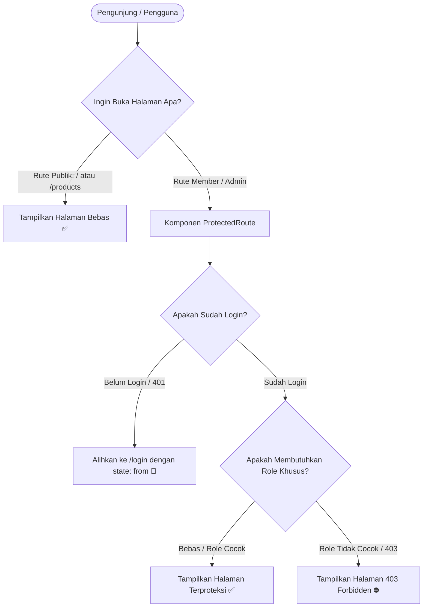

# Dokumen Komponen ProtectedRoute & Role-Based Access Control / RBAC (Hari 21)
**Aplikasi:** Okle Shop (E-Commerce Platform)  
**Fase:** FASE 2 - Autentikasi, Manajemen Pengguna & RBAC (Hari 11 – 25)  
**Teknologi:** React 18/19, React Router DOM v7, Zustand Store, RBAC (Customer vs Admin), HTTP 401 & 403 Guards  
**Status:** Disetujui (Hari 21)  
**Terakhir Diperbarui:** 2026-10-04  

---

## 1. Konsep & Arsitektur Pelindung Rute (ProtectedRoute)

Di aplikasi web e-commerce, halaman aplikasi terbagi menjadi 3 tingkat keamanan:
1. **Rute Publik (Semua Orang Boleh Masuk):** Beranda (`/`), Katalog Produk (`/products`), Halaman Masuk (`/login`), dan Pendaftaran (`/register`).
2. **Rute Member / Pelanggan (Wajib Login):** Buku Alamat (`/addresses`), Profil (`/profile`), Riwayat Pesanan (`/orders`), dan Checkout (`/checkout`).
3. **Rute Khusus Admin (Wajib Login DAN Wajib Role ADMIN):** Dashboard Admin (`/admin/dashboard`), Manajemen Produk (`/admin/products`), dan Laporan Penjualan (`/admin/reports`).



### 1.1 Penanganan "Intent Redirect" (Pengalaman Pengguna Terbaik)
Jika pembeli yang belum login mencoba membuka `/addresses`, `ProtectedRoute` tidak hanya melemparnya ke `/login`, melainkan menitipkan alamat asal tersebut (`state={{ from: location }}`).  
Setelah pembeli berhasil login, halaman login akan otomatis mengarahkannya **langsung ke `/addresses`**, bukan ke halaman beranda. Pengguna tidak perlu mencari ulang menu yang tadi ingin dibukanya!

---

## 2. Struktur File Hari 21 di `frontend/`

```text
frontend/src/
├── components/
│   └── ProtectedRoute.jsx     # Komponen Satpam Rute (Auth & RBAC Guard)
├── pages/
│   ├── ForbiddenPage.jsx      # Halaman 403 Akses Ditolak
│   ├── AdminDashboardPage.jsx # Halaman Panel Admin (Khusus Role ADMIN)
│   └── LoginPage.jsx          # Perbarui agar mendukung auto-redirect ke halaman asal
└── App.jsx                    # Konfigurasi pembungkusan rute terproteksi
```

---

## 3. Langkah Implementasi Kode

---

### Langkah 1: Buat Komponen `ProtectedRoute` di `frontend/src/components/ProtectedRoute.jsx`
Buat folder `frontend/src/components/`, lalu buat file `ProtectedRoute.jsx`:

```jsx
import { Navigate, Outlet, useLocation } from 'react-router-dom';
import { useAuthStore } from '../store/authStore';

/**
 * ProtectedRoute membatasi akses halaman berdasarkan status login dan role pengguna.
 * @param {Array<string>} allowedRoles - Daftar role yang diizinkan (misal: ['ADMIN'] atau ['CUSTOMER', 'ADMIN'])
 */
export default function ProtectedRoute({ allowedRoles = [] }) {
  const location = useLocation();
  const { isAuthenticated, user, isLoading } = useAuthStore();

  // 1. Tampilkan loading spinner jika status auth masih di-rehydrate
  if (isLoading) {
    return (
      <div className="min-h-screen bg-slate-900 flex items-center justify-center">
        <div className="flex flex-col items-center gap-3">
          <div className="w-8 h-8 border-3 border-indigo-500 border-t-transparent rounded-full animate-spin"></div>
          <p className="text-xs text-slate-400 font-mono">Memverifikasi hak akses...</p>
        </div>
      </div>
    );
  }

  // 2. KONDISI 401 UNAUTHORIZED: Pengguna belum login
  // Alihkan ke /login dan titipkan lokasi asal agar bisa kembali setelah login
  if (!isAuthenticated || !user) {
    return <Navigate to="/login" state={{ from: location }} replace />;
  }

  // 3. KONDISI 403 FORBIDDEN: Pengguna sudah login, tetapi rolenya tidak diizinkan
  // Contoh: Pengguna dengan role 'CUSTOMER' mencoba membuka rute 'ADMIN'
  if (allowedRoles.length > 0 && !allowedRoles.includes(user.role)) {
    return <Navigate to="/forbidden" replace />;
  }

  // 4. AKSES DIIZINKAN: Render halaman anak (Outlet)
  return <Outlet />;
}
```

---

### Langkah 2: Buat Halaman 403 Forbidden di `frontend/src/pages/ForbiddenPage.jsx`
Buat file `ForbiddenPage.jsx` di dalam folder `src/pages/`:

```jsx
import { Link } from 'react-router-dom';
import { ShieldAlert, ArrowLeft, Home } from 'lucide-react';
import { useAuthStore } from '../store/authStore';

export default function ForbiddenPage() {
  const { user } = useAuthStore();

  return (
    <div className="min-h-screen bg-slate-900 text-slate-100 flex items-center justify-center p-4 font-sans">
      <div className="max-w-md w-full bg-slate-800/80 backdrop-blur-md rounded-2xl border border-rose-800/40 p-8 text-center shadow-2xl space-y-6">
        
        {/* Ikon Peringatan 403 */}
        <div className="w-16 h-16 rounded-2xl bg-rose-500/20 text-rose-400 flex items-center justify-center mx-auto border border-rose-500/30">
          <ShieldAlert className="w-9 h-9" />
        </div>

        {/* Teks Penjelasan */}
        <div className="space-y-2">
          <span className="text-xs font-mono font-bold text-rose-400 tracking-widest uppercase">
            Error 403: Forbidden
          </span>
          <h1 className="text-2xl font-bold text-white">Akses Halaman Dibatasi</h1>
          <p className="text-xs text-slate-400 leading-relaxed">
            Akun Anda saat ini memiliki peran{' '}
            <span className="text-indigo-400 font-semibold font-mono">{user?.role || 'GUEST'}</span>. Halaman yang Anda tuju membutuhkan hak akses tingkat Administrator.
          </p>
        </div>

        {/* Tombol Aksi */}
        <div className="pt-2 flex flex-col sm:flex-row gap-3">
          <Link
            to="/"
            className="flex-1 bg-indigo-600 hover:bg-indigo-500 text-white font-medium py-2.5 rounded-xl text-xs flex items-center justify-center gap-2 transition shadow-lg shadow-indigo-600/30"
          >
            <Home className="w-4 h-4" /> Kembali ke Beranda
          </Link>
          <button
            onClick={() => window.history.back()}
            className="px-4 py-2.5 bg-slate-700 hover:bg-slate-600 text-slate-300 rounded-xl text-xs font-medium flex items-center justify-center gap-2 transition border border-slate-600"
          >
            <ArrowLeft className="w-4 h-4" /> Kembali
          </button>
        </div>

      </div>
    </div>
  );
}
```

---

### Langkah 3: Buat Halaman Panel Admin di `frontend/src/pages/AdminDashboardPage.jsx`
Buat file `AdminDashboardPage.jsx` sebagai halaman contoh yang dilindungi oleh role `ADMIN`:

```jsx
import { Link } from 'react-router-dom';
import { useAuthStore } from '../store/authStore';
import { ShieldCheck, Package, ShoppingCart, DollarSign, Users, ArrowLeft, LogOut } from 'lucide-react';

export default function AdminDashboardPage() {
  const { user, logout } = useAuthStore();

  return (
    <div className="min-h-screen bg-slate-900 text-slate-100 flex flex-col font-sans">
      {/* Topbar Admin */}
      <header className="bg-slate-800 border-b border-slate-700 px-6 py-4 flex justify-between items-center">
        <div className="flex items-center gap-3">
          <div className="w-9 h-9 rounded-xl bg-amber-500/20 text-amber-400 flex items-center justify-center border border-amber-500/30">
            <ShieldCheck className="w-5 h-5" />
          </div>
          <div>
            <h1 className="font-bold text-base text-slate-100">Okle Shop - Panel Admin</h1>
            <p className="text-xs text-slate-400">Area Terproteksi Khusus Role ADMINISTRATOR</p>
          </div>
        </div>

        <div className="flex items-center gap-4">
          <div className="text-right hidden sm:block">
            <p className="text-xs font-semibold text-slate-200">{user?.name} ({user?.email})</p>
            <span className="text-[10px] bg-amber-500/20 text-amber-300 border border-amber-500/40 px-2 py-0.5 rounded-full font-bold">
              SUPERADMIN
            </span>
          </div>
          <button
            onClick={logout}
            className="flex items-center gap-1.5 px-3 py-1.5 rounded-lg text-xs font-medium bg-rose-600/20 text-rose-300 hover:bg-rose-600/30 border border-rose-600/30 transition"
          >
            <LogOut className="w-3.5 h-3.5" /> Keluar
          </button>
        </div>
      </header>

      {/* Konten Dashboard */}
      <main className="flex-1 max-w-7xl mx-auto px-6 py-8 w-full space-y-8">
        <div className="flex items-center justify-between">
          <div>
            <h2 className="text-2xl font-bold text-white">Ringkasan Operasional Toko</h2>
            <p className="text-xs text-slate-400 mt-1">Data penjualan dan manajemen inventaris produk</p>
          </div>
          <Link
            to="/"
            className="flex items-center gap-1.5 text-xs text-indigo-400 hover:text-indigo-300 transition"
          >
            <ArrowLeft className="w-3.5 h-3.5" /> Lihat Tampilan Pembeli
          </Link>
        </div>

        {/* Kartu Metrik Toko */}
        <div className="grid grid-cols-1 sm:grid-cols-2 lg:grid-cols-4 gap-4">
          <div className="bg-slate-800 p-5 rounded-2xl border border-slate-700 space-y-2">
            <div className="w-8 h-8 rounded-lg bg-emerald-500/20 text-emerald-400 flex items-center justify-center">
              <DollarSign className="w-4 h-4" />
            </div>
            <p className="text-xs text-slate-400">Total Pendapatan</p>
            <p className="text-xl font-bold text-white">Rp 50.000.000</p>
          </div>

          <div className="bg-slate-800 p-5 rounded-2xl border border-slate-700 space-y-2">
            <div className="w-8 h-8 rounded-lg bg-sky-500/20 text-sky-400 flex items-center justify-center">
              <ShoppingCart className="w-4 h-4" />
            </div>
            <p className="text-xs text-slate-400">Pesanan Masuk</p>
            <p className="text-xl font-bold text-white">128 Pesanan</p>
          </div>

          <div className="bg-slate-800 p-5 rounded-2xl border border-slate-700 space-y-2">
            <div className="w-8 h-8 rounded-lg bg-indigo-500/20 text-indigo-400 flex items-center justify-center">
              <Package className="w-4 h-4" />
            </div>
            <p className="text-xs text-slate-400">Katalog Produk</p>
            <p className="text-xl font-bold text-white">64 Item Aktif</p>
          </div>

          <div className="bg-slate-800 p-5 rounded-2xl border border-slate-700 space-y-2">
            <div className="w-8 h-8 rounded-lg bg-amber-500/20 text-amber-400 flex items-center justify-center">
              <Users className="w-4 h-4" />
            </div>
            <p className="text-xs text-slate-400">Pelanggan Terdaftar</p>
            <p className="text-xl font-bold text-white">1.042 Member</p>
          </div>
        </div>
      </main>
    </div>
  );
}
```

---

#### 📝 Langkah 4: Update `frontend/src/pages/LoginPage.jsx` (Dukung Intent Redirect)
Buka file [LoginPage.jsx](file:///c:/Development/Golang/okle-shop/frontend/src/pages/LoginPage.jsx). Tambahkan `useLocation` dan ubah pengalihan agar kembali ke halaman yang tadi sempat dituju:

```jsx
// 1. Tambahkan useLocation pada import react-router-dom:
import { Link, useNavigate, useLocation } from 'react-router-dom';

export default function LoginPage() {
  const navigate = useNavigate();
  const location = useLocation(); // 🌟 Ambil state navigasi
  const { login, isAuthenticated, isLoading, error, clearError } = useAuthStore();

  // Tentukan tujuan redirect: Kembali ke halaman yang tadi dicegat, atau ke '/' jika tidak ada
  const from = location.state?.from?.pathname || '/';

  useEffect(() => {
    if (isAuthenticated) {
      navigate(from, { replace: true }); // 🌟 Alihkan ke tujuan awal!
    }
    clearError();
  }, [isAuthenticated, navigate, from, clearError]);

  const handleSubmit = async (e) => {
    e.preventDefault();
    if (!validate()) return;

    try {
      await login(email, password);
      navigate(from, { replace: true }); // 🌟 Alihkan ke tujuan awal!
    } catch {
      // Ditangani useAuthStore
    }
  };
```

---

#### 📝 Langkah 5: Hubungkan Semua Rute di `frontend/src/App.jsx`
Buka [frontend/src/App.jsx](file:///c:/Development/Golang/okle-shop/frontend/src/App.jsx) dan susun rute publik serta rute terproteksi:

```jsx
import { BrowserRouter, Routes, Route } from 'react-router-dom';
import ProtectedRoute from './components/ProtectedRoute';

// Halaman-Halaman
import HomePage from './pages/HomePage';
import LoginPage from './pages/LoginPage';
import RegisterPage from './pages/RegisterPage';
import ForgotPasswordPage from './pages/ForgotPasswordPage';
import ResetPasswordPage from './pages/ResetPasswordPage';
import ForbiddenPage from './pages/ForbiddenPage';
import AdminDashboardPage from './pages/AdminDashboardPage';

export default function App() {
  return (
    <BrowserRouter>
      <Routes>
        {/* ========================================================= */}
        {/* 1. RUTE PUBLIK (Dapat Diakses Siapa Saja)                 */}
        {/* ========================================================= */}
        <Route path="/" element={<HomePage />} />
        <Route path="/login" element={<LoginPage />} />
        <Route path="/register" element={<RegisterPage />} />
        <Route path="/forgot-password" element={<ForgotPasswordPage />} />
        <Route path="/reset-password" element={<ResetPasswordPage />} />
        <Route path="/forbidden" element={<ForbiddenPage />} />

        {/* ========================================================= */}
        {/* 2. RUTE MEMBER (Wajib Login: Customer & Admin)            */}
        {/* ========================================================= */}
        <Route element={<ProtectedRoute allowedRoles={['CUSTOMER', 'ADMIN']} />}>
          {/* Halaman Profil & Alamat akan disambungkan di Hari 22 & 23 */}
        </Route>

        {/* ========================================================= */}
        {/* 3. RUTE KHUSUS ADMIN (Wajib Login DAN Wajib Role ADMIN)  */}
        {/* ========================================================= */}
        <Route element={<ProtectedRoute allowedRoles={['ADMIN']} />}>
          <Route path="/admin/dashboard" element={<AdminDashboardPage />} />
        </Route>
      </Routes>
    </BrowserRouter>
  );
}
```

---

## 4. Panduan Pengujian di Browser

Pastikan backend dan frontend sedang menyala:
```powershell
# Di terminal backend:
go run cmd/api/main.go

# Di terminal frontend:
npm run dev
```

### Skenario Uji Coba:

#### 1. Uji Proteksi Belum Login (401 Redirect)
* Pastikan Anda dalam keadaan **Logout** (Belum Login).
* Coba ketik langsung di URL browser: `http://localhost:5173/admin/dashboard`.
* **Hasil:** Anda seketika ditolak dan dialihkan ke `/login`.

#### 2. Uji Proteksi Role Tidak Cocok (403 Forbidden)
* Login menggunakan akun pembeli biasa (**Role `CUSTOMER`**, misal: `customer@gmail.com`).
* Setelah berhasil masuk, coba ketik di URL browser: `http://localhost:5173/admin/dashboard`.
* **Hasil:** `ProtectedRoute` memeriksa bahwa role Anda adalah `CUSTOMER` sedangkan halaman tersebut membutuhkan `ADMIN`. Anda langsung dialihkan ke halaman **403 Forbidden (`/forbidden`)**!

#### 3. Uji Hak Akses Administrator
* Login menggunakan akun dengan role **`ADMIN`**.  
  *(Jika Anda belum punya akun Admin, Anda dapat mengubah role akun Anda menjadi `'ADMIN'` di MySQL dengan query: `UPDATE users SET role = 'ADMIN' WHERE email = 'customer@gmail.com';`)*.
* Buka kembali: `http://localhost:5173/admin/dashboard`.
* **Hasil:** Panel Admin terbuka sempurna dengan tampilan metrik toko!

---

## 5. Checklist Verifikasi Hari 21

| Kriteria Uji | Komponen | Status |
| :--- | :--- | :---: |
| Komponen `ProtectedRoute` menangani status loading, auth, dan role | `frontend/src/components/ProtectedRoute.jsx` | [x] |
| Pengunjung belum login dialihkan ke `/login` dengan parameter `from` | Intent redirect via `location.state` | [x] |
| Pengguna role `CUSTOMER` ditolak masuk ke rute `ADMIN` (403 Forbidden) | `frontend/src/pages/ForbiddenPage.jsx` | [x] |
| Halaman Panel Admin terbuka lancar saat user memiliki role `ADMIN` | `frontend/src/pages/AdminDashboardPage.jsx` | [x] |
| Rute terproteksi tersusun rapi menggunakan hierarki `<Outlet />` | `frontend/src/App.jsx` | [x] |

---
*Langkah selanjutnya (Hari 22): Halaman Profil Pengguna (Edit Profil, Ganti Kata Sandi, dan Tampilan Avatar).*
