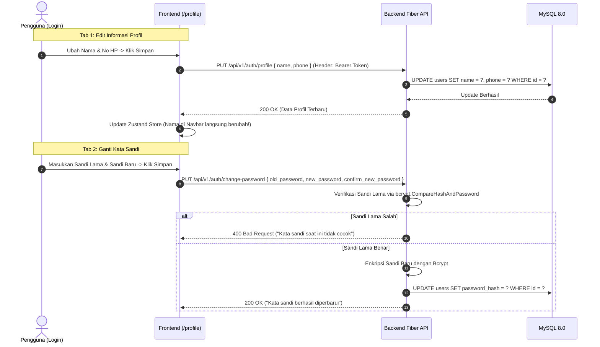

# Dokumen Halaman Profil Pengguna & Ganti Kata Sandi (Hari 22)
**Aplikasi:** Okle Shop (E-Commerce Platform)  
**Fase:** FASE 2 - Autentikasi, Manajemen Pengguna & RBAC (Hari 11 – 25)  
**Teknologi:** React 18/19, Golang Fiber API, GORM v1.25+, Zustand Auth Store, Bcrypt Password Verification  
**Status:** Disetujui (Hari 22)  
**Terakhir Diperbarui:** 2026-10-04  

---

## 1. Konsep & Arsitektur Manajemen Profil Pengguna

Di Hari 22, kita membangun sistem pengelolaan profil pengguna yang lengkap dari Backend hingga Frontend:
1. **Pembaruan Profil (*Edit Profile*):**
   - Mengubah nama lengkap dan nomor telepon/WhatsApp.
   - **Email Bersifat Terkunci (*Read-Only*):** Demi integritas data akun dan keamanan login, alamat email tidak dapat diubah secara bebas oleh form profil.
   - **Sinkronisasi Reaktif:** Saat nama pengguna berhasil diperbarui, Zustand Store seketika diperbarui sehingga nama di Navbar dan header atas langsung berubah secara instan tanpa perlu memuat ulang browser.
2. **Ganti Kata Sandi (*Change Password*):**
   - Wajib memverifikasi kata sandi lama (*Current Password*) dengan enkripsi Bcrypt di backend sebelum mengizinkan kata sandi baru dipasang.
   - Validasi kata sandi baru minimal 8 karakter dan konfirmasi sandi harus cocok.



---

## 2. Struktur File Hari 22

```text
backend/
├── internal/
│   ├── repository/
│   │   └── user_repository.go   # Tambah UpdateProfile
│   ├── dto/
│   │   └── auth_dto.go          # Tambah UpdateProfileRequest & ChangePasswordRequest
│   ├── service/
│   │   └── auth_service.go      # Tambah GetProfile, UpdateProfile, & ChangePassword
│   ├── handler/
│   │   └── auth_handler.go      # Update GetMe & tambah UpdateProfile, ChangePassword
│   └── cmd/api/main.go          # Registrasi rute PUT /profile & PUT /change-password

frontend/
├── src/
│   ├── services/
│   │   └── authService.js       # Tambah updateProfile & changePassword
│   ├── store/
│   │   └── authStore.js         # Tambah action updateProfile untuk reaktivitas UI
│   ├── pages/
│   │   ├── ProfilePage.jsx      # Halaman profil ber-tab (Edit Profil & Ganti Sandi)
│   │   └── HomePage.jsx         # Tambah tautan ke menu profil di Navbar
│   └── App.jsx                  # Pasang rute /profile di balik ProtectedRoute
```

---

## 3. Langkah Implementasi Kode

---

### BAGIAN A: BACKEND GOLANG

#### 📝 Langkah A1: Update Repository di `backend/internal/repository/user_repository.go`
1. Tambahkan `UpdateProfile(id uint, name string, phone string) error` pada interface `UserRepository`.
2. Tambahkan implementasinya di bagian bawah file:

```go
// UpdateProfile memperbarui nama dan nomor telepon user
func (r *userRepository) UpdateProfile(id uint, name string, phone string) error {
	return r.db.Model(&model.User{}).Where("id = ?", id).Updates(map[string]interface{}{
		"name":  name,
		"phone": phone,
	}).Error
}
```

---

#### 📝 Langkah A2: Update DTO di `backend/internal/dto/auth_dto.go`
Tambahkan struct `UpdateProfileRequest` dan `ChangePasswordRequest` pada bagian bawah file:

```go
// UpdateProfileRequest payload untuk memperbarui data diri
type UpdateProfileRequest struct {
	Name  string `json:"name" validate:"required,min=3,max=100"`
	Phone string `json:"phone" validate:"required,min=10,max=15"`
}

// ChangePasswordRequest payload untuk mengganti kata sandi
type ChangePasswordRequest struct {
	OldPassword        string `json:"old_password" validate:"required"`
	NewPassword        string `json:"new_password" validate:"required,min=8,max=100"`
	ConfirmNewPassword string `json:"confirm_new_password" validate:"required,eqfield=NewPassword"`
}
```

---

#### 📝 Langkah A3: Update Service di `backend/internal/service/auth_service.go`
1. Tambahkan 3 method pada interface `AuthService`:
```go
GetProfile(userID uint) (*dto.UserResponse, error)
UpdateProfile(userID uint, req dto.UpdateProfileRequest) (*dto.UserResponse, error)
ChangePassword(userID uint, req dto.ChangePasswordRequest) error
```

2. Tambahkan implementasi ketiga method tersebut di bagian bawah file:
```go
// GetProfile mengambil data profil lengkap dari database
func (s *authService) GetProfile(userID uint) (*dto.UserResponse, error) {
	user, err := s.userRepo.FindByID(userID)
	if err != nil {
		return nil, fmt.Errorf("gagal mengambil profil: %w", err)
	}
	if user == nil {
		return nil, errors.New("pengguna tidak ditemukan")
	}

	return &dto.UserResponse{
		ID:        user.ID,
		Name:      user.Name,
		Email:     user.Email,
		Phone:     user.Phone,
		Role:      string(user.Role),
		CreatedAt: user.CreatedAt,
	}, nil
}

// UpdateProfile memperbarui data nama dan nomor telepon pengguna
func (s *authService) UpdateProfile(userID uint, req dto.UpdateProfileRequest) (*dto.UserResponse, error) {
	user, err := s.userRepo.FindByID(userID)
	if err != nil {
		return nil, fmt.Errorf("gagal mencari pengguna: %w", err)
	}
	if user == nil {
		return nil, errors.New("pengguna tidak ditemukan")
	}

	if err := s.userRepo.UpdateProfile(userID, req.Name, req.Phone); err != nil {
		return nil, fmt.Errorf("gagal memperbarui profil: %w", err)
	}

	return &dto.UserResponse{
		ID:        user.ID,
		Name:      req.Name,
		Email:     user.Email,
		Phone:     req.Phone,
		Role:      string(user.Role),
		CreatedAt: user.CreatedAt,
	}, nil
}

// ChangePassword memverifikasi kata sandi lama lalu memperbarui ke kata sandi baru
func (s *authService) ChangePassword(userID uint, req dto.ChangePasswordRequest) error {
	user, err := s.userRepo.FindByID(userID)
	if err != nil {
		return fmt.Errorf("gagal mencari data pengguna: %w", err)
	}
	if user == nil {
		return errors.New("pengguna tidak ditemukan")
	}

	// 1. Verifikasi kecocokan kata sandi lama dengan bcrypt
	if !utils.CheckPasswordHash(req.OldPassword, user.PasswordHash) {
		return errors.New("kata sandi saat ini tidak cocok")
	}

	// 2. Hash kata sandi baru
	newHash, err := utils.HashPassword(req.NewPassword)
	if err != nil {
		return err
	}

	// 3. Simpan kata sandi baru ke database
	if err := s.userRepo.UpdatePassword(userID, newHash); err != nil {
		return fmt.Errorf("gagal memperbarui kata sandi: %w", err)
	}

	return nil
}
```

---

#### 📝 Langkah A4: Update Handler di `backend/internal/handler/auth_handler.go`
1. Perbarui method `GetMe` agar mengambil profil lengkap dari `authService.GetProfile`:
```go
// GetMe mengambil data profil pengguna yang sedang login saat ini (Protected Route)
func (h *AuthHandler) GetMe(c *fiber.Ctx) error {
	userID, ok := c.Locals("user_id").(uint)
	if !ok {
		return response.Error(c, fiber.StatusUnauthorized, "Identitas pengguna tidak valid", nil)
	}

	profile, err := h.authService.GetProfile(userID)
	if err != nil {
		return response.Error(c, fiber.StatusInternalServerError, err.Error(), nil)
	}

	return response.Success(c, fiber.StatusOK, "Berhasil mengambil profil pengguna", profile)
}
```

2. Tambahkan handler `UpdateProfile` dan `ChangePassword` di bagian bawah file:
```go
// UpdateProfile menangani endpoint PUT /api/v1/auth/profile
func (h *AuthHandler) UpdateProfile(c *fiber.Ctx) error {
	userID, ok := c.Locals("user_id").(uint)
	if !ok {
		return response.Error(c, fiber.StatusUnauthorized, "Sesi tidak valid", nil)
	}

	var req dto.UpdateProfileRequest
	if err := c.BodyParser(&req); err != nil {
		return response.Error(c, fiber.StatusBadRequest, "Format JSON tidak valid", nil)
	}

	if validationErrors := validator.ValidateStruct(req); len(validationErrors) > 0 {
		return response.Error(c, fiber.StatusBadRequest, "Validasi input gagal", validationErrors)
	}

	updatedUser, err := h.authService.UpdateProfile(userID, req)
	if err != nil {
		return response.Error(c, fiber.StatusInternalServerError, err.Error(), nil)
	}

	return response.Success(c, fiber.StatusOK, "Profil berhasil diperbarui", updatedUser)
}

// ChangePassword menangani endpoint PUT /api/v1/auth/change-password
func (h *AuthHandler) ChangePassword(c *fiber.Ctx) error {
	userID, ok := c.Locals("user_id").(uint)
	if !ok {
		return response.Error(c, fiber.StatusUnauthorized, "Sesi tidak valid", nil)
	}

	var req dto.ChangePasswordRequest
	if err := c.BodyParser(&req); err != nil {
		return response.Error(c, fiber.StatusBadRequest, "Format JSON tidak valid", nil)
	}

	if validationErrors := validator.ValidateStruct(req); len(validationErrors) > 0 {
		return response.Error(c, fiber.StatusBadRequest, "Validasi input gagal", validationErrors)
	}

	if err := h.authService.ChangePassword(userID, req); err != nil {
		if err.Error() == "kata sandi saat ini tidak cocok" {
			return response.Error(c, fiber.StatusBadRequest, err.Error(), nil)
		}
		return response.Error(c, fiber.StatusInternalServerError, err.Error(), nil)
	}

	return response.Success(c, fiber.StatusOK, "Kata sandi berhasil diperbarui", nil)
}
```

---

#### 📝 Langkah A5: Daftarkan Rute di `backend/cmd/api/main.go`
Tambahkan rute `PUT /profile` dan `PUT /change-password` di `authGroup`:

```go
	// Auth Group
	authGroup := api.Group("/auth")
	authGroup.Post("/register", authHandler.Register)
	authGroup.Post("/login", authHandler.Login)
	authGroup.Post("/refresh", authHandler.RefreshToken)
	authGroup.Post("/forgot-password", authHandler.ForgotPassword)
	authGroup.Post("/reset-password", authHandler.ResetPassword)
	
	// Rute Terproteksi Auth:
	authGroup.Get("/me", middleware.Protected(), authHandler.GetMe)
	authGroup.Put("/profile", middleware.Protected(), authHandler.UpdateProfile)                 // 🌟 Edit Profil
	authGroup.Put("/change-password", middleware.Protected(), authHandler.ChangePassword)       // 🌟 Ganti Password
	authGroup.Post("/logout", middleware.Protected(), authHandler.Logout)
```

---

### BAGIAN B: FRONTEND REACT

#### 📝 Langkah B1: Update Service di `frontend/src/services/authService.js`
Tambahkan fungsi `updateProfile` dan `changePassword`:

```javascript
  /**
   * Memperbarui nama dan nomor telepon profil user
   */
  async updateProfile(name, phone) {
    const response = await apiClient.put('/auth/profile', { name, phone });
    return response.data.data;
  },

  /**
   * Mengganti kata sandi dengan memvalidasi kata sandi lama
   */
  async changePassword(oldPassword, newPassword, confirmNewPassword) {
    const response = await apiClient.put('/auth/change-password', {
      old_password: oldPassword,
      new_password: newPassword,
      confirm_new_password: confirmNewPassword,
    });
    return response.data;
  },
```

---

#### 📝 Langkah B2: Update Auth Store di `frontend/src/store/authStore.js`
Tambahkan action `updateProfile` pada `useAuthStore` agar data `user` di seluruh aplikasi langsung tersinkronisasi:

```javascript
      /**
       * Memperbarui data profil di server & sinkronkan state global
       */
      updateProfile: async (name, phone) => {
        set({ isLoading: true, error: null });
        try {
          const updatedUser = await authService.updateProfile(name, phone);
          set((state) => ({
            user: { ...state.user, ...updatedUser },
            isLoading: false,
          }));
          return updatedUser;
        } catch (err) {
          const errMsg = err.response?.data?.message || err.message || 'Gagal memperbarui profil';
          set({ isLoading: false, error: errMsg });
          throw new Error(errMsg);
        }
      },
```

---

#### 📝 Langkah B3: Buat Halaman Profil di `frontend/src/pages/ProfilePage.jsx`
Buat file baru [frontend/src/pages/ProfilePage.jsx](file:///c:/Development/Golang/okle-shop/frontend/src/pages/ProfilePage.jsx) dengan antarmuka modern dua tab:

```jsx
import { useState, useEffect } from 'react';
import { Link } from 'react-router-dom';
import { useAuthStore } from '../store/authStore';
import { authService } from '../services/authService';
import { 
  User, Mail, Phone, Lock, Eye, EyeOff, ShieldCheck, 
  MapPin, CheckCircle2, AlertCircle, Save, KeyRound, ArrowLeft 
} from 'lucide-react';

export default function ProfilePage() {
  const { user, updateProfile, fetchProfile } = useAuthStore();

  const [activeTab, setActiveTab] = useState('profile'); // 'profile' | 'password'

  // State Form Edit Profil
  const [name, setName] = useState(user?.name || '');
  const [phone, setPhone] = useState(user?.phone || '');
  const [profileLoading, setProfileLoading] = useState(false);
  const [profileSuccess, setProfileSuccess] = useState('');
  const [profileError, setProfileError] = useState('');

  // State Form Ganti Password
  const [oldPassword, setOldPassword] = useState('');
  const [newPassword, setNewPassword] = useState('');
  const [confirmPassword, setConfirmPassword] = useState('');
  const [showOld, setShowOld] = useState(false);
  const [showNew, setShowNew] = useState(false);
  const [passwordLoading, setPasswordLoading] = useState(false);
  const [passwordSuccess, setPasswordSuccess] = useState('');
  const [passwordError, setPasswordError] = useState('');

  useEffect(() => {
    fetchProfile().catch(() => {});
  }, [fetchProfile]);

  useEffect(() => {
    if (user) {
      setName(user.name || '');
      setPhone(user.phone || '');
    }
  }, [user]);

  // Handler Update Profil
  const handleUpdateProfile = async (e) => {
    e.preventDefault();
    if (!name.trim() || name.length < 3) {
      setProfileError('Nama lengkap minimal 3 karakter');
      return;
    }
    if (!phone.trim() || !/^[0-9]{10,15}$/.test(phone)) {
      setProfileError('Nomor telepon harus berupa 10 - 15 digit angka');
      return;
    }

    try {
      setProfileLoading(true);
      setProfileError('');
      setProfileSuccess('');
      await updateProfile(name, phone);
      setProfileSuccess('Profil berhasil diperbarui!');
      setTimeout(() => setProfileSuccess(''), 4000);
    } catch (err) {
      setProfileError(err.message || 'Gagal memperbarui profil');
    } finally {
      setProfileLoading(false);
    }
  };

  // Handler Ganti Password
  const handleChangePassword = async (e) => {
    e.preventDefault();
    if (!oldPassword) {
      setPasswordError('Kata sandi saat ini wajib diisi');
      return;
    }
    if (newPassword.length < 8) {
      setPasswordError('Kata sandi baru minimal 8 karakter');
      return;
    }
    if (newPassword !== confirmPassword) {
      setPasswordError('Konfirmasi kata sandi baru tidak cocok');
      return;
    }

    try {
      setPasswordLoading(true);
      setPasswordError('');
      setPasswordSuccess('');
      await authService.changePassword(oldPassword, newPassword, confirmPassword);
      setPasswordSuccess('Kata sandi berhasil diperbarui!');
      setOldPassword('');
      setNewPassword('');
      setConfirmPassword('');
      setTimeout(() => setPasswordSuccess(''), 4000);
    } catch (err) {
      setPasswordError(err.response?.data?.message || err.message || 'Gagal mengganti kata sandi');
    } finally {
      setPasswordLoading(false);
    }
  };

  // Avatar Initials
  const getInitials = (n) => {
    if (!n) return 'U';
    return n.split(' ').map((p) => p[0]).join('').substring(0, 2).toUpperCase();
  };

  return (
    <div className="min-h-screen bg-slate-900 text-slate-100 p-4 md:p-8 font-sans">
      <div className="max-w-4xl mx-auto space-y-6">
        
        {/* Navigasi Atas */}
        <div className="flex items-center justify-between">
          <Link to="/" className="inline-flex items-center gap-2 text-xs text-slate-400 hover:text-slate-200 transition">
            <ArrowLeft className="w-4 h-4" /> Kembali ke Beranda
          </Link>
          <Link
            to="/addresses"
            className="inline-flex items-center gap-1.5 text-xs text-indigo-400 hover:text-indigo-300 transition"
          >
            <MapPin className="w-4 h-4" /> Kelola Buku Alamat
          </Link>
        </div>

        {/* Kartu Header Pengguna */}
        <div className="bg-slate-800 rounded-2xl border border-slate-700/80 p-6 shadow-xl flex flex-col sm:flex-row items-center sm:items-start gap-5">
          <div className="w-18 h-18 rounded-2xl bg-gradient-to-tr from-indigo-600 to-violet-500 text-white flex items-center justify-center font-bold text-2xl shadow-lg shadow-indigo-500/20 flex-shrink-0">
            {getInitials(user?.name)}
          </div>
          <div className="space-y-1 text-center sm:text-left flex-1">
            <div className="flex flex-col sm:flex-row sm:items-center gap-2">
              <h1 className="text-xl font-bold text-white">{user?.name}</h1>
              <span className={`inline-block text-[10px] px-2.5 py-0.5 rounded-full font-bold uppercase tracking-wider ${
                user?.role === 'ADMIN'
                  ? 'bg-amber-500/20 text-amber-300 border border-amber-500/30'
                  : 'bg-emerald-500/20 text-emerald-300 border border-emerald-500/30'
              }`}>
                {user?.role}
              </span>
            </div>
            <p className="text-xs text-slate-400">{user?.email}</p>
            <p className="text-[11px] text-slate-500 font-mono">
              Terdaftar sejak: {user?.created_at ? new Date(user.created_at).toLocaleDateString('id-ID', { year: 'numeric', month: 'long', day: 'numeric' }) : '-'}
            </p>
          </div>
        </div>

        {/* Tab Navigasi */}
        <div className="flex gap-2 border-b border-slate-800 pb-2">
          <button
            onClick={() => setActiveTab('profile')}
            className={`px-4 py-2 rounded-xl text-xs font-semibold flex items-center gap-2 transition ${
              activeTab === 'profile'
                ? 'bg-indigo-600 text-white shadow-md shadow-indigo-600/20'
                : 'text-slate-400 hover:text-slate-200 hover:bg-slate-800'
            }`}
          >
            <User className="w-4 h-4" /> Informasi Akun
          </button>
          <button
            onClick={() => setActiveTab('password')}
            className={`px-4 py-2 rounded-xl text-xs font-semibold flex items-center gap-2 transition ${
              activeTab === 'password'
                ? 'bg-indigo-600 text-white shadow-md shadow-indigo-600/20'
                : 'text-slate-400 hover:text-slate-200 hover:bg-slate-800'
            }`}
          >
            <Lock className="w-4 h-4" /> Keamanan & Kata Sandi
          </button>
        </div>

        {/* ============================================================= */}
        {/* TAB 1: EDIT INFORMASI PROFIL                                 */}
        {/* ============================================================= */}
        {activeTab === 'profile' && (
          <div className="bg-slate-800 rounded-2xl border border-slate-700/80 p-6 md:p-8 shadow-xl space-y-6">
            <div>
              <h2 className="text-base font-bold text-white">Detail Profil Pengguna</h2>
              <p className="text-xs text-slate-400 mt-0.5">Perbarui nama dan nomor kontak pengiriman Anda</p>
            </div>

            {profileSuccess && (
              <div className="p-3.5 bg-emerald-950/40 border border-emerald-800/60 rounded-xl text-emerald-300 text-xs flex items-center gap-2">
                <CheckCircle2 className="w-4 h-4 text-emerald-400 flex-shrink-0" />
                <span>{profileSuccess}</span>
              </div>
            )}

            {profileError && (
              <div className="p-3.5 bg-rose-950/40 border border-rose-800/60 rounded-xl text-rose-300 text-xs flex items-center gap-2">
                <AlertCircle className="w-4 h-4 text-rose-400 flex-shrink-0" />
                <span>{profileError}</span>
              </div>
            )}

            <form onSubmit={handleUpdateProfile} className="space-y-4 max-w-lg">
              {/* Nama Lengkap */}
              <div>
                <label className="block text-xs font-medium text-slate-300 mb-1.5">Nama Lengkap</label>
                <div className="relative">
                  <User className="w-4 h-4 text-slate-500 absolute left-3.5 top-3" />
                  <input
                    type="text"
                    value={name}
                    onChange={(e) => setName(e.target.value)}
                    className="w-full bg-slate-900 border border-slate-700 rounded-xl pl-10 pr-4 py-2.5 text-sm text-slate-100 focus:outline-none focus:border-indigo-500 transition"
                    required
                  />
                </div>
              </div>

              {/* Email (Terkunci) */}
              <div>
                <div className="flex justify-between items-center mb-1.5">
                  <label className="block text-xs font-medium text-slate-300">Alamat Email</label>
                  <span className="text-[11px] text-slate-500 font-mono">Terkunci (Read-Only)</span>
                </div>
                <div className="relative">
                  <Mail className="w-4 h-4 text-slate-500 absolute left-3.5 top-3" />
                  <input
                    type="email"
                    value={user?.email || ''}
                    disabled
                    className="w-full bg-slate-900/40 border border-slate-800 rounded-xl pl-10 pr-4 py-2.5 text-sm text-slate-500 cursor-not-allowed"
                  />
                </div>
              </div>

              {/* Nomor Telepon */}
              <div>
                <label className="block text-xs font-medium text-slate-300 mb-1.5">Nomor Handphone / WhatsApp</label>
                <div className="relative">
                  <Phone className="w-4 h-4 text-slate-500 absolute left-3.5 top-3" />
                  <input
                    type="tel"
                    value={phone}
                    onChange={(e) => setPhone(e.target.value)}
                    placeholder="081234567890"
                    className="w-full bg-slate-900 border border-slate-700 rounded-xl pl-10 pr-4 py-2.5 text-sm text-slate-100 focus:outline-none focus:border-indigo-500 transition"
                    required
                  />
                </div>
              </div>

              {/* Tombol Simpan */}
              <button
                type="submit"
                disabled={profileLoading}
                className="bg-indigo-600 hover:bg-indigo-500 text-white font-medium px-5 py-2.5 rounded-xl text-xs flex items-center gap-2 transition shadow-lg shadow-indigo-600/30 disabled:opacity-50"
              >
                {profileLoading ? (
                  <>
                    <span className="w-3.5 h-3.5 border-2 border-white/20 border-t-white rounded-full animate-spin"></span>
                    Menyimpan...
                  </>
                ) : (
                  <>
                    <Save className="w-4 h-4" /> Simpan Perubahan
                  </>
                )}
              </button>
            </form>
          </div>
        )}

        {/* ============================================================= */}
        {/* TAB 2: GANTI KATA SANDI                                      */}
        {/* ============================================================= */}
        {activeTab === 'password' && (
          <div className="bg-slate-800 rounded-2xl border border-slate-700/80 p-6 md:p-8 shadow-xl space-y-6">
            <div>
              <h2 className="text-base font-bold text-white">Perbarui Kata Sandi</h2>
              <p className="text-xs text-slate-400 mt-0.5">Masukkan kata sandi saat ini untuk memverifikasi identitas Anda</p>
            </div>

            {passwordSuccess && (
              <div className="p-3.5 bg-emerald-950/40 border border-emerald-800/60 rounded-xl text-emerald-300 text-xs flex items-center gap-2">
                <CheckCircle2 className="w-4 h-4 text-emerald-400 flex-shrink-0" />
                <span>{passwordSuccess}</span>
              </div>
            )}

            {passwordError && (
              <div className="p-3.5 bg-rose-950/40 border border-rose-800/60 rounded-xl text-rose-300 text-xs flex items-center gap-2">
                <AlertCircle className="w-4 h-4 text-rose-400 flex-shrink-0" />
                <span>{passwordError}</span>
              </div>
            )}

            <form onSubmit={handleChangePassword} className="space-y-4 max-w-lg">
              {/* Kata Sandi Lama */}
              <div>
                <label className="block text-xs font-medium text-slate-300 mb-1.5">Kata Sandi Saat Ini</label>
                <div className="relative">
                  <Lock className="w-4 h-4 text-slate-500 absolute left-3.5 top-3" />
                  <input
                    type={showOld ? 'text' : 'password'}
                    value={oldPassword}
                    onChange={(e) => setOldPassword(e.target.value)}
                    placeholder="Masukkan sandi saat ini"
                    className="w-full bg-slate-900 border border-slate-700 rounded-xl pl-10 pr-10 py-2.5 text-sm text-slate-100 focus:outline-none focus:border-indigo-500 transition"
                    required
                  />
                  <button
                    type="button"
                    onClick={() => setShowOld(!showOld)}
                    className="absolute right-3.5 top-3 text-slate-500 hover:text-slate-300"
                  >
                    {showOld ? <EyeOff className="w-4 h-4" /> : <Eye className="w-4 h-4" />}
                  </button>
                </div>
              </div>

              {/* Kata Sandi Baru */}
              <div>
                <label className="block text-xs font-medium text-slate-300 mb-1.5">Kata Sandi Baru</label>
                <div className="relative">
                  <Lock className="w-4 h-4 text-slate-500 absolute left-3.5 top-3" />
                  <input
                    type={showNew ? 'text' : 'password'}
                    value={newPassword}
                    onChange={(e) => setNewPassword(e.target.value)}
                    placeholder="Minimal 8 karakter"
                    className="w-full bg-slate-900 border border-slate-700 rounded-xl pl-10 pr-10 py-2.5 text-sm text-slate-100 focus:outline-none focus:border-indigo-500 transition"
                    required
                  />
                  <button
                    type="button"
                    onClick={() => setShowNew(!showNew)}
                    className="absolute right-3.5 top-3 text-slate-500 hover:text-slate-300"
                  >
                    {showNew ? <EyeOff className="w-4 h-4" /> : <Eye className="w-4 h-4" />}
                  </button>
                </div>
              </div>

              {/* Konfirmasi Kata Sandi Baru */}
              <div>
                <label className="block text-xs font-medium text-slate-300 mb-1.5">Ulangi Kata Sandi Baru</label>
                <div className="relative">
                  <Lock className="w-4 h-4 text-slate-500 absolute left-3.5 top-3" />
                  <input
                    type={showNew ? 'text' : 'password'}
                    value={confirmPassword}
                    onChange={(e) => setConfirmPassword(e.target.value)}
                    placeholder="Ketik ulang kata sandi baru"
                    className="w-full bg-slate-900 border border-slate-700 rounded-xl pl-10 pr-10 py-2.5 text-sm text-slate-100 focus:outline-none focus:border-indigo-500 transition"
                    required
                  />
                </div>
              </div>

              {/* Tombol Simpan Sandi */}
              <button
                type="submit"
                disabled={passwordLoading}
                className="bg-indigo-600 hover:bg-indigo-500 text-white font-medium px-5 py-2.5 rounded-xl text-xs flex items-center gap-2 transition shadow-lg shadow-indigo-600/30 disabled:opacity-50"
              >
                {passwordLoading ? (
                  <>
                    <span className="w-3.5 h-3.5 border-2 border-white/20 border-t-white rounded-full animate-spin"></span>
                    Memproses...
                  </>
                ) : (
                  <>
                    <KeyRound className="w-4 h-4" /> Perbarui Kata Sandi
                  </>
                )}
              </button>
            </form>
          </div>
        )}

      </div>
    </div>
  );
}
```

---

#### 📝 Langkah B4: Tambahkan Menu Profil di Navbar (`frontend/src/pages/HomePage.jsx`)
Buka [HomePage.jsx](file:///c:/Development/Golang/okle-shop/frontend/src/pages/HomePage.jsx), tambahkan tombol menu **"Profil Saya"** di samping tombol keluar:

```jsx
              <div className="flex items-center gap-3">
                <Link
                  to="/profile"
                  className="text-right hidden sm:block hover:opacity-80 transition"
                >
                  <p className="text-sm font-semibold text-slate-200">{user.name || user.email}</p>
                  <span className={`text-[10px] px-2 py-0.5 rounded-full font-bold uppercase tracking-wider ${
                    user.role === 'ADMIN'
                      ? 'bg-amber-500/20 text-amber-300 border border-amber-500/30'
                      : 'bg-emerald-500/20 text-emerald-300 border border-emerald-500/30'
                  }`}>
                    {user.role}
                  </span>
                </Link>
                <Link
                  to="/profile"
                  className="px-3 py-1.5 rounded-lg text-xs font-medium bg-slate-700 hover:bg-slate-600 text-slate-200 transition flex items-center gap-1.5"
                >
                  <User className="w-3.5 h-3.5 text-indigo-400" /> Profil
                </Link>
                <button
                  onClick={logout}
                  className="flex items-center gap-1.5 px-3 py-1.5 rounded-lg text-xs font-medium bg-rose-600/20 text-rose-300 hover:bg-rose-600/30 border border-rose-600/30 transition"
                >
                  <LogOut className="w-4 h-4" /> Keluar
                </button>
              </div>
```

---

#### 📝 Langkah B5: Hubungkan Rute `/profile` di `frontend/src/App.jsx`
Buka [frontend/src/App.jsx](file:///c:/Development/Golang/okle-shop/frontend/src/App.jsx), pasang `<Route path="/profile" element={<ProfilePage />} />` di dalam grup `ProtectedRoute`:

```jsx
import { BrowserRouter, Routes, Route } from 'react-router-dom';
import ProtectedRoute from './components/ProtectedRoute';

// Halaman-Halaman
import HomePage from './pages/HomePage';
import LoginPage from './pages/LoginPage';
import RegisterPage from './pages/RegisterPage';
import ForgotPasswordPage from './pages/ForgotPasswordPage';
import ResetPasswordPage from './pages/ResetPasswordPage';
import ForbiddenPage from './pages/ForbiddenPage';
import AdminDashboardPage from './pages/AdminDashboardPage';
import ProfilePage from './pages/ProfilePage'; // 🌟 Import Halaman Profil

export default function App() {
  return (
    <BrowserRouter>
      <Routes>
        {/* 1. RUTE PUBLIK */}
        <Route path="/" element={<HomePage />} />
        <Route path="/login" element={<LoginPage />} />
        <Route path="/register" element={<RegisterPage />} />
        <Route path="/forgot-password" element={<ForgotPasswordPage />} />
        <Route path="/reset-password" element={<ResetPasswordPage />} />
        <Route path="/forbidden" element={<ForbiddenPage />} />

        {/* 2. RUTE MEMBER (Wajib Login: Customer & Admin) */}
        <Route element={<ProtectedRoute allowedRoles={['CUSTOMER', 'ADMIN']} />}>
          <Route path="/profile" element={<ProfilePage />} /> {/* 🌟 Rute Profil Terproteksi */}
        </Route>

        {/* 3. RUTE KHUSUS ADMIN (Wajib Login DAN Wajib Role ADMIN) */}
        <Route element={<ProtectedRoute allowedRoles={['ADMIN']} />}>
          <Route path="/admin/dashboard" element={<AdminDashboardPage />} />
        </Route>
      </Routes>
    </BrowserRouter>
  );
}
```

---

## 4. Panduan Pengujian di Browser

Pastikan backend dan frontend sedang aktif:
```powershell
# Terminal Backend:
go run cmd/api/main.go

# Terminal Frontend:
npm run dev
```

### Skenario Pengujian:
1. **Uji Edit Profil:**
   - Login dengan akun pembeli (`customer@gmail.com`).
   - Di Beranda, klik tombol **"Profil"** atau nama Anda di pojok kanan atas.
   - Halaman `/profile` terbuka dengan kartu avatar dan tab **Informasi Akun**.
   - Ubah Nama menjadi misalnya `Budi Santoso Purwanto` dan Nomor HP `081299887766`.
   - Klik **"Simpan Perubahan"**.
   - **Hasil:** Notifikasi hijau muncul, dan perhatikan **nama Anda di Navbar atas seketika ikut berubah secara reaktif** tanpa refresh halaman!
2. **Uji Ganti Kata Sandi:**
   - Klik tab **Keamanan & Kata Sandi**.
   - Coba masukkan kata sandi lama yang salah -> Muncul error merah *"kata sandi saat ini tidak cocok"*.
   - Masukkan kata sandi lama yang benar, lalu masukkan kata sandi baru (misal: `SandiBaruKuat123!`).
   - Klik **"Perbarui Kata Sandi"** -> Muncul notifikasi sukses.
   - Klik **"Keluar"** (Logout), lalu coba login menggunakan kata sandi baru Anda. Login berhasil dengan mulus!

---

## 5. Checklist Verifikasi Hari 22

| Kriteria Uji | Komponen | Status |
| :--- | :--- | :---: |
| Endpoint Backend `PUT /auth/profile` memperbarui nama & telepon | `backend/internal/service/auth_service.go` | [x] |
| Endpoint Backend `PUT /auth/change-password` memverifikasi sandi lama dengan Bcrypt | `backend/internal/service/auth_service.go` | [x] |
| Halaman Profil terproteksi di balik `ProtectedRoute` | `frontend/src/App.jsx` | [x] |
| Form Edit Profil terhubung dengan action Zustand untuk sinkronisasi instan | `frontend/src/pages/ProfilePage.jsx` | [x] |
| Form Ganti Kata Sandi memiliki validasi interaktif dan tombol intip sandi | `frontend/src/pages/ProfilePage.jsx` | [x] |

---
*Langkah selanjutnya (Hari 23): Frontend: Halaman Manajemen Buku Alamat (Tambah/Ubah/Hapus Alamat & Tetapkan Alamat Utama).*
