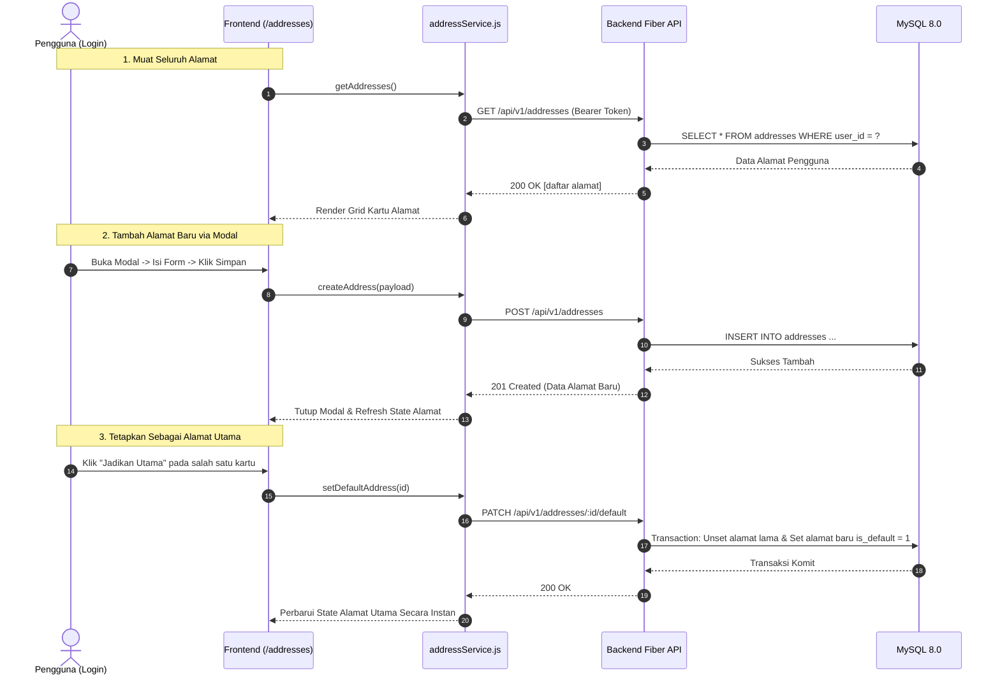

# Dokumen Halaman Manajemen Buku Alamat Pengguna (Hari 23)
**Aplikasi:** Okle Shop (E-Commerce Platform)  
**Fase:** FASE 2 - Autentikasi, Manajemen Pengguna & RBAC (Hari 11 – 25)  
**Teknologi:** React 18/19, Tailwind CSS v3, Axios Interceptor, Lucide Icons, REST API Fiber v2  
**Status:** Disetujui (Hari 23)  
**Terakhir Diperbarui:** 2026-10-05  

---

## 1. Konsep & Arsitektur Manajemen Buku Alamat

Pada tahap pengembangan e-commerce, buku alamat (*Address Book*) merupakan komponen esensial yang menghubungkan akun pembeli dengan alur *checkout* dan logistik pengiriman.

Di Hari 23, kita membangun antarmuka frontend yang elegan, intuitif, dan responsif untuk mengelola seluruh siklus hidup alamat pengiriman yang telah disiapkan backend-nya pada Hari 16:
1. **Melihat Daftar Alamat (*Address Listing*):** Menampilkan semua alamat dalam bentuk kartu (*cards*) responsif, dengan penanda visual khusus (*glowing badge*) untuk **Alamat Utama (*Default Address*)**.
2. **Tambah Alamat Baru (*Create Address Modal*):** Modal interaktif dengan validasi form (Nama, Nomor Telepon/WhatsApp, Alamat Lengkap, Kota, Provinsi, Kode Pos, dan opsi Alamat Utama).
3. **Ubah Alamat (*Edit Address Modal*):** Mengisi otomatis form modal dengan data alamat terpilih untuk diperbarui.
4. **Jadikan Alamat Utama (*Set Default Address*):** Mengirim request `PATCH /api/v1/addresses/:id/default`. UI seketika merespons dengan memindahkan lencana "Alamat Utama" ke kartu tersebut.
5. **Hapus Alamat (*Delete Address Modal*):** Dialog konfirmasi hapus untuk mencegah kesalahan klik pengguna yang tidak disengaja.



---

## 2. Struktur File Hari 23 di `frontend/`

```text
frontend/src/
├── services/
│   ├── api.js                # Instance Axios & interceptor (Hari 17)
│   ├── authService.js        # Auth service (Hari 17 - 22)
│   └── addressService.js     # 🌟 BARU: Service CRUD Alamat Pengiriman
├── pages/
│   ├── AddressesPage.jsx     # 🌟 BARU: Halaman Manajemen Buku Alamat + Modal
│   ├── ProfilePage.jsx       # Tautan ke /addresses sudah terhubung
│   └── HomePage.jsx          # Tambah tautan Alamat di Navbar
└── App.jsx                   # Pasang rute /addresses di balik ProtectedRoute
```

---

## 3. Langkah Implementasi Kode

---

### 📝 Langkah 1: Buat Service di `frontend/src/services/addressService.js`
Buat file baru [frontend/src/services/addressService.js](file:///c:/Development/Golang/okle-shop/frontend/src/services/addressService.js). Service ini membungkus semua interaksi HTTP ke endpoint `/api/v1/addresses`:

```javascript
import apiClient from './api';

export const addressService = {
  /**
   * Mengambil semua daftar alamat pengiriman milik pengguna login
   */
  async getAddresses() {
    const response = await apiClient.get('/addresses');
    return response.data.data || [];
  },

  /**
   * Mengambil detail satu alamat berdasarkan ID
   */
  async getAddressById(id) {
    const response = await apiClient.get(`/addresses/${id}`);
    return response.data.data;
  },

  /**
   * Menambahkan alamat pengiriman baru
   */
  async createAddress(addressData) {
    const response = await apiClient.post('/addresses', addressData);
    return response.data.data;
  },

  /**
   * Memperbarui alamat pengiriman yang sudah ada
   */
  async updateAddress(id, addressData) {
    const response = await apiClient.put(`/addresses/${id}`, addressData);
    return response.data.data;
  },

  /**
   * Menghapus alamat pengiriman berdasarkan ID
   */
  async deleteAddress(id) {
    const response = await apiClient.delete(`/addresses/${id}`);
    return response.data;
  },

  /**
   * Menetapkan suatu alamat menjadi Alamat Utama (is_default = true)
   */
  async setDefaultAddress(id) {
    const response = await apiClient.patch(`/addresses/${id}/default`);
    return response.data;
  },
};
```

---

### 📝 Langkah 2: Buat Halaman Buku Alamat di `frontend/src/pages/AddressesPage.jsx`
Buat file baru [frontend/src/pages/AddressesPage.jsx](file:///c:/Development/Golang/okle-shop/frontend/src/pages/AddressesPage.jsx). Halaman ini menyediakan:
- Tampilan kartu alamat responsif dengan indikator "Alamat Utama".
- Tombol aksi: "Jadikan Utama", "Ubah", dan "Hapus".
- Modal Form Tambah / Edit Alamat dengan validasi interaktif.
- Modal Konfirmasi Hapus Alamat.
- Notifikasi feedback (*Alert banner*) hijau/merah.

```jsx
import { useState, useEffect } from 'react';
import { Link } from 'react-router-dom';
import { addressService } from '../services/addressService';
import { 
  MapPin, Plus, Edit2, Trash2, CheckCircle2, 
  AlertCircle, ArrowLeft, Phone, User, X, Check, Loader2 
} from 'lucide-react';

export default function AddressesPage() {
  const [addresses, setAddresses] = useState([]);
  const [isLoading, setIsLoading] = useState(true);
  const [errorMessage, setErrorMessage] = useState('');
  const [successMessage, setSuccessMessage] = useState('');

  // State Modal Form (Tambah / Edit)
  const [isModalOpen, setIsModalOpen] = useState(false);
  const [modalMode, setModalMode] = useState('add'); // 'add' | 'edit'
  const [selectedAddressId, setSelectedAddressId] = useState(null);
  const [formSubmitting, setFormSubmitting] = useState(false);
  const [formError, setFormError] = useState('');

  // State Form Fields
  const [formData, setFormData] = useState({
    recipient_name: '',
    phone_number: '',
    street_address: '',
    city_name: '',
    province_name: '',
    postal_code: '',
    is_default: false,
  });

  // State Modal Konfirmasi Hapus
  const [isDeleteModalOpen, setIsDeleteModalOpen] = useState(false);
  const [addressToDelete, setAddressToDelete] = useState(null);
  const [deleteSubmitting, setDeleteSubmitting] = useState(false);

  // Ambil data alamat saat komponen dimuat
  const fetchAddresses = async () => {
    try {
      setIsLoading(true);
      setErrorMessage('');
      const data = await addressService.getAddresses();
      setAddresses(data);
    } catch (err) {
      setErrorMessage(err.response?.data?.message || err.message || 'Gagal memuat buku alamat');
    } finally {
      setIsLoading(false);
    }
  };

  useEffect(() => {
    fetchAddresses();
  }, []);

  const showSuccessNotification = (msg) => {
    setSuccessMessage(msg);
    setTimeout(() => setSuccessMessage(''), 4000);
  };

  // Buka Modal Tambah Alamat
  const handleOpenAddModal = () => {
    setModalMode('add');
    setSelectedAddressId(null);
    setFormError('');
    setFormData({
      recipient_name: '',
      phone_number: '',
      street_address: '',
      city_name: '',
      province_name: '',
      postal_code: '',
      // Jika belum ada alamat sama sekali, otomatis default = true
      is_default: addresses.length === 0,
    });
    setIsModalOpen(true);
  };

  // Buka Modal Ubah Alamat
  const handleOpenEditModal = (addr) => {
    setModalMode('edit');
    setSelectedAddressId(addr.id);
    setFormError('');
    setFormData({
      recipient_name: addr.recipient_name,
      phone_number: addr.phone_number,
      street_address: addr.street_address,
      city_name: addr.city_name,
      province_name: addr.province_name,
      postal_code: addr.postal_code,
      is_default: addr.is_default,
    });
    setIsModalOpen(true);
  };

  // Handler Submit Form Tambah / Ubah
  const handleSubmitForm = async (e) => {
    e.preventDefault();
    if (!formData.recipient_name.trim() || formData.recipient_name.length < 3) {
      setFormError('Nama penerima minimal 3 karakter');
      return;
    }
    if (!formData.phone_number.trim() || !/^[0-9]{10,15}$/.test(formData.phone_number)) {
      setFormError('Nomor telepon harus berupa 10 - 15 digit angka');
      return;
    }
    if (!formData.street_address.trim() || formData.street_address.length < 5) {
      setFormError('Alamat lengkap minimal 5 karakter');
      return;
    }
    if (!formData.city_name.trim()) {
      setFormError('Kota/Kabupaten wajib diisi');
      return;
    }
    if (!formData.province_name.trim()) {
      setFormError('Provinsi wajib diisi');
      return;
    }
    if (!formData.postal_code.trim() || formData.postal_code.length < 5) {
      setFormError('Kode pos minimal 5 karakter');
      return;
    }

    try {
      setFormSubmitting(true);
      setFormError('');

      if (modalMode === 'add') {
        await addressService.createAddress(formData);
        showSuccessNotification('Alamat baru berhasil ditambahkan!');
      } else {
        await addressService.updateAddress(selectedAddressId, formData);
        showSuccessNotification('Alamat berhasil diperbarui!');
      }

      setIsModalOpen(false);
      await fetchAddresses();
    } catch (err) {
      setFormError(err.response?.data?.message || err.message || 'Gagal menyimpan alamat');
    } finally {
      setFormSubmitting(false);
    }
  };

  // Handler Jadikan Alamat Utama
  const handleSetDefault = async (id) => {
    try {
      await addressService.setDefaultAddress(id);
      showSuccessNotification('Alamat utama berhasil diperbarui!');
      await fetchAddresses();
    } catch (err) {
      setErrorMessage(err.response?.data?.message || err.message || 'Gagal menetapkan alamat utama');
    }
  };

  // Buka Modal Konfirmasi Hapus
  const handleOpenDeleteModal = (addr) => {
    setAddressToDelete(addr);
    setIsDeleteModalOpen(true);
  };

  // Eksekusi Hapus Alamat
  const handleConfirmDelete = async () => {
    if (!addressToDelete) return;
    try {
      setDeleteSubmitting(true);
      await addressService.deleteAddress(addressToDelete.id);
      setIsDeleteModalOpen(false);
      setAddressToDelete(null);
      showSuccessNotification('Alamat berhasil dihapus!');
      await fetchAddresses();
    } catch (err) {
      setErrorMessage(err.response?.data?.message || err.message || 'Gagal menghapus alamat');
    } finally {
      setDeleteSubmitting(false);
    }
  };

  return (
    <div className="min-h-screen bg-slate-900 text-slate-100 p-4 md:p-8 font-sans">
      <div className="max-w-4xl mx-auto space-y-6">

        {/* Bar Navigasi Atas */}
        <div className="flex items-center justify-between">
          <Link
            to="/profile"
            className="inline-flex items-center gap-2 text-xs text-slate-400 hover:text-slate-200 transition"
          >
            <ArrowLeft className="w-4 h-4" /> Kembali ke Profil
          </Link>
          <button
            onClick={handleOpenAddModal}
            className="bg-indigo-600 hover:bg-indigo-500 text-white font-medium px-4 py-2 rounded-xl text-xs flex items-center gap-2 transition shadow-lg shadow-indigo-600/30"
          >
            <Plus className="w-4 h-4" /> Tambah Alamat Baru
          </button>
        </div>

        {/* Judul & Deskripsi Halaman */}
        <div className="bg-slate-800 rounded-2xl border border-slate-700/80 p-6 shadow-xl flex flex-col sm:flex-row sm:items-center justify-between gap-4">
          <div className="space-y-1">
            <h1 className="text-xl font-bold text-white flex items-center gap-2.5">
              <MapPin className="w-6 h-6 text-indigo-400" /> Buku Alamat Pengiriman
            </h1>
            <p className="text-xs text-slate-400">
              Kelola alamat tujuan pengiriman untuk mempermudah proses checkout pesanan belanja Anda
            </p>
          </div>
          <span className="text-xs px-3 py-1.5 rounded-xl bg-slate-900/60 border border-slate-700 text-slate-300 font-mono self-start sm:self-auto">
            Total: {addresses.length} Alamat
          </span>
        </div>

        {/* Notifikasi Banner Sukses */}
        {successMessage && (
          <div className="p-3.5 bg-emerald-950/40 border border-emerald-800/60 rounded-xl text-emerald-300 text-xs flex items-center gap-2 animate-fadeIn">
            <CheckCircle2 className="w-4 h-4 text-emerald-400 flex-shrink-0" />
            <span>{successMessage}</span>
          </div>
        )}

        {/* Notifikasi Banner Error */}
        {errorMessage && (
          <div className="p-3.5 bg-rose-950/40 border border-rose-800/60 rounded-xl text-rose-300 text-xs flex items-center gap-2 animate-fadeIn">
            <AlertCircle className="w-4 h-4 text-rose-400 flex-shrink-0" />
            <span>{errorMessage}</span>
          </div>
        )}

        {/* Loading Skeleton */}
        {isLoading ? (
          <div className="grid grid-cols-1 md:grid-cols-2 gap-4">
            {[1, 2].map((n) => (
              <div key={n} className="bg-slate-800 rounded-2xl border border-slate-700/80 p-6 animate-pulse space-y-4">
                <div className="h-4 bg-slate-700 rounded w-1/3"></div>
                <div className="h-3 bg-slate-700 rounded w-2/3"></div>
                <div className="h-3 bg-slate-700 rounded w-full"></div>
                <div className="h-8 bg-slate-700 rounded-xl w-1/2"></div>
              </div>
            ))}
          </div>
        ) : addresses.length === 0 ? (
          /* Tampilan Kosong (Empty State) */
          <div className="bg-slate-800 rounded-2xl border border-dashed border-slate-700 p-12 text-center space-y-4 shadow-xl">
            <div className="w-16 h-16 mx-auto rounded-2xl bg-indigo-500/10 border border-indigo-500/20 text-indigo-400 flex items-center justify-center">
              <MapPin className="w-8 h-8" />
            </div>
            <div className="space-y-1">
              <h3 className="text-base font-bold text-white">Belum Ada Alamat Tersimpan</h3>
              <p className="text-xs text-slate-400 max-w-md mx-auto">
                Tambahkan alamat rumah, kantor, atau tujuan pengiriman pertama Anda untuk mulai berbelanja di Okle Shop.
              </p>
            </div>
            <button
              onClick={handleOpenAddModal}
              className="bg-indigo-600 hover:bg-indigo-500 text-white font-medium px-5 py-2.5 rounded-xl text-xs inline-flex items-center gap-2 transition shadow-lg shadow-indigo-600/30"
            >
              <Plus className="w-4 h-4" /> Tambah Alamat Pertama
            </button>
          </div>
        ) : (
          /* Grid Kartu Alamat */
          <div className="grid grid-cols-1 md:grid-cols-2 gap-4">
            {addresses.map((addr) => (
              <div
                key={addr.id}
                className={`rounded-2xl p-6 transition flex flex-col justify-between relative shadow-xl ${
                  addr.is_default
                    ? 'bg-slate-800 border-2 border-indigo-500/80 shadow-indigo-500/10'
                    : 'bg-slate-800 border border-slate-700/80 hover:border-slate-600'
                }`}
              >
                {/* Header Kartu: Nama & Badge Alamat Utama */}
                <div>
                  <div className="flex items-start justify-between gap-3 mb-3">
                    <div className="space-y-1">
                      <div className="flex items-center gap-2">
                        <span className="font-bold text-base text-white">{addr.recipient_name}</span>
                        {addr.is_default && (
                          <span className="inline-flex items-center gap-1 text-[10px] px-2.5 py-0.5 rounded-full font-bold uppercase tracking-wider bg-emerald-500/20 text-emerald-300 border border-emerald-500/30">
                            <CheckCircle2 className="w-3 h-3" /> Utama
                          </span>
                        )}
                      </div>
                      <p className="text-xs text-slate-400 font-mono flex items-center gap-1.5">
                        <Phone className="w-3.5 h-3.5 text-slate-500" /> {addr.phone_number}
                      </p>
                    </div>
                  </div>

                  {/* Isi Alamat */}
                  <div className="space-y-1.5 py-2 text-xs border-t border-slate-700/60 mt-2">
                    <p className="text-slate-200 leading-relaxed font-medium">
                      {addr.street_address}
                    </p>
                    <p className="text-slate-400 flex items-center gap-1.5">
                      <MapPin className="w-3.5 h-3.5 text-indigo-400 flex-shrink-0" />
                      {addr.city_name}, {addr.province_name} {addr.postal_code}
                    </p>
                  </div>
                </div>

                {/* Footer Kartu: Tombol Aksi */}
                <div className="flex items-center justify-between pt-4 mt-2 border-t border-slate-700/60 text-xs">
                  <div>
                    {!addr.is_default ? (
                      <button
                        onClick={() => handleSetDefault(addr.id)}
                        className="text-xs font-semibold text-indigo-400 hover:text-indigo-300 transition flex items-center gap-1"
                      >
                        <Check className="w-3.5 h-3.5" /> Jadikan Utama
                      </button>
                    ) : (
                      <span className="text-[11px] text-slate-500 italic">Alamat default saat checkout</span>
                    )}
                  </div>

                  <div className="flex items-center gap-3">
                    <button
                      onClick={() => handleOpenEditModal(addr)}
                      className="text-slate-300 hover:text-white transition flex items-center gap-1"
                    >
                      <Edit2 className="w-3.5 h-3.5" /> Ubah
                    </button>
                    <button
                      onClick={() => handleOpenDeleteModal(addr)}
                      className="text-rose-400 hover:text-rose-300 transition flex items-center gap-1"
                    >
                      <Trash2 className="w-3.5 h-3.5" /> Hapus
                    </button>
                  </div>
                </div>

              </div>
            ))}
          </div>
        )}

      </div>

      {/* ============================================================= */}
      {/* MODAL FORM: TAMBAH / UBAH ALAMAT                             */}
      {/* ============================================================= */}
      {isModalOpen && (
        <div className="fixed inset-0 z-50 bg-black/70 backdrop-blur-sm flex items-center justify-center p-4 overflow-y-auto">
          <div className="bg-slate-800 border border-slate-700 rounded-2xl w-full max-w-lg shadow-2xl overflow-hidden my-8 animate-fadeIn">
            
            {/* Header Modal */}
            <div className="flex items-center justify-between p-6 border-b border-slate-700/80">
              <h2 className="text-base font-bold text-white flex items-center gap-2">
                <MapPin className="w-5 h-5 text-indigo-400" />
                {modalMode === 'add' ? 'Tambah Alamat Pengiriman' : 'Ubah Alamat Pengiriman'}
              </h2>
              <button
                onClick={() => setIsModalOpen(false)}
                className="text-slate-400 hover:text-slate-200 transition"
              >
                <X className="w-5 h-5" />
              </button>
            </div>

            {/* Error Form Banner */}
            {formError && (
              <div className="mx-6 mt-4 p-3 bg-rose-950/40 border border-rose-800/60 rounded-xl text-rose-300 text-xs flex items-center gap-2">
                <AlertCircle className="w-4 h-4 text-rose-400 flex-shrink-0" />
                <span>{formError}</span>
              </div>
            )}

            {/* Body Form */}
            <form onSubmit={handleSubmitForm} className="p-6 space-y-4">
              {/* Nama Penerima */}
              <div>
                <label className="block text-xs font-medium text-slate-300 mb-1.5">Nama Penerima</label>
                <div className="relative">
                  <User className="w-4 h-4 text-slate-500 absolute left-3.5 top-3" />
                  <input
                    type="text"
                    value={formData.recipient_name}
                    onChange={(e) => setFormData({ ...formData, recipient_name: e.target.value })}
                    placeholder="Contoh: Budi Santoso"
                    className="w-full bg-slate-900 border border-slate-700 rounded-xl pl-10 pr-4 py-2.5 text-sm text-slate-100 focus:outline-none focus:border-indigo-500 transition"
                    required
                  />
                </div>
              </div>

              {/* Nomor Handphone */}
              <div>
                <label className="block text-xs font-medium text-slate-300 mb-1.5">Nomor Handphone / WhatsApp</label>
                <div className="relative">
                  <Phone className="w-4 h-4 text-slate-500 absolute left-3.5 top-3" />
                  <input
                    type="tel"
                    value={formData.phone_number}
                    onChange={(e) => setFormData({ ...formData, phone_number: e.target.value })}
                    placeholder="081234567890"
                    className="w-full bg-slate-900 border border-slate-700 rounded-xl pl-10 pr-4 py-2.5 text-sm text-slate-100 focus:outline-none focus:border-indigo-500 transition"
                    required
                  />
                </div>
              </div>

              {/* Alamat Lengkap */}
              <div>
                <label className="block text-xs font-medium text-slate-300 mb-1.5">Alamat Lengkap</label>
                <textarea
                  value={formData.street_address}
                  onChange={(e) => setFormData({ ...formData, street_address: e.target.value })}
                  placeholder="Nama jalan, nomor rumah, RT/RW, blok, atau patokan terdekat"
                  rows={3}
                  className="w-full bg-slate-900 border border-slate-700 rounded-xl px-4 py-2.5 text-sm text-slate-100 focus:outline-none focus:border-indigo-500 transition"
                  required
                />
              </div>

              {/* Kota & Provinsi (2 Kolom) */}
              <div className="grid grid-cols-1 sm:grid-cols-2 gap-3">
                <div>
                  <label className="block text-xs font-medium text-slate-300 mb-1.5">Kota / Kabupaten</label>
                  <input
                    type="text"
                    value={formData.city_name}
                    onChange={(e) => setFormData({ ...formData, city_name: e.target.value })}
                    placeholder="Contoh: Jakarta Selatan"
                    className="w-full bg-slate-900 border border-slate-700 rounded-xl px-4 py-2.5 text-sm text-slate-100 focus:outline-none focus:border-indigo-500 transition"
                    required
                  />
                </div>
                <div>
                  <label className="block text-xs font-medium text-slate-300 mb-1.5">Provinsi</label>
                  <input
                    type="text"
                    value={formData.province_name}
                    onChange={(e) => setFormData({ ...formData, province_name: e.target.value })}
                    placeholder="Contoh: DKI Jakarta"
                    className="w-full bg-slate-900 border border-slate-700 rounded-xl px-4 py-2.5 text-sm text-slate-100 focus:outline-none focus:border-indigo-500 transition"
                    required
                  />
                </div>
              </div>

              {/* Kode Pos */}
              <div>
                <label className="block text-xs font-medium text-slate-300 mb-1.5">Kode Pos</label>
                <input
                  type="text"
                  value={formData.postal_code}
                  onChange={(e) => setFormData({ ...formData, postal_code: e.target.value })}
                  placeholder="Contoh: 12430"
                  className="w-full bg-slate-900 border border-slate-700 rounded-xl px-4 py-2.5 text-sm text-slate-100 focus:outline-none focus:border-indigo-500 transition"
                  required
                />
              </div>

              {/* Checkbox Jadikan Alamat Utama */}
              <div className="flex items-center gap-2.5 pt-1">
                <input
                  type="checkbox"
                  id="is_default_checkbox"
                  checked={formData.is_default}
                  onChange={(e) => setFormData({ ...formData, is_default: e.target.checked })}
                  className="w-4 h-4 rounded text-indigo-600 bg-slate-900 border-slate-700 focus:ring-indigo-500"
                />
                <label htmlFor="is_default_checkbox" className="text-xs text-slate-300 cursor-pointer">
                  Jadikan sebagai alamat utama
                </label>
              </div>

              {/* Tombol Aksi Modal */}
              <div className="flex items-center justify-end gap-3 pt-4 border-t border-slate-700/80">
                <button
                  type="button"
                  onClick={() => setIsModalOpen(false)}
                  className="px-4 py-2 rounded-xl text-xs font-medium text-slate-300 hover:bg-slate-700 transition"
                >
                  Batal
                </button>
                <button
                  type="submit"
                  disabled={formSubmitting}
                  className="bg-indigo-600 hover:bg-indigo-500 text-white font-medium px-5 py-2 rounded-xl text-xs flex items-center gap-2 transition shadow-lg shadow-indigo-600/30 disabled:opacity-50"
                >
                  {formSubmitting ? (
                    <>
                      <Loader2 className="w-3.5 h-3.5 animate-spin" />
                      Menyimpan...
                    </>
                  ) : (
                    'Simpan Alamat'
                  )}
                </button>
              </div>
            </form>

          </div>
        </div>
      )}

      {/* ============================================================= */}
      {/* MODAL KONFIRMASI HAPUS ALAMAT                                */}
      {/* ============================================================= */}
      {isDeleteModalOpen && addressToDelete && (
        <div className="fixed inset-0 z-50 bg-black/70 backdrop-blur-sm flex items-center justify-center p-4">
          <div className="bg-slate-800 border border-slate-700 rounded-2xl w-full max-w-sm p-6 shadow-2xl space-y-4 animate-fadeIn">
            <div className="w-12 h-12 rounded-2xl bg-rose-500/10 border border-rose-500/20 text-rose-400 flex items-center justify-center mx-auto">
              <Trash2 className="w-6 h-6" />
            </div>

            <div className="text-center space-y-1">
              <h3 className="text-base font-bold text-white">Hapus Alamat?</h3>
              <p className="text-xs text-slate-400">
                Apakah Anda yakin ingin menghapus alamat untuk penerima{' '}
                <span className="font-semibold text-slate-200">"{addressToDelete.recipient_name}"</span>?
                Tindakan ini tidak dapat dibatalkan.
              </p>
            </div>

            <div className="flex items-center justify-center gap-3 pt-2">
              <button
                type="button"
                onClick={() => setIsDeleteModalOpen(false)}
                className="px-4 py-2 rounded-xl text-xs font-medium text-slate-300 hover:bg-slate-700 transition"
              >
                Batal
              </button>
              <button
                type="button"
                disabled={deleteSubmitting}
                onClick={handleConfirmDelete}
                className="bg-rose-600 hover:bg-rose-500 text-white font-medium px-4 py-2 rounded-xl text-xs flex items-center gap-2 transition shadow-lg shadow-rose-600/30 disabled:opacity-50"
              >
                {deleteSubmitting ? (
                  <>
                    <Loader2 className="w-3.5 h-3.5 animate-spin" />
                    Menghapus...
                  </>
                ) : (
                  'Ya, Hapus'
                )}
              </button>
            </div>
          </div>
        </div>
      )}

    </div>
  );
}
```

---

### 📝 Langkah 3: Tambah Tautan Buku Alamat di `frontend/src/pages/HomePage.jsx`
Di [frontend/src/pages/HomePage.jsx](file:///c:/Development/Golang/okle-shop/frontend/src/pages/HomePage.jsx), tambahkan menu tombol **"Alamat"** di header Navbar:

```jsx
              <div className="flex items-center gap-2.5">
                <Link
                  to="/profile"
                  className="text-right hidden sm:block hover:opacity-80 transition"
                >
                  <p className="text-sm font-semibold text-slate-200">{user.name || user.email}</p>
                  <span className={`text-[10px] px-2 py-0.5 rounded-full font-bold uppercase tracking-wider ${
                    user.role === 'ADMIN'
                      ? 'bg-amber-500/20 text-amber-300 border border-amber-500/30'
                      : 'bg-emerald-500/20 text-emerald-300 border border-emerald-500/30'
                  }`}>
                    {user.role}
                  </span>
                </Link>
                <Link
                  to="/profile"
                  className="px-3 py-1.5 rounded-lg text-xs font-medium bg-slate-700 hover:bg-slate-600 text-slate-200 transition flex items-center gap-1.5"
                >
                  <User className="w-3.5 h-3.5 text-indigo-400" /> Profil
                </Link>
                <Link
                  to="/addresses"
                  className="px-3 py-1.5 rounded-lg text-xs font-medium bg-slate-700 hover:bg-slate-600 text-slate-200 transition flex items-center gap-1.5"
                >
                  <MapPin className="w-3.5 h-3.5 text-indigo-400" /> Alamat
                </Link>
                <button
                  onClick={logout}
                  className="flex items-center gap-1.5 px-3 py-1.5 rounded-lg text-xs font-medium bg-rose-600/20 text-rose-300 hover:bg-rose-600/30 border border-rose-600/30 transition"
                >
                  <LogOut className="w-4 h-4" /> Keluar
                </button>
              </div>
```

*(Catatan: Pastikan ikon `MapPin` di-import dari `'lucide-react'` di bagian atas `HomePage.jsx`)*.

---

### 📝 Langkah 4: Daftarkan Rute `/addresses` di `frontend/src/App.jsx`
Di [frontend/src/App.jsx](file:///c:/Development/Golang/okle-shop/frontend/src/App.jsx), import `AddressesPage` dan masukkan ke dalam grup `ProtectedRoute`:

```jsx
import { BrowserRouter, Routes, Route } from 'react-router-dom';
import ProtectedRoute from './components/ProtectedRoute';

// Halaman-Halaman
import HomePage from './pages/HomePage';
import LoginPage from './pages/LoginPage';
import RegisterPage from './pages/RegisterPage';
import ForgotPasswordPage from './pages/ForgotPasswordPage';
import ResetPasswordPage from './pages/ResetPasswordPage';
import ForbiddenPage from './pages/ForbiddenPage';
import AdminDashboardPage from './pages/AdminDashboardPage';
import ProfilePage from './pages/ProfilePage';
import AddressesPage from './pages/AddressesPage'; // 🌟 Import Halaman Buku Alamat

export default function App() {
  return (
    <BrowserRouter>
      <Routes>
        {/* 1. RUTE PUBLIK */}
        <Route path="/" element={<HomePage />} />
        <Route path="/login" element={<LoginPage />} />
        <Route path="/register" element={<RegisterPage />} />
        <Route path="/forgot-password" element={<ForgotPasswordPage />} />
        <Route path="/reset-password" element={<ResetPasswordPage />} />
        <Route path="/forbidden" element={<ForbiddenPage />} />

        {/* 2. RUTE MEMBER (Wajib Login: Customer & Admin) */}
        <Route element={<ProtectedRoute allowedRoles={['CUSTOMER', 'ADMIN']} />}>
          <Route path="/profile" element={<ProfilePage />} />
          <Route path="/addresses" element={<AddressesPage />} /> {/* 🌟 Rute Buku Alamat Terproteksi */}
        </Route>

        {/* 3. RUTE KHUSUS ADMIN (Wajib Login DAN Wajib Role ADMIN) */}
        <Route element={<ProtectedRoute allowedRoles={['ADMIN']} />}>
          <Route path="/admin/dashboard" element={<AdminDashboardPage />} />
        </Route>
      </Routes>
    </BrowserRouter>
  );
}
```

---

## 4. Panduan Pengujian di Browser

Pastikan backend dan frontend aktif:
```powershell
# Terminal Backend:
go run cmd/api/main.go

# Terminal Frontend:
npm run dev
```

### Skenario Pengujian Alamat:
1. **Uji Akses Terproteksi:**
   - Coba buka URL `http://localhost:5173/addresses` dalam kondisi *Logout*.
   - **Hasil:** Otomatis dialihkan ke `/login` dengan parameter *intent-redirect*.
2. **Uji Tambah Alamat Pertama:**
   - Login sebagai pembeli (`customer@gmail.com`).
   - Masuk ke menu **"Alamat"** atau dari link di halaman **Profil**.
   - Halaman menampilkan *Empty State* ("Belum Ada Alamat Tersimpan").
   - Klik **"Tambah Alamat Pertama"** -> Isi form alamat rumah -> Simpan.
   - **Hasil:** Alamat muncul dengan label hijau **"Utama"** karena alamat pertama otomatis berstatus default.
3. **Uji Tambah Alamat Kedua & Switch Alamat Utama:**
   - Klik **"Tambah Alamat Baru"** -> Masukkan data alamat kantor (jangan centang default) -> Simpan.
   - Kedua alamat kini tampil berjejer rapi di grid.
   - Klik tombol **"Jadikan Utama"** pada alamat kantor.
   - **Hasil:** Lencana "Utama" langsung berpindah ke alamat kantor, dan alamat rumah kini memiliki tombol "Jadikan Utama".
4. **Uji Ubah Data Alamat:**
   - Klik **"Ubah"** pada salah satu kartu alamat.
   - Form modal terbuka dengan data yang sudah terisi sebelumnya.
   - Ubah nomor telepon atau kode pos -> Klik **"Simpan Alamat"**.
   - **Hasil:** Data kartu seketika terupdate di layar.
5. **Uji Hapus Alamat:**
   - Klik **"Hapus"** pada alamat kedua -> Muncul modal konfirmasi peringatan.
   - Klik **"Ya, Hapus"**.
   - **Hasil:** Alamat terhapus dari grid dengan notifikasi hijau sukses.

---

## 5. Checklist Verifikasi Hari 23

| Kriteria Uji | Komponen | Status |
| :--- | :--- | :---: |
| Service Axios `addressService.js` lengkap membungkus CRUD & patch default | `frontend/src/services/addressService.js` | [x] |
| Halaman `/addresses` terproteksi di balik `ProtectedRoute` | `frontend/src/App.jsx` | [x] |
| Tampilan *Empty State* ketika user belum memiliki alamat | `frontend/src/pages/AddressesPage.jsx` | [x] |
| Form Modal Tambah & Ubah Alamat dengan validasi interaktif | `frontend/src/pages/AddressesPage.jsx` | [x] |
| Penetapan Alamat Utama instan dengan feedback UI | `frontend/src/pages/AddressesPage.jsx` | [x] |
| Modal Konfirmasi Hapus Alamat mencegah klik tidak disengaja | `frontend/src/pages/AddressesPage.jsx` | [x] |

---
*Langkah selanjutnya (Hari 24): Integrasi & Pengujian Menyeluruh Alur Auth & User Lifecycle antara React dan Golang API.*
