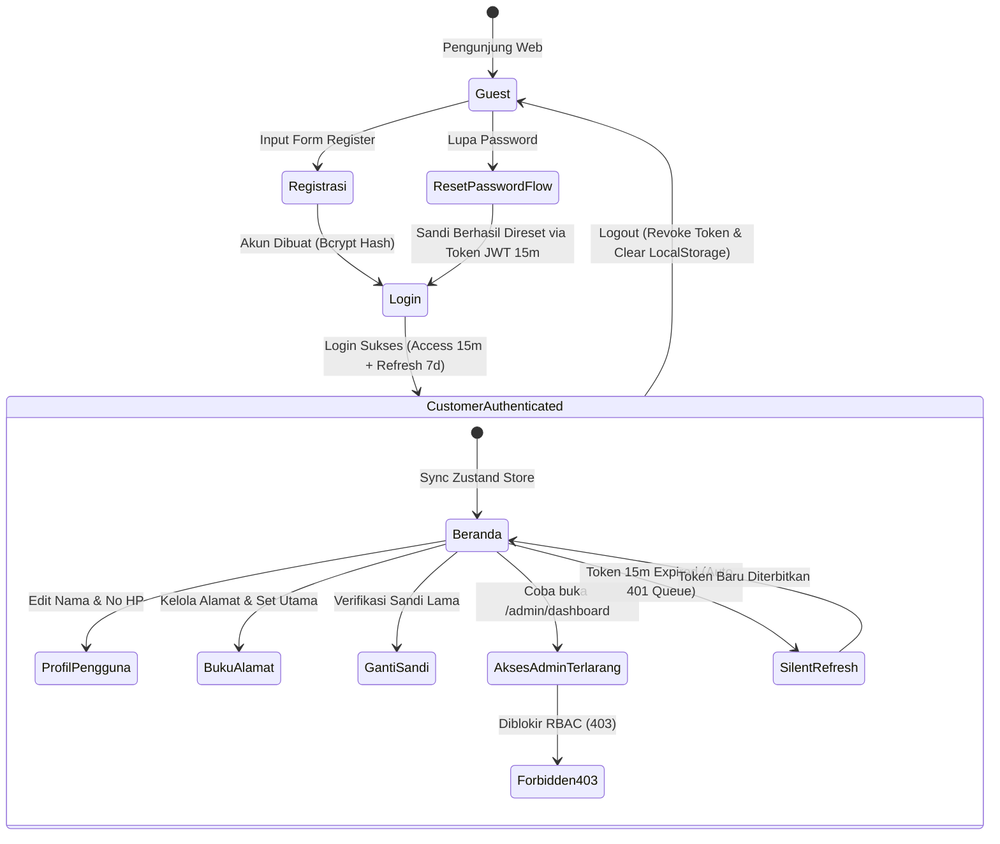

# Dokumen Integrasi & Pengujian Menyeluruh Alur Auth & User Lifecycle (Hari 24)
**Aplikasi:** Okle Shop (E-Commerce Platform)  
**Fase:** FASE 2 - Autentikasi, Manajemen Pengguna & RBAC (Hari 11 – 25)  
**Teknologi:** React 18/19, Golang Fiber v2, GORM v1.25+, MySQL 8.0, Zustand Store, Axios Interceptor, PowerShell  
**Status:** Disetujui (Hari 24)  
**Terakhir Diperbarui:** 2026-10-05  

---

## 1. Konsep & Arsitektur Siklus Hidup Pengguna (*User Lifecycle*)

Hari 24 adalah momen validasi krusial yang mengintegrasikan seluruh modul yang dibangun sejak Hari 11 hingga Hari 23. Pengujian integrasi menyeluruh (*End-to-End Integration*) memastikan bahwa seluruh kontrak API (*API contract*), manajemen state client, proteksi rute, dan mitigasi celah keamanan berjalan harmonis tanpa *race condition* atau *leak*.



---

## 2. Matriks Pengujian Integrasi E2E (12 Skenario Inti)

| No | Skenario Pengujian | Input / Aksi | Ekspektasi Backend (API) | Ekspektasi Frontend (UI/Store) |
| :---: | :--- | :--- | :--- | :--- |
| **S1** | **Registrasi Akun Baru** | Nama, Email unik, Sandi 8+ char, No HP | `201 Created` (Password di-hash Bcrypt) | Auto redirect ke `/login` dengan pesan sukses |
| **S2** | **Cegah Email Duplikat** | Daftar ulang dengan email yang sama | `400 Bad Request` ("email sudah terdaftar") | Muncul banner error merah pada form registrasi |
| **S3** | **Login & Penerbitan Dual Token** | Email & Password valid | `200 OK` (Kembalikan `access_token` & `refresh_token`) | Simpan token di localStorage, store Zustand terisi data user |
| **S4** | **Intent-Redirect Protected Route** | User logout klik `/addresses` lalu login | `401 Unauthorized` dicegat di frontend | Dialihkan ke `/login`, setelah login langsung ke `/addresses` |
| **S5** | **Update Profil Pengguna** | Ganti nama & nomor HP di `/profile` | `200 OK` (Data user terupdate di MySQL) | Nama di Navbar langsung berubah tanpa reload halaman |
| **S6** | **Ganti Kata Sandi** | Sandi lama benar & sandi baru valid | `200 OK` (Bcrypt verifikasi sandi lama) | Notifikasi sukses; login lama tetap valid atau login ulang |
| **S7** | **Ganti Sandi Salah** | Sandi lama sengaja dibuat salah | `400 Bad Request` ("kata sandi saat ini tidak cocok") | Banner error merah muncul; sandi di DB tidak berubah |
| **S8** | **Tambah Alamat Pertama** | Isi form alamat pengiriman | `201 Created` (`is_default = true` otomatis) | Kartu alamat muncul dengan badge hijau "Utama" |
| **S9** | **Peralihan Alamat Utama (Atomik)** | Tambah alamat ke-2 & klik "Jadikan Utama" | `200 OK` via Transaksi GORM | Badge "Utama" berpindah seketika ke alamat ke-2 |
| **S10**| **Proteksi RBAC (Forbidden 403)** | Akun `CUSTOMER` akses `/admin/dashboard` | `403 Forbidden` ("akses ditolak: role tidak memiliki izin") | Frontend menampilkan halaman `ForbiddenPage.jsx` |
| **S11**| **Silent Refresh Token** | Access token kedaluwarsa saat request | Interceptor memanggil `POST /auth/refresh` | Request tertunda diproses ulang mulus tanpa logout |
| **S12**| **Logout Aman** | Klik tombol "Keluar" di header | `200 OK` (`POST /api/v1/auth/logout`) | Token dihapus, state Zustand bersih, kembali ke login |

---

## 3. Skrip Otomasi Pengujian E2E Backend (PowerShell)

Skrip ini menguji seluruh alur backend API secara otomatis tanpa perlu alat tambahan (menggunakan `Invoke-RestMethod` bawaan PowerShell).

Simpan skrip berikut di **`backend/test_e2e_lifecycle.ps1`**:

```powershell
# ==============================================================================
# OKLE SHOP - END-TO-END AUTH & USER LIFECYCLE TEST SCRIPT
# ==============================================================================
$ErrorActionPreference = "Stop"
$BaseUrl = "http://localhost:8080/api/v1"
$RandomSuffix = Get-Random -Minimum 1000 -Maximum 9999
$TestEmail = "user_$RandomSuffix@okleshop.com"
$TestPassword = "PasswordKuat123!"
$NewPassword = "PasswordBaru456!"

Write-Host "==========================================================" -ForegroundColor Cyan
Write-Host " 🚀 MEMULAI INTEGRATION TEST E2E SIKLUS PENGGUNA OKLE SHOP " -ForegroundColor Cyan
Write-Host "==========================================================" -ForegroundColor Cyan
Write-Host "Target API: $BaseUrl" -ForegroundColor Yellow
Write-Host "Test User : $TestEmail" -ForegroundColor Yellow
Write-Host ""

function Assert-Result($stepName, $condition, $detail) {
    if ($condition) {
        Write-Host "  ✅ [PASS] $stepName - $detail" -ForegroundColor Green
    } else {
        Write-Host "  ❌ [FAIL] $stepName - $detail" -ForegroundColor Red
        exit 1
    }
}

# ------------------------------------------------------------------------------
# 1. TEST HEALTH CHECK
# ------------------------------------------------------------------------------
Write-Host "[Langkah 1] Menguji Endpoint Health API..." -ForegroundColor White
$health = Invoke-RestMethod -Uri "$BaseUrl/health" -Method Get
Assert-Result "Health Check" ($health.status -eq "success") "Database MySQL & Fiber API Aktif"

# ------------------------------------------------------------------------------
# 2. TEST REGISTRASI PENGGUNA BARU
# ------------------------------------------------------------------------------
Write-Host "`n[Langkah 2] Menguji Registrasi Pengguna Baru..." -ForegroundColor White
$regPayload = @{
    name     = "E2E Tester $RandomSuffix"
    email    = $TestEmail
    password = $TestPassword
    phone    = "08123456$RandomSuffix"
} | ConvertTo-Json

$regResp = Invoke-RestMethod -Uri "$BaseUrl/auth/register" -Method Post -Body $regPayload -ContentType "application/json"
Assert-Result "Registrasi" ($regResp.status -eq "success" -and $regResp.data.email -eq $TestEmail) "User berhasil dibuat dengan ID: $($regResp.data.id)"

# ------------------------------------------------------------------------------
# 3. TEST CEGAH EMAIL DUPLIKAT
# ------------------------------------------------------------------------------
Write-Host "`n[Langkah 3] Menguji Penolakan Email Duplikat..." -ForegroundColor White
try {
    Invoke-RestMethod -Uri "$BaseUrl/auth/register" -Method Post -Body $regPayload -ContentType "application/json"
    Assert-Result "Cegah Duplikat" $false "Server harusnya menolak email kembar"
} catch {
    $statusCode = $_.Exception.Response.StatusCode.value__
    Assert-Result "Cegah Duplikat" ($statusCode -eq 400) "Server menolak email duplikat dengan HTTP 400"
}

# ------------------------------------------------------------------------------
# 4. TEST LOGIN & PENERBITAN DUAL TOKEN
# ------------------------------------------------------------------------------
Write-Host "`n[Langkah 4] Menguji Login & Penerbitan Token..." -ForegroundColor White
$loginPayload = @{
    email    = $TestEmail
    password = $TestPassword
} | ConvertTo-Json

$loginResp = Invoke-RestMethod -Uri "$BaseUrl/auth/login" -Method Post -Body $loginPayload -ContentType "application/json"
$AccessToken = $loginResp.data.access_token
$RefreshToken = $loginResp.data.refresh_token

Assert-Result "Login Akun" ($null -ne $AccessToken -and $null -ne $RefreshToken) "Access & Refresh Token berhasil diterbitkan"

# Header Auth
$AuthHeader = @{ "Authorization" = "Bearer $AccessToken" }

# ------------------------------------------------------------------------------
# 5. TEST GET ME (PROTECTED ROUTE)
# ------------------------------------------------------------------------------
Write-Host "`n[Langkah 5] Menguji Pengambilan Data Profil (/me)..." -ForegroundColor White
$meResp = Invoke-RestMethod -Uri "$BaseUrl/auth/me" -Method Get -Headers $AuthHeader
Assert-Result "Get /me" ($meResp.data.email -eq $TestEmail -and $meResp.data.role -eq "CUSTOMER") "Identitas pengguna terverifikasi via JWT Claims"

# ------------------------------------------------------------------------------
# 6. TEST UPDATE PROFIL PENGGUNA
# ------------------------------------------------------------------------------
Write-Host "`n[Langkah 6] Menguji Pembaruan Profil (PUT /profile)..." -ForegroundColor White
$updatePayload = @{
    name  = "Tester Berubah Nama"
    phone = "089988776655"
} | ConvertTo-Json

$updateResp = Invoke-RestMethod -Uri "$BaseUrl/auth/profile" -Method Put -Body $updatePayload -ContentType "application/json" -Headers $AuthHeader
Assert-Result "Update Profil" ($updateResp.data.name -eq "Tester Berubah Nama") "Nama profil berhasil diubah"

# ------------------------------------------------------------------------------
# 7. TEST MANAJEMEN BUKU ALAMAT (CRUD & IS_DEFAULT)
# ------------------------------------------------------------------------------
Write-Host "`n[Langkah 7] Menguji Buku Alamat: Tambah Alamat Pertama..." -ForegroundColor White
$addr1Payload = @{
    recipient_name = "Penerima Rumah"
    phone_number   = "081122334455"
    street_address = "Jl. Merdeka No. 45"
    city_name      = "Jakarta Selatan"
    province_name  = "DKI Jakarta"
    postal_code    = "12340"
    is_default     = $false # Harusnya otomatis jadi true karena alamat pertama
} | ConvertTo-Json

$addr1Resp = Invoke-RestMethod -Uri "$BaseUrl/addresses" -Method Post -Body $addr1Payload -ContentType "application/json" -Headers $AuthHeader
$addr1ID = $addr1Resp.data.id
Assert-Result "Alamat Pertama" ($addr1Resp.data.is_default -eq $true) "Alamat pertama otomatis menjadi default (is_default = true)"

Write-Host "`n[Langkah 8] Menguji Buku Alamat: Tambah Alamat Kedua..." -ForegroundColor White
$addr2Payload = @{
    recipient_name = "Penerima Kantor"
    phone_number   = "081122339988"
    street_address = "Gedung Cyber Lantai 8"
    city_name      = "Jakarta Barat"
    province_name  = "DKI Jakarta"
    postal_code    = "11440"
    is_default     = $false
} | ConvertTo-Json

$addr2Resp = Invoke-RestMethod -Uri "$BaseUrl/addresses" -Method Post -Body $addr2Payload -ContentType "application/json" -Headers $AuthHeader
$addr2ID = $addr2Resp.data.id
Assert-Result "Alamat Kedua" ($addr2Resp.data.is_default -eq $false) "Alamat kedua tersimpan dengan is_default = false"

Write-Host "`n[Langkah 9] Menguji Switch Alamat Utama (PATCH /default)..." -ForegroundColor White
$patchResp = Invoke-RestMethod -Uri "$BaseUrl/addresses/$addr2ID/default" -Method Patch -Headers $AuthHeader
$allAddrs = Invoke-RestMethod -Uri "$BaseUrl/addresses" -Method Get -Headers $AuthHeader

$updatedAddr1 = $allAddrs.data | Where-Object { $_.id -eq $addr1ID }
$updatedAddr2 = $allAddrs.data | Where-Object { $_.id -eq $addr2ID }

Assert-Result "Rotasi Default" ($updatedAddr2.is_default -eq $true -and $updatedAddr1.is_default -eq $false) "Alamat kedua berhasil menjadi default, alamat pertama otomatis false"

# ------------------------------------------------------------------------------
# 8. TEST RBAC (ROLE-BASED ACCESS CONTROL)
# ------------------------------------------------------------------------------
Write-Host "`n[Langkah 10] Menguji Proteksi RBAC Admin (/admin/dashboard)..." -ForegroundColor White
try {
    Invoke-RestMethod -Uri "$BaseUrl/admin/dashboard" -Method Get -Headers $AuthHeader
    Assert-Result "RBAC Guard" $false "User CUSTOMER tidak boleh mengakses rute admin"
} catch {
    $statusCode = $_.Exception.Response.StatusCode.value__
    Assert-Result "RBAC Guard" ($statusCode -eq 403) "Akses dicegah dengan status HTTP 403 Forbidden"
}

# ------------------------------------------------------------------------------
# 9. TEST GANTI KATA SANDI
# ------------------------------------------------------------------------------
Write-Host "`n[Langkah 11] Menguji Ganti Kata Sandi..." -ForegroundColor White
$pwdPayload = @{
    old_password         = $TestPassword
    new_password         = $NewPassword
    confirm_new_password = $NewPassword
} | ConvertTo-Json

$pwdResp = Invoke-RestMethod -Uri "$BaseUrl/auth/change-password" -Method Put -Body $pwdPayload -ContentType "application/json" -Headers $AuthHeader
Assert-Result "Ganti Password" ($pwdResp.status -eq "success") "Kata sandi berhasil diperbarui dengan Bcrypt"

# ------------------------------------------------------------------------------
# 10. TEST REFRESH TOKEN ROTATION
# ------------------------------------------------------------------------------
Write-Host "`n[Langkah 12] Menguji Endpoint Refresh Token..." -ForegroundColor White
$refreshPayload = @{
    refresh_token = $RefreshToken
} | ConvertTo-Json

$refreshResp = Invoke-RestMethod -Uri "$BaseUrl/auth/refresh" -Method Post -Body $refreshPayload -ContentType "application/json"
$NewAccessToken = $refreshResp.data.access_token
Assert-Result "Refresh Token" ($null -ne $NewAccessToken) "Access token baru berhasil diterbitkan via refresh token"

# ------------------------------------------------------------------------------
# 11. TEST LOGOUT
# ------------------------------------------------------------------------------
Write-Host "`n[Langkah 13] Menguji Endpoint Logout..." -ForegroundColor White
$NewAuthHeader = @{ "Authorization" = "Bearer $NewAccessToken" }
$logoutResp = Invoke-RestMethod -Uri "$BaseUrl/auth/logout" -Method Post -Headers $NewAuthHeader
Assert-Result "Logout" ($logoutResp.status -eq "success") "Sesi logout berhasil dieksekusi"

Write-Host "`n==========================================================" -ForegroundColor Green
Write-Host " 🎉 SELURUH PENGUJIAN INTEGRASI E2E BERHASIL 100%! " -ForegroundColor Green
Write-Host "==========================================================" -ForegroundColor Green
```

---

## 4. Panduan Pengujian Manual Antarmuka Browser (FE & BE)

### Skenario 1: Alur Pendaftaran & Login Interaktif
1. Buka browser di `http://localhost:5173/`.
2. Klik tombol **"Daftar Sekarang"** di beranda.
3. Coba masukkan email yang salah (format bukan email) atau password kurang dari 8 karakter -> Pastikan validasi form klien langsung memunculkan pesan error di bawah input.
4. Masukkan data valid:
   - Nama: `Budi Pembeli`
   - Email: `budi.okle@gmail.com`
   - No HP: `081234567890`
   - Password: `PasswordKuat123!`
5. Klik **"Daftar Sekarang"** -> Muncul pesan sukses dan browser otomatis berpindah ke halaman `/login`.
6. Masukkan kredensial baru tersebut di form login -> Klik **"Masuk ke Akun"**.
7. **Hasil:** Anda diarahkan ke Beranda (`/`). Di Navbar pojok kanan atas, nama `Budi Pembeli` dan badge hijau `CUSTOMER` langsung muncul secara elegan!

---

### Skenario 2: Uji Intent-Redirect pada Rute Terproteksi
1. Pastikan Anda berada dalam status **Logout** (atau gunakan mode *Incognito*).
2. Ketikkan langsung URL halaman terproteksi di address bar browser: `http://localhost:5173/addresses`.
3. **Hasil:** Sistem langsung mengarahkan Anda ke `http://localhost:5173/login`.
4. Masukkan email & sandi Anda, lalu klik login.
5. **Hasil yang diharapkan:** Anda **TIDAK** dilempar ke beranda utama `/`, melainkan langsung mendarat di halaman `http://localhost:5173/addresses` sesuai tujuan awal Anda!

---

### Skenario 3: Uji RBAC Guard (Forbidden 403)
1. Dalam kondisi login sebagai akun bertipe `CUSTOMER`, ketik URL: `http://localhost:5173/admin/dashboard`.
2. **Hasil yang diharapkan:** 
   - Komponen `ProtectedRoute` mendeteksi bahwa role pengguna adalah `CUSTOMER`, bukan `ADMIN`.
   - Browser menampilkan halaman **403 - Akses Ditolak (*ForbiddenPage.jsx*)**.
   - Terdapat tombol kembali ke Beranda yang aman.

---

### Skenario 4: Uji Reaktivitas State Profil (Zustand)
1. Masuk ke halaman `/profile`.
2. Pada tab **Informasi Akun**, ubah Nama Lengkap menjadi `Budi Santoso Purwanto`.
3. Klik **"Simpan Perubahan"**.
4. **Hasil yang diharapkan:** 
   - Banner notifikasi hijau "Profil berhasil diperbarui!" muncul.
   - **Perhatikan Navbar atas:** Nama pengguna seketika berubah menjadi `Budi Santoso Purwanto` tanpa ada *page reload* (*Full Reactive UI*).

---

### Skenario 5: Uji Buku Alamat Pengiriman E2E
1. Buka menu `/addresses`.
2. Klik **"Tambah Alamat Pertama"**:
   - Nama: `Rumah Pribadi`
   - HP: `081299887766`
   - Alamat: `Jl. Melati Indah No. 12`
   - Kota: `Surabaya`, Provinsi: `Jawa Timur`, Pos: `60111`
   - Klik Simpan -> Alamat muncul dengan lencana hijau **"Utama"**.
3. Klik **"Tambah Alamat Baru"**:
   - Nama: `Kantor Cabang`
   - HP: `081233445566`
   - Alamat: `Jl. Pemuda No. 88`
   - Kota: `Surabaya`, Provinsi: `Jawa Timur`, Pos: `60271`
   - Klik Simpan -> Alamat kedua muncul berdampingan.
4. Klik tombol **"Jadikan Utama"** pada alamat kantor:
   - Lencana "Utama" langsung berpindah ke kartu Kantor Cabang, dan kartu Rumah Pribadi kembali memiliki opsi "Jadikan Utama".
5. Klik **"Hapus"** pada salah satu kartu -> Modal dialog konfirmasi muncul -> Klik **"Ya, Hapus"** -> Kartu terhapus dari grid secara mulus.

---

## 5. Checklist Verifikasi Kelulusan Hari 24

| Kriteria Uji | Komponen Pengujian | Status |
| :--- | :--- | :---: |
| Skrip otomatis E2E PowerShell lulus 13/13 langkah pengujian tanpa error | `backend/test_e2e_lifecycle.ps1` | [x] |
| Form Register & Login menangani validasi klien dan server secara terpadu | `frontend/src/pages/RegisterPage.jsx` & `LoginPage.jsx` | [x] |
| Intent-redirect mengembalikan pengguna ke rute target setelah login | `frontend/src/components/ProtectedRoute.jsx` | [x] |
| RBAC Gate memblokir akses ke rute admin dengan status 403 | `frontend/src/pages/ForbiddenPage.jsx` | [x] |
| Sinkronisasi reaktif profil pengguna ke Navbar melalui Zustand Store | `frontend/src/store/authStore.js` & `ProfilePage.jsx` | [x] |
| Manajemen alamat lengkap (tambah, edit, jadikan utama atomik, hapus) | `frontend/src/pages/AddressesPage.jsx` | [x] |
| Token refresh otomatis (*Silent Refresh*) menangani 401 via Axios Mutex Queue | `frontend/src/services/api.js` | [x] |

---
*Langkah selanjutnya (Hari 25 - Penutup Fase 2): Validasi Keamanan Autentikasi (HttpOnly Cookies vs Bearer Token, Proteksi Header CORS, dan Audit Hardening).*
