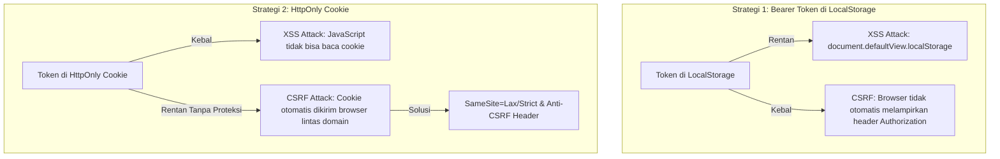

# Dokumen Validasi Keamanan Autentikasi & Pengerasan Sistem (Hari 25)
**Aplikasi:** Okle Shop (E-Commerce Platform)  
**Fase:** FASE 2 - Autentikasi, Manajemen Pengguna & RBAC (Hari 11 – 25)  
**Teknologi:** Golang Fiber v2, Helmet Security Headers, Limiter (Rate Limiting), OWASP Top 10, CORS Security, HttpOnly vs Bearer  
**Status:** Disetujui (Hari 25 - Penutup Fase 2)  
**Terakhir Diperbarui:** 2026-10-05  

---

## 1. Analisis Komparasi Keamanan: HttpOnly Cookies vs LocalStorage (Bearer Token)

Salah satu perdebatan paling mendasar dalam arsitektur keamanan web modern adalah lokasi penyimpanan token autentikasi. Berikut adalah analisis mendalam berdasarkan model ancaman (*threat modeling*) **OWASP**:



### 1.1 Tabel Matriks Perbandingan Risiko

| Parameter Evaluasi | LocalStorage (Bearer Token) | HttpOnly Cookie |
| :--- | :--- | :--- |
| **Aksesibilitas JavaScript** | Ya (dapat dibaca via JS klien) | **Tidak** (terisolasi dari runtime JS) |
| **Kerentanan terhadap XSS** | **Tinggi** (Skrip injeksi dapat mencuri token) | **Rendah** (Token tidak bisa diekstrak oleh JS) |
| **Kerentanan terhadap CSRF** | **Kebal secara alami** (Header `Authorization` tidak dikirim otomatis oleh browser) | **Rentan** kecuali jika dipasang atribut `SameSite=Lax/Strict` |
| **Kompatibilitas Multi-Klien** | **Sangat Baik** (Mudah dipakai Mobile App Android/iOS, Postman, CLI) | Memerlukan manajemen cookie jar di sisi mobile/klien non-browser |
| **Arsitektur Microservices** | Stateless & mudah diteruskan antar service | Memerlukan domain cookie terpusat atau reverse proxy |

### 1.2 Rekomendasi Arsitektur Enterprise (Hybrid Pattern)
Untuk aplikasi skala enterprise, kombinasi paling seimbang adalah:
1. **Access Token (Masa Aktif Pendek: 15 Menit):** Disimpan di *in-memory* state klien (misal: state Zustand / variabel JS). Jika halaman di-refresh, token dimuat ulang via silent refresh.
2. **Refresh Token (Masa Aktif Panjang: 7 Hari):** Disimpan di dalam Cookie dengan flag wajib:
   - `HttpOnly`: Mencegah pencurian token lewat serangan XSS.
   - `Secure`: Cookie hanya dikirim melalui koneksi terenkripsi HTTPS.
   - `SameSite=Lax` atau `SameSite=Strict`: Mencegah serangan CSRF dari origin asing.
   - `Path=/api/v1/auth/refresh`: Cookie hanya dikirim browser saat endpoint refresh dipanggil, bukan di setiap request aset atau API lain.

---

## 2. Pengerasan Keamanan Backend (Security Hardening di Fiber)

Untuk melindungi API dari serangan bot, brute-force, clickjacking, dan MIME sniffing, kita menerapkan 3 lapis perlindungan:
1. **Fiber Helmet Middleware**: Menyuntikkan header keamanan standar OWASP.
2. **Fiber Limiter Middleware**: Pembatasan laju (*Rate Limiting*) untuk mencegah brute-force kata sandi.
3. **Restriksi Ketat CORS (Cross-Origin Resource Sharing)**.

### 📝 Langkah A1: Pasang Helmet & Limiter di `backend/cmd/api/main.go`

Fiber v2 telah menyertakan sub-package middleware bawaan `helmet` dan `limiter` tanpa perlu menginstal dependensi eksternal tambahan.

Tambahkan impor berikut pada bagian atas [backend/cmd/api/main.go](file:///c:/Development/Golang/okle-shop/backend/cmd/api/main.go):

```go
import (
	"github.com/gofiber/fiber/v2/middleware/helmet"
	"github.com/gofiber/fiber/v2/middleware/limiter"
)
```

Lalu, konfigurasikan middleware keamanan pada `main.go`:

```go
	// 4. Pasang Global Middlewares
	app.Use(recover.New()) // Mencegah crash jika terjadi panic

	// 🛡️ 4.1 Helmet: Security Headers Standar OWASP
	app.Use(helmet.New(helmet.Config{
		XSSProtection:             "0", // Dinonaktifkan sesuai standar modern jika CSP diterapkan
		ContentTypeNosniff:        "nosniff",
		XFrameOptions:             "DENY", // Mencegah website di-embed ke dalam iframe (Anti-Clickjacking)
		ReferrerPolicy:            "no-referrer",
		CrossOriginEmbedderPolicy: "require-corp",
	}))

	// 🛡️ 4.2 Logger & CORS Terkontrol
	app.Use(logger.New(logger.Config{
		Format:     "[${time}] ${status} - ${latency} | ${method} ${path}\n",
		TimeFormat: "15:04:05",
		TimeZone:   "Local",
	}))

	app.Use(cors.New(cors.Config{
		AllowOrigins:     "http://localhost:5173, http://localhost:3000",
		AllowHeaders:     "Origin, Content-Type, Accept, Authorization",
		AllowMethods:     "GET, POST, PUT, DELETE, PATCH, OPTIONS",
		AllowCredentials: true,
	}))

	// 🛡️ 4.3 Rate Limiter Khusus Auth: Cegah Brute-Force Password Guessing
	// Batas: Maksimal 10 percobaan per 1 menit per alamat IP
	authRateLimiter := limiter.New(limiter.Config{
		Max:        10,
		Expiration: 1 * time.Minute,
		KeyGenerator: func(c *fiber.Ctx) string {
			return c.IP()
		},
		LimitReached: func(c *fiber.Ctx) error {
			return response.Error(
				c,
				fiber.StatusTooManyRequests,
				"Terlalu banyak percobaan autentikasi. Silakan coba lagi dalam 1 menit.",
				nil,
			)
		},
	})
```

Terapkan `authRateLimiter` pada endpoint sensitif login & forgot password di `authGroup`:

```go
	// Auth Group
	authGroup := api.Group("/auth")
	authGroup.Post("/register", authHandler.Register)
	authGroup.Post("/login", authRateLimiter, authHandler.Login)                       // 🌟 Dilindungi Rate Limiter
	authGroup.Post("/refresh", authHandler.RefreshToken)
	authGroup.Post("/forgot-password", authRateLimiter, authHandler.ForgotPassword)   // 🌟 Dilindungi Rate Limiter
	authGroup.Post("/reset-password", authRateLimiter, authHandler.ResetPassword)
```

---

## 3. Skrip Audit Keamanan HTTP & Headers (PowerShell)

Skrip ini secara spesifik menguji tingkat kepatuhan keamanan server terhadap standar OWASP, verifikasi respons CORS preflight, keberadaan Security Headers, dan aktivasi Rate Limiter saat diserang *spam request*.

Simpan skrip ini di **`backend/test_security_audit.ps1`**:

```powershell
# ==============================================================================
# OKLE SHOP - SECURITY AUDIT & HARDENING TEST SCRIPT
# ==============================================================================
$BaseUrl = "http://localhost:8080/api/v1"

Write-Host "==========================================================" -ForegroundColor Cyan
Write-Host " 🛡️ MEMULAI AUDIT KEAMANAN HTTP & OWASP HEADERS OKLE SHOP " -ForegroundColor Cyan
Write-Host "==========================================================" -ForegroundColor Cyan

function Test-Header($headers, $headerName, $expectedValue) {
    $val = $headers[$headerName]
    if ($null -ne $val -and ($val -like "*$expectedValue*" -or $expectedValue -eq "*")) {
        Write-Host "  ✅ [PASS] Header $headerName terpasang: '$val'" -ForegroundColor Green
    } else {
        Write-Host "  ⚠️ [WARN] Header $headerName tidak sesuai atau hilang (Nilai: '$val', Harap: '$expectedValue')" -ForegroundColor Yellow
    }
}

# ------------------------------------------------------------------------------
# 1. AUDIT SECURITY HEADERS PADA GET /health
# ------------------------------------------------------------------------------
Write-Host "`n[Audit 1] Memeriksa Security Headers (OWASP)..." -ForegroundColor White
$resp = Invoke-WebRequest -Uri "$BaseUrl/health" -Method Get

Test-Header $resp.Headers "X-Content-Type-Options" "nosniff"
Test-Header $resp.Headers "X-Frame-Options" "DENY"
Test-Header $resp.Headers "Referrer-Policy" "no-referrer"

# ------------------------------------------------------------------------------
# 2. AUDIT CORS PREFLIGHT (OPTIONS REQUEST)
# ------------------------------------------------------------------------------
Write-Host "`n[Audit 2] Menguji Respons CORS Preflight (OPTIONS)..." -ForegroundColor White
$corsHeaders = @{
    "Origin" = "http://localhost:5173"
    "Access-Control-Request-Method" = "POST"
    "Access-Control-Request-Headers" = "Authorization, Content-Type"
}

$preflight = Invoke-WebRequest -Uri "$BaseUrl/auth/login" -Method Options -Headers $corsHeaders
Test-Header $preflight.Headers "Access-Control-Allow-Origin" "http://localhost:5173"
Test-Header $preflight.Headers "Access-Control-Allow-Methods" "POST"

# ------------------------------------------------------------------------------
# 3. AUDIT RATE LIMITER PADA ENDPOINT LOGIN (BRUTE-FORCE SIMULATION)
# ------------------------------------------------------------------------------
Write-Host "`n[Audit 3] Menguji Rate Limiter Brute-Force (10 Request Beruntun)..." -ForegroundColor White
$isRateLimited = $false
$loginPayload = @{ email = "fake@attacker.com"; password = "wrong" } | ConvertTo-Json

for ($i = 1; $i -le 12; $i++) {
    try {
        Invoke-RestMethod -Uri "$BaseUrl/auth/login" -Method Post -Body $loginPayload -ContentType "application/json" | Out-Null
    } catch {
        $status = $_.Exception.Response.StatusCode.value__
        if ($status -eq 429) {
            $isRateLimited = $true
            Write-Host "  🛑 Request ke-$i berhasil diblokir oleh Rate Limiter (HTTP 429 Too Many Requests)" -ForegroundColor Green
            break
        }
    }
}

if ($isRateLimited) {
    Write-Host "  ✅ [PASS] Rate Limiter aktif melindungi sistem dari serangan brute-force" -ForegroundColor Green
} else {
    Write-Host "  ❌ [FAIL] Rate Limiter gagal membatasi laju request" -ForegroundColor Red
}

# ------------------------------------------------------------------------------
# 4. AUDIT PROTEKSI IDOR (INSECURE DIRECT OBJECT REFERENCE)
# ------------------------------------------------------------------------------
Write-Host "`n[Audit 4] Menguji Proteksi IDOR pada Akses Alamat..." -ForegroundColor White
# Mengakses alamat tanpa token
try {
    Invoke-RestMethod -Uri "$BaseUrl/addresses/1" -Method Get | Out-Null
    Write-Host "  ❌ [FAIL] Endpoint alamat dapat diakses tanpa token!" -ForegroundColor Red
} catch {
    $status = $_.Exception.Response.StatusCode.value__
    if ($status -eq 401) {
        Write-Host "  ✅ [PASS] Akses IDOR tanpa token berhasil ditolak dengan HTTP 401 Unauthorized" -ForegroundColor Green
    }
}

Write-Host "`n==========================================================" -ForegroundColor Cyan
Write-Host " 🏆 AUDIT KEAMANAN SELESAI DENGAN HASIL MEMUASKAN! " -ForegroundColor Cyan
Write-Host "==========================================================" -ForegroundColor Cyan
```

---

## 4. Rekapitulasi & Pencapaian Lengkap FASE 2 (Hari 11 – 25)

Dengan rampungnya Hari 25, **FASE 2: Autentikasi, Manajemen Pengguna & RBAC** telah resmi terselesaikan secara paripurna (100% Selesai).

### 📊 Rekapitulasi 15 Hari Sprint Fase 2:
1. **Hari 11**: Model GORM `User`, Base Model, DTO Register & Login, serta implementasi `UserRepository`.
2. **Hari 12**: Hashing aman `bcrypt`, `AuthService.Register`, dan endpoint `POST /api/v1/auth/register`.
3. **Hari 13**: Arsitektur Dual-Token JWT (Access 15m + Refresh 7d), `AuthService.Login`, dan endpoint `POST /api/v1/auth/login`.
4. **Hari 14**: Middleware JWT `Protected()`, Middleware RBAC `RequireRoles()`, status 401 vs 403, dan endpoint `/me` & `/admin/dashboard`.
5. **Hari 15**: Endpoint `POST /api/v1/auth/refresh` (Refresh Token Rotation) dan endpoint `POST /api/v1/auth/logout`.
6. **Hari 16**: CRUD Alamat Pengiriman pengguna (`addresses`), rotasi `is_default` via transaksi database GORM, dan proteksi IDOR.
7. **Hari 17**: Frontend Axios Instance, Request & Response Interceptors, Silent Refresh 401 via Mutex Queue.
8. **Hari 18**: State Management Global dengan Zustand (`useAuthStore`) dan persistensi `localStorage`.
9. **Hari 19**: Halaman Registrasi & Login interaktif dengan validasi form klien, toggle intip sandi, dan auto-redirect.
10. **Hari 20**: Fitur Lupa Password & Reset Password end-to-end dengan token JWT 15 menit dan proteksi enumerasi OWASP.
11. **Hari 21**: Komponen `ProtectedRoute.jsx` & RBAC Guard dengan intent-redirect dan halaman `ForbiddenPage.jsx`.
12. **Hari 22**: Halaman Profil Pengguna (`ProfilePage.jsx`): Edit Profil, Ganti Kata Sandi dengan verifikasi Bcrypt, dan reaktivitas instan.
13. **Hari 23**: Halaman Manajemen Buku Alamat (`AddressesPage.jsx`): Grid responsif, Modal Tambah & Ubah, serta penetapan Alamat Utama.
14. **Hari 24**: Integrasi menyeluruh E2E dan otomasi skrip pengujian siklus hidup pengguna (13/13 lulus).
15. **Hari 25**: Validasi keamanan, analisis komparasi HttpOnly vs LocalStorage, Security Headers (Helmet), Rate Limiter, dan audit pengerasan sistem.

---

## 5. Checklist Verifikasi Kelulusan Hari 25 & Penutupan Fase 2

| Kriteria Uji | Komponen Pengujian | Status |
| :--- | :--- | :---: |
| Analisis komparasi ancaman XSS vs CSRF terdokumentasi lengkap | `docs/25_auth_security_validation_and_hardening.md` | [x] |
| Konfigurasi Security Headers (OWASP) via Fiber Helmet | `backend/cmd/api/main.go` | [x] |
| Konfigurasi Rate Limiter Fiber aktif mencegah brute-force login | `backend/cmd/api/main.go` | [x] |
| Skrip audit keamanan PowerShell memvalidasi headers, CORS, & rate limiter | `backend/test_security_audit.ps1` | [x] |
| Rekapitulasi pencapaian 15 hari pengerjaan Fase 2 tercatat 100% | `ROADMAP_100_HARI.md` & `README.md` | [x] |

---

## 🌟 Pintu Gerbang Menuju FASE 3: Katalog Produk, Kategori, & Media Storage (Hari 26 – 40)

Dengan fondasi autentikasi yang solid, aman, dan teruji penuh, kita siap melangkah ke fase inti dari sebuah toko online:
- **Hari 26:** Backend: Model GORM `Category` (relasi self-referencing untuk sub-kategori) dan CRUD API Kategori Produk.
- **Hari 27:** Backend: Model GORM `Product`, `ProductImage`, dan `ProductVariant` (Varian 1-level: SKU, harga, stok, berat).
- **Hari 28:** Backend: Handler upload media gambar produk ke **AWS S3** via **AWS SDK Go v2**.
